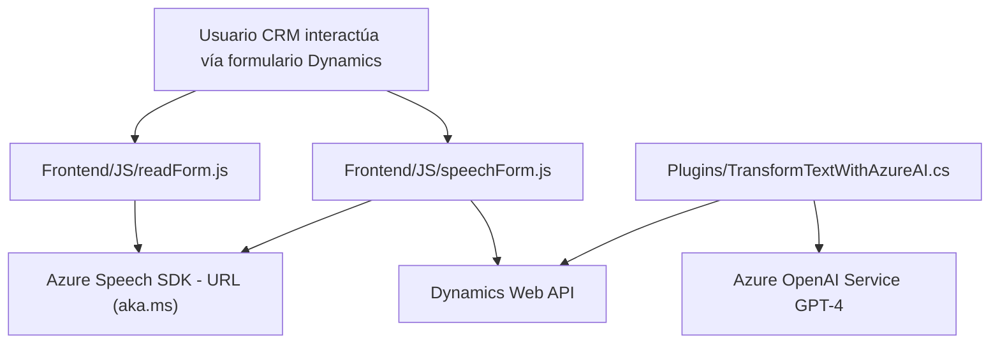

### Resumen Técnico
El repositorio define una solución que interactúa con Microsoft Dynamics 365, soportando funcionalidades avanzadas basadas en voz, texto y procesamiento adaptativo. Se integran servicios externos como **Azure Speech SDK**, **Azure OpenAI**, y APIs personalizadas de Dynamics, con un enfoque hacia mejorar la interacción humana con datos del CRM, ya sea por voz o transformación avanzada de texto.

---

### Descripción de arquitectura
La solución mezcla componentes **frontend** con lógica de negocio situada en plugins backend, logrando una conexión integral pese a usar patrones modulares e integración distribuida. Los elementos principales son:
1. **Frontend personalizado**: Basado en JavaScript, interactúa con Dynamics 365 utilizando SDKs y Web APIs.
2. **Backend extensible**: Implementado como plugins desarrollados para Dynamics CRM, con lógica específica ligada a eventos del sistema.

El diseño puede ser considerado una arquitectura **modular en capas**:
- **Presentación** (Frontend que interactúa con usuarios a través de formularios dinámicos).
- **Lógica de negocio** (Plugins personalizados para Dynamics que implementan reglas específicas).
- **Capa externa/servicios** (Interacción directa con servicios como Azure Speech SDK y OpenAI).

---

### Tecnologías usadas
1. **Frameworks y librerías:**
   - **Frontend (JS)**:
     - Azure Speech SDK: Síntesis y reconocimiento de voz.
     - Dynamics Web API: Manipulación de formularios.
   - **Backend (.NET / C#)**:
     - Microsoft.Xrm.Sdk: Para extensión de Dynamics 365.
     - Newtonsoft.Json y System.Text.Json: Procesamiento de JSON.
     - System.Net.Http: Consumo de APIs externas.

2. **Plataformas:**
   - Dynamics 365, para gestión de formularios y datos empresariales.
   - Azure services:
     - Azure Speech SDK (para procesos de TTS/Reconocimiento de voz en el frontend).
     - Azure OpenAI (GPT-4 para plugins backend).

3. **Patrones de diseño:**
   - Modularización funcional.
   - Delegate Pattern para el manejo de eventos en el cliente.
   - Plugin-based Architecture (backend Dynamics CRM).
   - Adaptador (traducción entre formatos de entrada y datos del formulario).
   - Encapsulación de lógica y desacoplamiento entre capas.

---

### Diagrama Mermaid (Válido para GitHub Markdown)

---

### Conclusión Final
La solución presentada mezcla tecnologías modernas para habilitar funcionalidades avanzadas como entrada por voz, síntesis de textos hablados y uso de inteligencia artificial en el procesamiento de datos. Su arquitectura combina elementos frontend y backend bien organizados, definiendo un sistema modular con capas nítidas y dependencias externas robustas. La integración con servicios como Azure OpenAI y Speech SDK amplía las capacidades del sistema CRM, orientándolo hacia la eficiencia en tareas dinámicas y adaptadas al usuario. Esta solución puede ser extendida para otros sistemas donde la interacción voz/texto sea crucial.