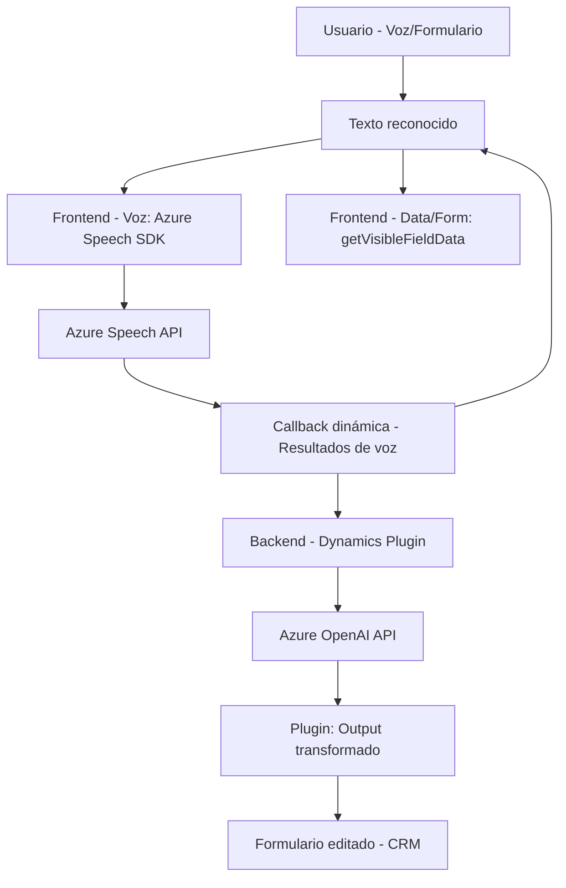

### Breve resumen técnico
El repositorio contiene distintos elementos que interactúan entre sí para implementar funcionalidades de procesamiento y síntesis de voz y enriquecimiento de datos. Utiliza Azure Speech SDK y Azure OpenAI API para tareas relacionadas con entrada/salida de voz, transcripción, AI, y transformación de datos. El código está orientado a integrarse en un entorno Dynamics CRM y está compuesto por dos módulos principales: un frontend basado en JavaScript y un backend en C# que opera como un plugin para Dynamics.

---

### Descripción de arquitectura
La arquitectura observada parece seguir una estructura **de servicios desacoplados** y orientada a eventos. Los componentes están organizados como:
1. **Frontend en JavaScript**: Maneja la interacción del usuario a nivel del navegador (sintetización y reconocimiento de voz, manipulación de formularios).
2. **Backend en C#**: Implementa un plugin para Dynamics CRM que enriquece la funcionalidad del sistema a través de interacción con la API Azure OpenAI.
    
Aunque el diseño del frontend puede parecer monolítico (organizado por archivos específicos), el flujo general se alinea con un enfoque de **arquitectura de servicios** donde los módulos interactúan mediante APIs o invocación directa, fomentando la extensibilidad.

El backend se ajusta al patrón **n-capas**, que separa la interacción del servicio externo (API OpenAI) de la lógica del CRM. 

---

### Tecnologías usadas
#### Tecnologías y frameworks observados:
1. **Frontend:**
   - Lenguaje: **JavaScript**.
   - Azure Speech SDK: Reconocimiento y síntesis de voz.
   - Manejo de DOM (extracción de información de formularios).
   
2. **Backend:**
   - Lenguaje: **C#** (Plugin Dynamics CRM).
   - Framework para CRM: **Microsoft.Xrm.Sdk**.
   - **Azure OpenAI API**: Procesamiento y transformación de texto en JSON estructurado.
   - **Newtonsoft.Json** / **System.Text.Json**: Bibliotecas para manejo de JSON en .NET.
   - **System.Net.Http**: Para comunicación HTTP con Azure.

#### Patrones usados:
- **Eventos**: Capacidad de reaccionar a cambios en los datos del formulario y al resultado del procesamiento.
- **Dynamic Library Loading**: Carga del SDK de Azure Speech en tiempo de ejecución.
- **Integración RESTful**: Interacción con Azure OpenAI mediante solicitudes HTTP.
- **Single Responsibility Principle**: Funciones bien definidas con tareas específicas.

---

### Componentes externos y posibles dependencias
1. **Azure Speech SDK**: Dependencia directa para los módulos de síntesis y reconocimiento de voz.
2. **Azure OpenAI API**: Transformación de texto según normas específicas.
3. **Dynamics CRM API**: Dependencia del plugin de backend.
4. **Xrm.WebApi**: Utilizado para invocar APIs dentro de Dynamics (posiblemente el módulo de backend interactúa con datos del CRM).
5. **Storage seguro**: Sería recomendable que claves como `apiKey` y `azureRegion` estén almacenadas en un servicio seguro, como Azure Key Vault.

---

### Diagrama **Mermaid**

---

### Conclusión final
El repositorio muestra una solución orientada a la integración con sistemas **Dynamics CRM** con soporte para accesibilidad mediante tecnologías de voz y enriquecimiento de datos mediante IA. Utiliza una arquitectura basada en servicios desacoplados, donde el frontend maneja la interacción del usuario y el backend se ocupa de las integraciones avanzadas en el contexto del CRM.

La elección de tecnologías como Azure Speech SDK y OpenAI API garantiza el uso de servicios modernos y escalables, aunque el manejo de claves y dependencias externas puede ser un área de mejora en términos de seguridad y configuración.