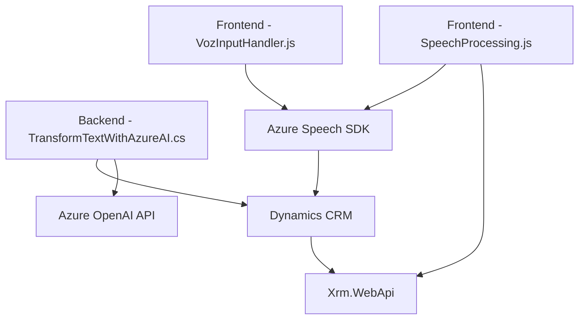

### **Análisis del repositorio**
#### **Breve resumen técnico**
Este repositorio parece estar diseñado para la integración entre funcionalidades de formularios, reconocimiento de voz, síntesis de texto en audio y transformación de texto usando tecnologías de Microsoft como Azure Speech SDK y Azure OpenAI. Combina frontend dinámico, procesamiento en tiempo real y extensibilidad en sistemas CRM (Dynamics) mediante plugins.

---

### **1. Tipo de solución**
La solución incluye los siguientes componentes:
1. **Front-end:**
   - Manejo de eventos en formularios y síntesis/entrada de voz con Azure Speech SDK.
   - Uso de JavaScript para interacción con el DOM y APIs de reconocimiento/enriquecimiento de datos.
2. **Back-end:**
   - Un plugin orientado a transformar texto usando Azure OpenAI, ejecutado en el contexto de Dynamics CRM.
   
Por lo tanto, el repositorio está orientado a una **integración de sistemas basada en APIs y SDK**, actuando como puente entre los datos del usuario, procesamiento de voz/texto y servicios en la nube como Azure.

---

### **2. Tecnologías, frameworks y patrones usados**
- **Frontend (JavaScript):**
  - **Tecnologías:** JavaScript ES6+, Azure Speech SDK, APIs de navegador, manipulación DOM.
  - **Patrones:** 
    - Cargador dinámico de SDK.
    - Desacoplamiento funcional (cada función tiene un propósito único y combinable).
    - Integración de API externa (Azure Speech SDK).
- **Backend (C#):**
  - **Frameworks:** Dynamics CRM SDK (`IPlugin`), Azure OpenAI API, Newtonsoft.Json para manejo de JSON.
  - **Patrones:** 
    - Arquitectura extensible basada en plugins.
    - Servicio externo vía HTTP (API REST).
    - Serialización/transformación de datos.
- **Interacción con sistemas:** 
  - Plugins en Dynamics CRM para datos contextuales.
  - API personalizada (Dynamics WebApi) para operaciones CRM.

---

### **3. Tipo de arquitectura**
La solución presenta una **arquitectura modular híbrida**, combinando:
1. **Frontend:** Manejo de formularios dinámicos como capa de presentación (proceso visual del usuario).
2. **Back-end:** 
   - Plugins en CRM (Dynamics) que se integran a servicios externos como Azure OpenAI.
   - Procesamiento en servicios por API.
3. **Capa de servicio:** Accesos a servicios (Azure Speech, Azure OpenAI) en una arquitectura orientada a interacciones por API REST.

La arquitectura general puede considerarse basada en **n-capas** con integración de servicios externos.

---

### **4. Dependencias o componentes externos**
- **Azure Speech SDK:** Para reconocimiento de voz, síntesis de texto en audio, y gestión de idiomas como español.
- **Azure OpenAI (GPT):** Para transformar texto basado en reglas predefinidas.
- **Dynamics CRM SDK:** Manejo de datos contextuales, operaciones de plugin y API personalizada de Dynamics (`Xrm.WebApi`).
- **Newtonsoft.Json:** Para manipulación de estructuras JSON complejas.
- **System.Net.Http:** Para realizar solicitudes REST (Azure).
- **Navegador:** Uso de APIs estándar como manipulación del DOM (`document.createElement`, etc.).

---

### **5. Diagrama en Mermaid**

---

### **Conclusión final**
Este repositorio presenta una solución bien integrada para combinar entrada/salida de voz y procesamiento de texto en formularios dinámicos, conectado con servicios en la nube como Azure y sistemas empresariales como Dynamics CRM. La arquitectura es modular, desacoplada, y diseñada para adaptarse a escenarios diversos de conversión y procesamiento de datos en tiempo real. Su diseño cumple principios de n-capas, orientación a servicios, y extensibilidad mediante plugins, resultando en una solución eficaz para el manejo de datos en sistemas de negocio.