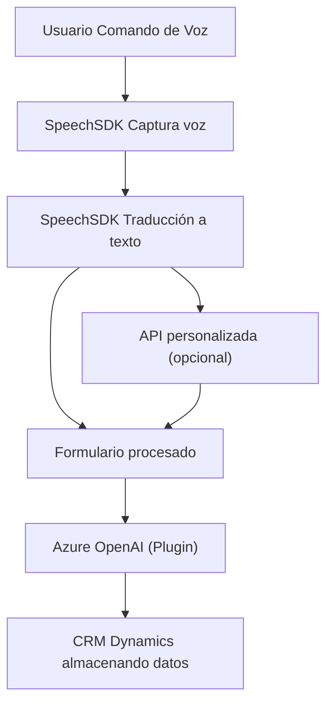

### Breve Resumen Técnico

El repositorio en cuestión parece formar parte de una solución híbrida compuesta por:
1. **Frontend**: Implementación en JavaScript para CRM (Dynamics 365), con integración de Azure Speech SDK para síntesis y reconocimiento de voz.
2. **Backend/Plugins**: Plugins de Dynamics escritos en C#, extendiendo el comportamiento del sistema mediante integración con Azure OpenAI API.

La funcionalidad principal gira en torno a mejorar la interacción con formularios de CRM, utilizando voz y servicios basados en IA para realizar una síntesis, reconocimiento y procesamiento dinámico de datos del usuario.

---

### Descripción de Arquitectura

La arquitectura es modular y consta de dos capas principales:
1. **Frontend basada en Event-driven Architecture y funciones autónomas**:
   - Independencia de funcionalidades: Separación clara de síntesis de voz, procesamiento de transcripciones y manipulación del formulario.
   - Uso de SDK externos (Azure Speech) mediante wrapper dinámicos.  
   - Extensión de funcionalidades del CRM para interactuar con los datos y APIs integradas.

2. **Backend orientado a Plugins de Dynamics CRM**:
   - Implementación de un microservicio para procesar información textual usando Azure OpenAI.
   - Manejo de solicitudes HTTP mediante la API de OpenAI, con un claro enfoque en estructuración y transformación de datos.

La arquitectura global se aproxima a una combinación de **n capas** (interacción modular entre frontend y backend) junto con un enfoque en **microservicios**, especialmente cuando se delega el procesamiento de datos a Azure OpenAI.

---

### Tecnologías Usadas
1. **Frontend**:
   - **JavaScript** para lógica en el navegador y manipulación de datos de formularios.
   - **Azure Speech SDK** para reconocimiento y síntesis de voz.
   - **APIs de Dynamics 365** (`Xrm.WebApi`) para integración con datos del CRM.

2. **Backend**:
   - **C#** para la implementación de plugins.
   - **Microsoft Dynamics SDK** para interacción con CRM.
   - **Newtonsoft.Json** para manejo JSON en el plugin.
   - **Azure OpenAI** para generación y procesamiento de texto mediante inteligencia artificial.

---

### Diagrama Mermaid 100 % Compatible con GitHub Markdown

---

### Conclusión Final

La solución presentada es una integración avanzada de tecnologías de **Microsoft** como Dynamics CRM, Azure Speech SDK y OpenAI. Su propósito es optimizar la interacción de los usuarios con formularios usando medios innovadores como comandos hablados y reglas avanzadas de IA.  
La arquitectura es flexible, permite extensibilidad mediante APIs y SDKs, y combina patrones de **n capas** con **microservicios** para garantizar eficiencia y escalabilidad, haciéndola apta para ambientes corporativos y de desarrollo ágil.