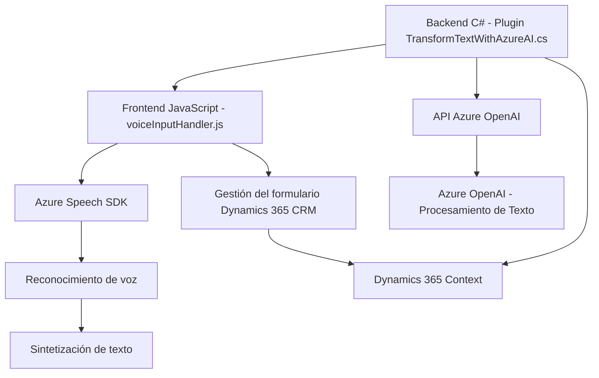

### Breve Resumen Técnico
El repositorio analizado contiene principalmente componentes para reconocer voz, procesar datos y transformar texto respectivamente en un entorno de integración con Dynamics 365 CRM y servicios externos como Azure Speech y Azure OpenAI. Observamos código frontend en **JavaScript** y backend en **C#**. La solución implementada es una **extensión interactiva para formularios que utiliza entrada y síntesis de voz, junto con procesamiento textual avanzado**.

### Descripción de Arquitectura
La arquitectura se basa en un diseño orientado hacia un modelo **n capas**:
- La capa **frontend** maneja la interacción directa del usuario, incluida la entrada de voz, y realiza llamadas a APIs internas y externas para procesar la información.
- La capa **API** (alojada en plugins de Dynamics CRM) implementa operaciones con Azure OpenAI, como la transformación de texto.
- Dependencias externas como Azure Speech SDK, APIs OpenAI y Dynamics 365 actúan como capa integrada de servicios.

El diseño también aplica elementos de **arquitectura hexagonal** para desacoplar las interacciones entre capas, especialmente buscando abstraer la comunicación entre servicios externos y funcionalidades internas.

### Tecnologías Usadas
1. **Frontend/JavaScript**:
   - Azure Speech SDK (para sintesis de voz y reconocimiento).
   - Dynamics 365 JavaScript API (`Xrm.WebApi`, contextos de formulario).
   
2. **Backend/C#**:
   - Microsoft Dynamics CRM plugin framework (`IPlugin`).
   - Azure OpenAI Service API.
   - Bibliotecas estándar .NET (`System.Net.Http`, `System.Text.Json`).

3. **Arquitectura y Patrones**:
   - **Patrón modular**: Se completa la solución dividiendo funcionalidades en módulos claros y reutilizables.
   - **Callback/Promesas asincrónicas**: Uso prominente en la carga del SDK y APIs externas.
   - **Speech-to-Form Pattern**: Implementado para convertir entrada de voz en datos estructurados aplicables a un formulario.
   - **Hexagonal** (en parte): Integración de servicios externos con mínimos acoplamientos en funcionalidades locales.

### Dependencias o Componentes Externos
- **Azure Speech SDK**: Para reconocimiento de voz y síntesis.
- **Azure OpenAI Service**: Transformación avanzada de texto en JSON estructurado.
- **Dynamics 365 CRM API**: Manipulación de formularios y datos del entorno Dynamics.
- **CDNs Externos**: Scripts y recursos relacionados con Azure y SDK de speech.

### Diagrama Mermaid
Diagramamos los elementos clave del sistema y sus interacciones:

### Conclusión Final
Este sistema implementa una solución de reconocimiento y síntesis de voz con interacción directa en formularios de Dynamics 365 CRM. Está diseñado utilizando una arquitectura **n-capas** que abstrae bien la interacción entre frontend, backend y APIs externas como Azure Speech y OpenAI. La integración con servicios en la nube refuerza su capacidad de procesar voz y texto de manera avanzada, haciendo del sistema una herramienta poderosa para simplificar el procesamiento de datos mediante input de voz y transformaciones automatizadas por IA de Microsoft Azure. Se recomienda consolidar parámetros de configuración para servicios externos en un único lugar y documentar bien estos detalles para garantizar la escalabilidad y mantenimiento del sistema.