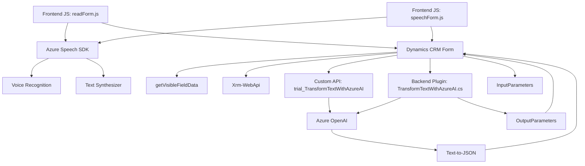

### Breve resumen técnico

El repositorio presentado muestra una solución tecnológica enfocada en la integración entre aplicaciones de Microsoft Dynamics CRM y servicios de Microsoft Azure, específicamente Azure Speech SDK y Azure OpenAI. El objetivo es habilitar funcionalidades de reconocimiento y síntesis de voz, así como la generación de estructuras JSON mediante inteligencia artificial aplicada al texto proporcionado por usuarios. Este sistema potencia la interacción y accesibilidad en formularios dinámicos, permitiendo el procesamiento e integración de datos.

---

### Descripción de arquitectura

La arquitectura de esta solución se divide en varios niveles:

- **Tipo de arquitectura:**  
  - Este repositorio se asemeja a una arquitectura **de diseño n-capas** con una separación lógica entre diferentes responsabilidades como el frontend (interfaz de usuario y manejo de datos del formulario), middleware (Azure Speech SDK y Custom APIs) y capa lógica en el backend para ejecutar plugins y procesamiento de datos.

- **Componentes principales:**
  1. **Frontend:** Archivos como `readForm.js` y `speechForm.js` en el cliente (JavaScript) para capturar, leer y enviar datos del formulario a servicios en la nube y actualizar los campos visibles dinámicamente.
  2. **Custom APIs:** Integración de una API personalizada de Dynamics CRM para transformar texto desde la transcripción de voz mediante IA de Azure OpenAI.
  3. **Plugins en el servidor:** Ejecución de lógica en el backend de Dynamics CRM mediante el archivo `TransformTextWithAzureAI.cs`. Este actúa utilizando el patrón Plugin y realiza la transformación y comunicación con el servicio externo de Azure OpenAI.

---

### Tecnologías Usadas

1. **Javascript**:
   - Principal lenguaje para el frontend dentro del ecosistema de Dynamics CRM.
   - Manejo de eventos del formulario (`executionContext`) para lectura de datos y envío de comandos.

2. **Microsoft Azure Speech SDK**:
   - Reconocimiento y síntesis de texto en lenguaje natural usando servicios de Azure para mejorar la accesibilidad y la interacción.

3. **Microsoft Azure OpenAI service**:
   - Utilizado en el backend, específicamente en el contexto del plugin `TransformTextWithAzureAI.cs`, para procesar y estructurar texto de entrada basado en normas predefinidas usando la API para generación de texto.

4. **Microsoft Dynamics 365 APIs**:
   - Uso del `dataverse` SDK para interactuar con los formularios y objetos (como atributos, controles y entidades) en el sistema CRM.

5. **Patrones principales:**
   - **Plugin Design Pattern:** El plugin implementa la interface `IPlugin` de Dynamics CRM, proporcionando una lógica específica que puede ejecutarse en eventos del sistema.
   - **External Service Integration Pattern:** Comunicación efectiva entre los componentes internos (como formularios y datos CRM) y los servicios de Azure para reconocimiento de voz, síntesis y transformación, usando REST APIs.
   - **Modularidad:** Las funciones en el frontend y la clase en el backend están diseñadas para ser funcionalmente separadas (Single Responsibility Principle).

---

### Dependencias o componentes externos

1. **Dependencia: Azure Speech SDK**  
   URL: `"https://aka.ms/csspeech/jsbrowserpackageraw"`  
   Usada tanto para la síntesis (reproducción) como para el reconocimiento de voz.

2. **Dependencia: Azure OpenAI Service**  
   URL: `"https://openai-netcore.openai.azure.com/"`  
   Propósito: Procesamiento de texto de entrada y generación de JSON estructurado vía GPT.

3. **Framework Dynamics CRM/Dataverse**  
   Componentes asociados: `executionContext`, `Xrm.WebApi`.

4. **Other .NET libraries**:  
   - `System.Net.Http`: Para enviar y procesar una solicitud HTTP.
   - `Newtonsoft.Json.Linq`: Análisis y manipulación JSON en el backend.

5. **Custom API** (`trial_TransformTextWithAzureAI`)  
   Interactúa con Dynamics CRM para transformar texto por IA de OpenAI.

6. **Plugin Lifecycle:**  
   Usando la clase `IServiceProvider` para acceder a datos de contexto y ejecutar lógica personalizada en eventos del sistema.

---

### Diagrama Mermaid (válido para GitHub Markdown)

---

### Conclusión final

La solución presentada integra servicios de Microsoft Dynamics CRM y Azure para proporcionar funcionalidades avanzadas de síntesis de voz, reconocimiento de lenguaje natural y procesamiento de texto. Utilizando una clara separación de responsabilidades con estructura n-capas, funciones modulares, plugins y APIs personalizadas, se logra una implementación extensible y escalable. Esta arquitectura se sesga hacia una integración eficiente de sistemas en la nube y promueve el uso de patrones actuales para construir aplicaciones modernas, accesibles e inteligentes.