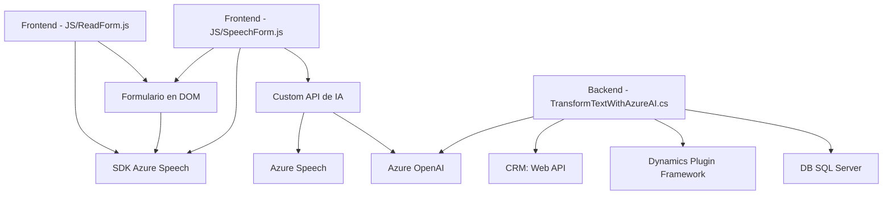

### Breve Resumen Técnico

El repositorio contiene una solución de múltiples componentes diseñada para integrar servicios de **Azure Cognitive Services (Speech SDK y OpenAI)** con formularios dinámicos y procesamiento de texto en Microsoft Dynamics CRM. Las tecnologías abarcan desde integraciones de API hasta plugins de Dynamics CRM que interactúan con modelos de IA y servicios cognitivos de Azure.

### Descripción de la Arquitectura

La solución sigue una **arquitectura de integración en capas** con separación entre frontend, lógica de negocio y acceso a servicios externos. Está dividida en tres bloques principales:
1. **Frontend**: Implementado en JavaScript, realiza interacción con formularios y el SDK de Azure Speech para entrada/salida de voz.
2. **Backend Plugin**: Plugin para Microsoft Dynamics CRM en C# destinado al procesamiento de texto usando Azure OpenAI.
3. **Servicios Externos**: Se conectan con Azure Speech SDK y OpenAI para manejar funcionalidades específicas (síntesis de voz, reconocimiento y transformación de texto).

El diseño sigue un patrón **n capas**:
- **Capa de presentación**: Código JavaScript en frontend que interactúa con formularios.
- **Capa lógica**: Plugin que ejecuta lógica avanzada y transformación de datos.
- **Capa de integración**: Comunicación con servicios externos (Azure Speech y Azure OpenAI).

### Tecnologías Usadas

1. **Frontend**:
   - JavaScript.
   - Azure Speech SDK.
   - DOM API para interacción directa con el formulario.

2. **Backend**:
   - C# (Dynamics CRM Plugin).
   - Microsoft Dynamics SDK.
   - Azure OpenAI API.
   - Newtonsoft.Json para manejo de JSON.

3. **Patrones y principios**:
   - **Asynchronous programming**: Uso de funciones asincrónicas en el frontend.
   - **Integración externa**: Comunicación mediante servicios HTTP como Azure Speech y OpenAI.
   - **Delegación**: Particionamiento claro de funciones para carga de SDK, manejo de datos de formulario y síntesis.
   - **Plugin-based**: Integración de lógica personalizada en Dynamics CRM mediante el plugin `TransformTextWithAzureAI`.

### Dependencias o Componentes Externos

1. **Azure Speech SDK**:
   - Manejo de síntesis de texto a voz y reconocimiento de voz.
   - Dinámica carga del SDK vía un script remoto.

2. **Azure OpenAI API**:
   - Utilizada para generación de texto JSON procesado basado en GPT.
   - Necesita configuración de llave API, región y endpoint.

3. **Microsoft Dynamics CRM SDK**:
   - Facilita acceso al contexto del CRM mediante interfaces como `IServiceProvider`.

4. **Newtonsoft.Json**:
   - Para trabajar con JSON en el plugin.

5. **HTTP Client y System.Text.Json**:
   - Comunicación y transformación de datos JSON en C#.

6. **Web API (CRM)**:
   - Uso del Xrm.WebApi para consultas dinámicas de datos.

---

### Diagrama Mermaid

---

### Conclusión Final

Esta solución implementa una arquitectura n capas bien definida que aprovecha servicios cognitivos y de IA en Azure, lo que la hace altamente eficiente y escalable. El diseño presenta una adecuada separación de responsabilidades entre el frontend, backend y servicios externos, garantizando facilidad de mantenimiento y extensibilidad. El uso de SDKs externos para funcionalidad avanzada como la síntesis de voz y la conversión de texto por IA proporciona flexibilidad y optimización de recursos evitando procesamiento local intensivo.