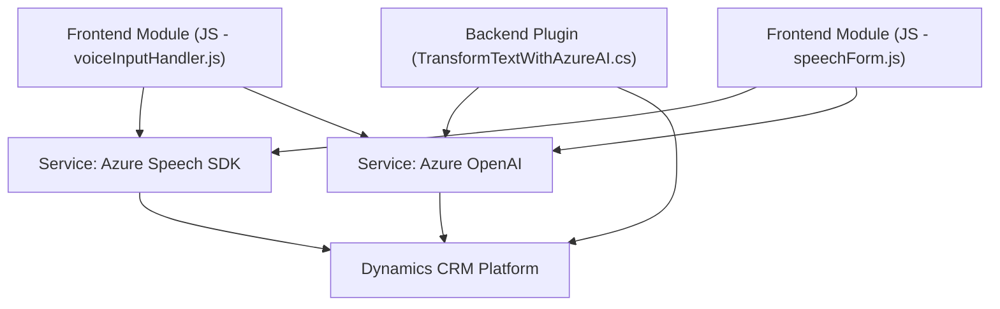

### Breve resumen técnico:
El repositorio contiene tres módulos principales que trabajan en conjunto para implementar funcionalidades basadas en reconocimiento y síntesis de voz, integración con formularios, y procesamiento de texto mediante Inteligencia Artificial. Cada archivo colabora en la implementación de una solución basada en tecnologías de **Azure Speech SDK**, **OpenAI**, y **Dynamics CRM**.

---

### **Descripción de arquitectura**
El sistema tiene una arquitectura **n-capas** que incluye módulos frontend, backend (plugin), y servicios externos. Está diseñado bajo el principio de modularidad y separación de preocupaciones.  
- **Frontend:** Contiene scripts JavaScript que manejan el reconocimiento de voz, síntesis de voz, y mapeo de datos entre voz y formularios. Interactúa con servicios como Azure Speech SDK y una API custom.
- **Backend Plugin:** Define el comportamiento en Dynamics CRM, transformando texto en JSON estructurado utilizando Azure OpenAI.
- **Servicios externos:** Utilización de Azure Speech SDK para reconocimiento/síntesis de voz y Azure OpenAI para procesamiento avanzado de texto.

---

### **Tecnologías usadas**
1. **Lenguajes de programación:**
   - **JavaScript:** En módulos frontend (speechForm.js, readForm.js) para integración del SDK de Azure.
   - **C#:** En el plugin `TransformTextWithAzureAI.cs` para Dynamics CRM.

2. **Frameworks y SDKs:**
   - **Azure Speech SDK:** Gestión de reconocimiento de voz y síntesis de texto.
   - **Azure OpenAI Service:** Procesamiento avanzado de texto hablado en formato JSON.
   - **Dynamics CRM SDK (`Microsoft.Xrm.Sdk`)**: Para integrar el plugin en Microsoft Dynamics CRM.

3. **Patrones de diseño:**
   - **Modularización:** Código dividido en funciones independientes, cada una con roles específicos que favorecen la reutilización.
   - **Integración con API externa:** Utilización de servicios externos (Azure OpenAI y Azure Speech SDK) mediante llamadas HTTP.
   - **Event-driven architecture:** Interacciones como síntesis de voz o reconocimiento se desencadenan dinámicamente al cargar SDK o eventos del formulario.
   - **Data Mapping:** Mapeo entre campos del formulario y las transcripciones de voz.

---

### **Dependencias o componentes externos presentes**
1. **Azure Speech SDK:** Es clave para la síntesis y reconocimiento de voz; se carga dinámicamente desde la URL.
2. **Azure OpenAI Service:** Servicio utilizado por el plugin para transformar texto en JSON estructurado.
3. **Dynamics CRM Web API:** En el plugin para ejecutarse como parte del flujo automático en la plataforma CRM.
4. **HTTP requests:** Se utilizan para comunicación con los servicios de Azure y posiblemente con una API custom dedicada al frontend.

---

### **Diagrama Mermaid**

---

### **Conclusión final**
El repositorio implementa una solución basada en una arquitectura **n-capas** que utiliza una mezcla de tecnologías frontend (JavaScript), backend (C# Plugin), y servicios externos para enriquecer la experiencia de usuario mediante voz e inteligencia artificial. Las funcionalidades están dirigidas a mejorar aplicaciones CRM, apoyándose en patrones de diseño como **modularidad**, **event-driven**, y **integración con APIs externas**.