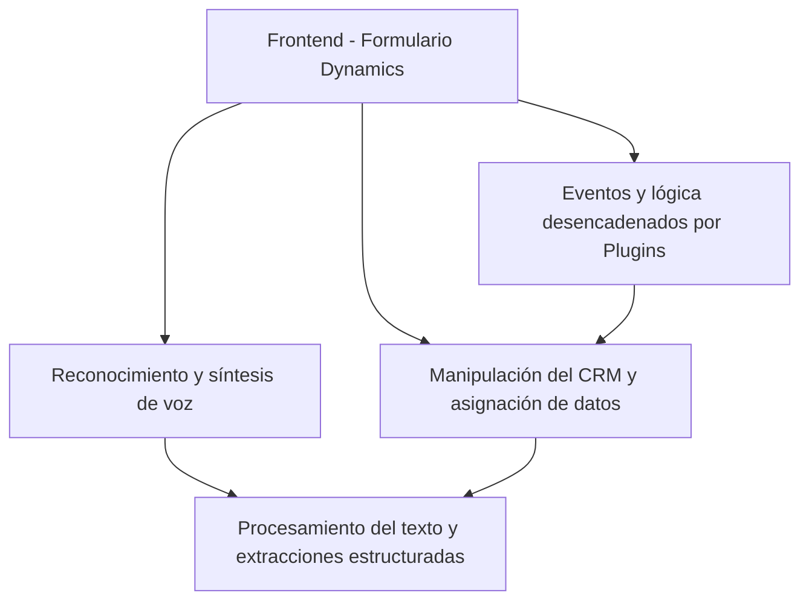

### Breve resumen técnico:

El repositorio es una solución enfocada en procesar datos de formularios de Microsoft Dynamics CRM utilizando funcionalidades avanzadas como reconocimiento de voz, síntesis de voz y procesamiento de texto mediante inteligencia artificial (Azure Speech SDK y Azure OpenAI). Incluye tanto módulos frontend en JavaScript como lógica backend implementada como plugins en C#.

---

### Descripción de arquitectura:

1. **Tipo de solución:**
   - **API personalizada, Frontend dinámico y Plugins CRM.**
   - Solución híbrida que integra lógica cliente (procesamiento de voz y datos en formularios), servicios externos (Azure APIs), y lógica de negocio (plugins en servidores CRM).

2. **Arquitectura utilizada:**
   - **Multicapa (n-Capas):**
     - Divide las responsabilidades entre:
       - **Capa de presentación** (Frontend en JavaScript).
       - **Capa de lógica de negocio** (Plugins como `TransformTextWithAzureAI`).
       - **Capa de integración externa** (Azure Speech SDK y Azure OpenAI).
   - **Orientación a servicios (SOA):**
     - Usa servicios externos (SDK y APIs).
   - **Modularidad:** Cada funcionalidad está encapsulada en módulos frontend y métodos del plugin backend.

---

### Tecnologías usadas:

1. **Frontend (JavaScript):**
   - **Azure Speech SDK**:
     - Usado para reconocimiento y síntesis de voz.
   - **API personalizada de Dynamics CRM**:
     - Procesa interacciones avanzadas con IA (inteligencia artificial).
   - **DOM manipulation**: Permite cargar dinámicamente el SDK y procesar formularios.
   - **Eventos dinámicos**: Invocación de funciones basadas en interacciones del usuario.

2. **Backend (C# Plugins):**
   - **Azure OpenAI**:
     - Procesa texto y transforma datos a JSON estructurado.
   - **Microsoft Dynamics CRM SDK** (V9+):
     - Manipulación de datos y eventos de negocio del CRM.
   - **HTTP Client**:
     - Envío y recepción de peticiones a servicios de Azure.
   - **Newtonsoft JSON**:
     - Manejo y transformación de datos JSON.

3. **Patrones de diseño y arquitectónicos:**
   - **Arquitectura basada en eventos:** Lógica activada por eventos del CRM y del SDK.
   - **Facade/Mediator:** Uso de mediadores como `IServiceProvider` en plugins.
   - **Cliente/Servidor:** Interacción entre cliente (UI) y backend (API).

---

### Dependencias o componentes externos presentes:

1. **Exclusivas de Azure:**
   - **Azure Speech SDK:** Para reconocimiento de voz y síntesis.
   - **Azure OpenAI Endpoint:** Procesa texto para convertirlo en JSON estructurado.
   - **Azure Keys y Configuration:** Proporciona autenticación y configuración regional.

2. **Entornos de Microsoft Dynamics CRM:**
   - APIs `Xrm.WebApi` y `IPluginExecutionContext` para manipulación de formularios y lógica CRM.

3. **Frameworks secundarios:**
   - **Newtonsoft Json.NET:** Para serialización/deserialización de datos JSON.
   - **Microsoft Dynamics Nuget Packages:** Integración con el entorno de CRM.

---

### Diagrama Mermaid válido para GitHub:

---

### Conclusión final:

La solución combina capacidades de **procesamiento de voz**, **accesibilidad**, y **automatización dinámica de formularios CRM** mediante servicios de Azure y plugins de Dynamics CRM. 
- Tiene una arquitectura orientada a servicios (SOA) y multicapa (Frontend/Backend).
- Aprovecha dependencias externas como Azure Speech SDK y Azure OpenAI para ejecutar funciones avanzadas mediante APIs bien vinculadas.
