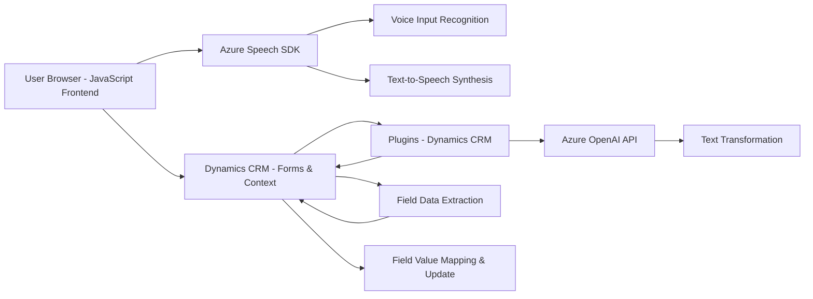

### Breve resumen técnico

El repositorio representa una solución híbrida orientada al procesamiento de datos (texto y voz) mediante tecnologías como **Azure Speech SDK** y **Azure OpenAI API**, con integración en un ecosistema Dynamics CRM. La solución abarca una arquitectura cliente-servidor mediante un frontend basado en JavaScript para interacción con formularios y plugins de CRM en .NET para procesamiento y transformación de datos en tiempo real.

---

### Descripción de arquitectura

1. **Tipo de solución**:  
   - El repositorio es una solución combinada de **frontend (interfaz web)** y **backend de plugins CRM**, orientada a agregar capacidades de accesibilidad y procesamiento avanzado mediante tecnologías como reconocimiento de voz, síntesis de voz, y transformación de texto basado en IA.

2. **Patrones arquitectónicos**:  
   - **N capas**: Un frontend que incluye integración directa con SDKs y APIs, y un backend (en forma de plugins) que se comunica con el servicio CRM y servicios externos como Azure OpenAI.  
   - **Modularidad**: Los archivos tienen una clara separación de responsabilidades (procesamiento de texto, configuración del SDK, interacción con IA externa).  
   - **Event-driven architecture**: Uso de eventos en el contexto del formulario (Dynamics CRM) para activar las acciones del SDK.  
   - **Integración con servicios de nube**: Dependencias externas como Azure Speech y Azure OpenAI API.

---

### Tecnologías usadas

1. **Frontend (JavaScript)**:  
   - Funcionalidad interactiva del SDK (lectura y síntesis de voz).  
   - Carga dinámica de SDK desde CDN: `https://aka.ms/csspeech/jsbrowserpackageraw`.  
   - Procesamiento de datos directamente en cliente.

2. **Backend (C#)**:  
   - **Dynamics CRM Plugins** para extender funcionalidad nativa del sistema.  
   - **System.Net.Http** y **Azure OpenAI API** para operaciones HTTP y transformación de datos mediante IA.  
   - Manejo de JSON a través de `System.Text.Json` y `Newtonsoft.Json.Linq`.

3. **Servicios externos**:  
   - **Azure Speech SDK**: Para reconocimiento y síntesis de voz.  
   - **Azure OpenAI API**: Para transformación avanzada de texto mediante IA.

---

### Dependencias o componentes externos

1. **Azure Speech SDK**:  
   Usado en la parte frontend para reconocer voz y generar síntesis de texto a voz.

2. **Azure OpenAI API**:  
   Utilizado en el plugin para transformar texto según normas específicas.

3. **Dynamics CRM API**:  
   Backend en C# interactúa con esta API para obtener campos del formulario y aplicar resultados.

4. **Libraries**:  
   - **System.Net.Http**: Para realizar solicitudes HTTP.  
   - **System.Text.Json**: Serialización y deserialización de JSON.  
   - **Newtonsoft.Json.Linq**: Procesamiento de objetos JSON complejos.

---

### Diagrama Mermaid válido para GitHub

---

### Conclusión final

Este repositorio representa una solución bien estructurada que cumple propósitos de transformación de datos y mejora de accesibilidad en sistemas basados en Dynamics CRM. Usa una arquitectura **n-capas** con integración de servicios externos como **Azure Speech SDK** y **Azure OpenAI API**, aprovechando patrones como la modularidad y la delegación basada en eventos del formulario. Su capacidad de adaptarse a configuraciones dinámicas la hace flexible y escalable, en especial para entornos empresariales que necesiten accesibilidad basada en voz e IA.