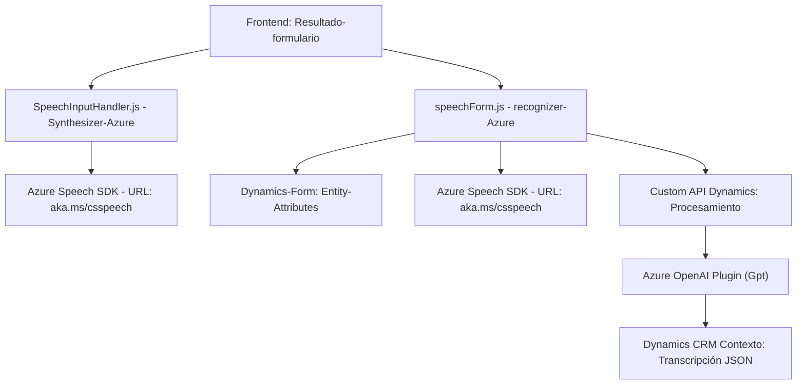

### Breve resumen técnico
El repositorio realiza una integración entre **Microsoft Dynamics 365** y servicios de Azure, facilitando la interacción a través de reconocimiento de voz (en frontend) y transformación de texto (por Inteligencia Artificial). Utiliza el Azure Speech SDK para la síntesis y reconocimiento de voz, y el Azure OpenAI Service para convertir texto en estructuras JSON bajo normas definidas. Está dividido en varios componentes: archivos frontend para el trabajo en el navegador con formularios de Dynamics y plugins en backend (C#) que extienden funcionalidades del CRM mediante interacción con APIs externas.

---

### Descripción de la arquitectura
La arquitectura es predominantemente **integrada con microservicios**, con un fuerte desacoplamiento entre los diferentes componentes que aportan funciones específicas:
1. **Frontend (readForm.js & speechForm.js):** Un modelo **modular y event-driven** basado en JavaScript para manejar funciones relacionadas con formularios y sintetizadores de voz. Los datos viajan a través de API para ser procesados por un servicio externo (Azure Speech e Intelligent AI). Incluye la lógica para procesar tanto la síntesis de voz como el reconocimiento y actualización de formularios según la entrada del usuario.
2. **Backend plugin (TransformTextWithAzureAI.cs):** Sigue un patrón de **extensibilidad de Dynamics CRM** incorporando un plugin que utiliza servicios externos (Azure OpenAI) para recibir texto, procesarlo y devolver respuestas en formato JSON.

La comunicación entre el cliente (frontend) y el servidor (plugins/API) sigue el patrón **API-Based Integration**, consumiendo tanto Azure Speech como Azure OpenAI.

---

### Tecnologías usadas
1. **Frontend:**
   - **JavaScript**: Implementa las funciones para formularios interactivos y la integración con Azure Speech SDK.
   - **Azure Speech SDK**: Reconocimiento de voz y síntesis en el navegador.
   - **Dynamics 365 SDK**: Para la interacción con contextos de formularios.

2. **Backend:**
   - **C#**: Plugin basado en Dynamics CRM SDK.
   - **Microsoft Dynamics CRM SDK**: Extensión del sistema CRM mediante eventos y plugins.
   - **Azure OpenAI Service**: Procesamiento del texto según normas predefinidas.
   - **System.Net.Http**: Comunicación API HTTP.
   - **Newtonsoft.Json** y **System.Text.Json**: Manejo de estructuras JSON.
   
---

### Dependencias y componentes externos
- **Azure Speech SDK**: Para síntesis y reconocimiento de voz en JavaScript (frontend).
- **Azure OpenAI Service**: Procesa el texto para transformarlo en estructuras JSON (backend plugin).
- **Microsoft Dynamics CRM SDK**: Base de interacción y extensión del sistema CRM.
- **HTTP API personalizada**: Comunicaciones dinámicas entre frontend y backend, incluyendo posibles endpoints específicos para Dynamics.
- **Librerías JSON y Regex**: Utilizadas para la manipulación de datos en plugins.

---

### Diagrama Mermaid válido para GitHub

---

### Conclusión final
El repositorio aborda la problemática de interacción entre usuarios y formularios internos de Microsoft Dynamics, facilitando entradas mediante voz (Síntesis y Reconocimiento – **Azure Speech SDK**) e implementando una lógica avanzada de procesamiento de texto estructurado mediante inteligencia artificial (**Azure OpenAI Service**). Combina una solución cliente/servidor basada en **microservicios**, integrando múltiples componentes mediante APIs remotas y eventos dinámicos del CRM. La elección de tecnologías refuerza la escalabilidad y desacoplamiento modular para futuras ampliaciones en este ecosistema.