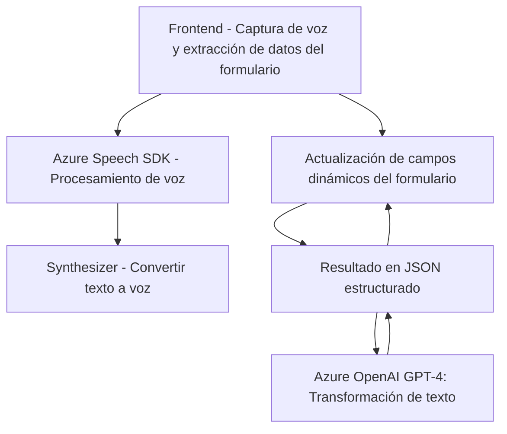

### Resumen Técnico
El repositorio parece ser parte de una solución integrada que utiliza **Azure Speech SDK** y **Azure OpenAI GPT-4** para realizar tareas de procesamiento de voz y texto en un ecosistema de **Microsoft Dynamics 365**. La estructura incluye un frontend dinámico en JavaScript y un backend basado en plugins .NET para extender las capacidades del sistema empresarial. La solución conecta interfaces de usuario, servicios externos de IA y de síntesis de voz, y APIs personalizadas de Dynamics 365.

---

### Descripción de la Arquitectura
La arquitectura general es **modular y de capas**, con un enfoque híbrido entre un cliente pesado (frontend) y servicios backend ligeros. Aunque no es estrictamente un diseño de microservicios completo, cada módulo tiene responsabilidades claras y se comunica mediante APIs y SDKs. Los plugins .NET para Microsoft Dynamics 365 actúan como un componente clave al extender la funcionalidad del sistema hacia capacidades de IA.

1. **Capa Presentación**: Módulos JavaScript que interactúan con los usuarios mediante el frontend dinámico.
2. **Capa de Servicios**: Uso de Azure Speech SDK para síntesis de voz desde texto y reconocimiento de voz. También realiza la comunicación con el servicio Azure OpenAI para la transformación de texto.
3. **Backend de Integración**: Plugins .NET que interactúan con Dynamics 365 y consumen servicios externos como Azure OpenAI, además de la actualización de dinámicos campos del formulario.
4. **Ecosistema externo**:
   - **Azure Speech SDK**: Procesamiento de voz.
   - **Azure OpenAI GPT-4**: Procesamiento avanzado de texto.
   - **Microsoft Dynamics 365 APIs**: Manipulación de datos y servicios empresariales.

---

### Tecnologías Usadas
1. **Frontend**:
   - **JavaScript** con modularidad funcional.
   - SDKs dinámicos como **Azure Speech SDK**.

2. **Backend (Plugins .NET)**:
   - **C#**
   - **Microsoft Dynamics CRM SDK** (`Microsoft.Xrm.Sdk`).
   - **HttpClient** para integración con servicios RESTful.
   - **Serialization Frameworks** como `System.Text.Json`.

3. **Servicios Externos**:
   - **Azure Speech SDK**: Reconocimiento de voz y síntesis de texto a voz.
   - **Azure OpenAI GPT-4**: Para transformación avanzada de texto y uso de algoritmos IA.
   - **Custom APIs en Microsoft Dynamics 365**.

---

### Diagrama **Mermaid** (100 % compatible con GitHub Markdown)

---

### Conclusión Final
La solución analizada es una arquitectura híbrida orientada principalmente a integrar un ecosistema empresarial con procesamiento de voz y texto mediante IA. Utiliza una combinación de frontend modular (JavaScript) y backend extensible (C# plugins y APIs personalizadas). Cada componente está diseñado para cumplir tareas específicas dentro de las capas de procesamiento y comunicación.

**Fortalezas**:
- Modularidad que facilita la extensibilidad (Azure Speech SDK, OpenAI GPT-4).
- Integración profunda con datos sensibles y procesos empresariales de Dynamics 365 mediante SDKs específicos.

**Debilidades**:
- Alto nivel de dependencia en servicios externos (Azure y Dynamics 365).
- Escalabilidad limitada si los plugins y servicios se convierten en puntos críticos de fallo.

La arquitectura se ajusta a escenarios empresariales modernos, donde la integración entre **IA**, procesamiento de datos y plataformas dinámicas es crucial para mejorar la efectividad de los usuarios y procesos.