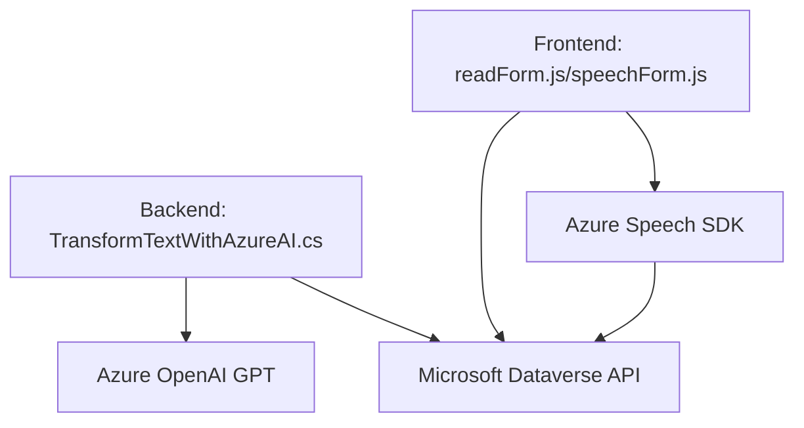

### Breve resumen técnico:
El repositorio contiene componentes que abarcan varias capas de una solución, enfocada principalmente en la interacción entre servicios de Azure (Speech SDK, OpenAI) y sistemas como Microsoft Dynamics CRM. Los archivos están orientados al procesamiento de datos mediante voz, texto estructurado y API externas, logrando una solución integrada entre frontend, cliente y plataformas cloud.

---

### Descripción de arquitectura:
La arquitectura del sistema sigue un **modelo multicapa**, combinando elementos del diseño tradicional de aplicaciones cliente-servidor con integración de servicios externos basados en APIs. Los componentes analizados encajan en la siguiente estructura:
1. **Frontend (archivos JavaScript `readForm.js` y `speechForm.js`)**:
   - Procesa interacción del usuario con formularios, reconocimiento de voz y síntesis de texto en el navegador.
   - Usa una arquitectura de modularidad funcional, donde cada función tiene responsabilidades específicas.
   - Se integran servicios externos como Azure Speech SDK para tareas de reconocimiento y síntesis de voz.

2. **Backend (archivo `TransformTextWithAzureAI.cs`)**:
   - Plugin basado en Dynamics CRM SDK (Microsoft) que interactúa con datos del contexto de CRM.
   - Llama a la API de Azure OpenAI para desarrollar tareas avanzadas de procesamiento de datos/texto.
   - Arquitectura hexagonal en el plugin, que organiza la interacción entre dominios (CRM, Azure OpenAI).

---

### Tecnologías usadas:
1. **Frontend**:
   - **Azure Speech SDK**: Reconocimiento de voz, síntesis de texto a audio.
   - **JavaScript**: Desarrollo y manipulación client-side.
   - **Microsoft Dataverse API (`Xrm.WebApi.online.execute`)**: Para ejecutar operaciones CRUD y APIs personalizadas en el CRM.
   
2. **Backend**:
   - **Dynamics CRM SDK**: Extensión de funcionalidades del sistema CRM mediante el desarrollo de plugins que interactúan con entidades de Dataverse.
   - **Azure OpenAI**: Para la transformación de texto utilizando modelos GPT-4 o similares.
   - Librerías auxiliares: `Newtonsoft.Json`, `System.Net.Http`.

3. **Patrones**:
   - **Modularidad funcional**: División del código en funciones especializadas.
   - **Encapsulación de lógica**: Plugins para CRM centralizan la responsabilidad del procesamiento.
   - **Integración de servicios externos**: Uso de SDKs y APIs para extender capacidades locales mediante servicios cloud.
   - **Callback y promesas**: Manejo de operaciones asíncronas para llamadas a APIs externas.
   - **Desacoplamiento**: Separación de lógica entre la interfaz, servicios externos y procesamiento.

---

### Diagrama **Mermaid**:

---

### Conclusión final:
La solución integra potentes herramientas y servicios cloud para resolver problemas específicos como reconocer texto mediante voz, transformar datos mediante IA (GPT-4 en Azure), y sintetizar audio en español utilizando Azure Speech SDK. La arquitectura modular es apropiada para proyectos escalables, con líneas bien definidas entre cliente (frontend) y servidor (backend). El proyecto aprovecha los servicios PaaS como Azure OpenAI y Speech SDK para extender capacidades, reduciendo dependencias en infraestructura y facilitando su despliegue en ecosistemas dinámicos como Dynamics CRM.