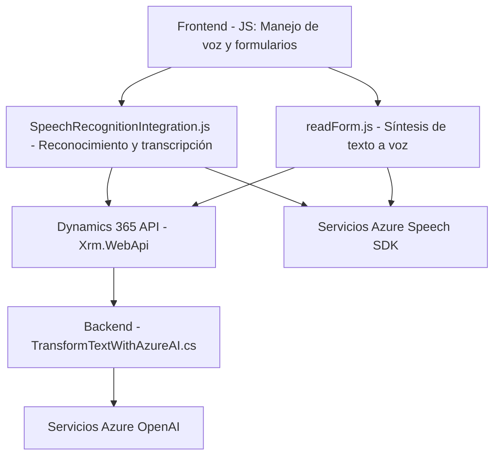

### Breve Resumen Técnico
Este repositorio contiene principalmente implementaciones para un **sistema de reconocimiento de voz** y síntesis de texto a voz, diseñado para integrarse con formularios en **Microsoft Dynamics 365**. Utiliza **Azure Speech SDK** y el servicio **Azure OpenAI** para manejar operaciones de voz, procesamiento de texto y manipulación de valores en formularios. 

---

### Descripción de Arquitectura
La arquitectura del sistema es de tipo **n-capas** con integración de servicios externos. Se estructura en:
1. **Capa de Presentación (Frontend)**: Implementaciones en JavaScript para la síntesis y reconocimiento de voz, así como manipulación de formularios a nivel cliente.
2. **Capa de Lógica de Negocio**: Plug-ins que procesan datos en Dynamics 365 utilizando **Xrm.WebApi** y transforman texto mediante Azure OpenAI.
3. **Capa de Servicios Externos**: Las operaciones dependientes de **Azure Speech SDK** y **Azure OpenAI**, que procesan la entrada y salida entre el sistema local y los servicios remotos.

---

### Tecnologías Usadas
1. **Frontend**:
   - JavaScript & ES6.
   - Azure Speech SDK (`https://aka.ms/csspeech/jsbrowserpackageraw`).
   - API Dynamics 365 (formContext, Xrm.WebApi).
2. **Backend (Plugins)**:
   - .NET Framework/C#.
   - Microsoft Dynamics SDK (`Microsoft.Xrm.Sdk`).
   - Azure OpenAI API.
   - Librerías .NET (`System.Net.Http`, `Newtonsoft.Json`).
3. **Servicios y Integraciones**:
   - **Azure Speech SDK** para voz.
   - **Azure OpenAI** para procesamiento avanzado.

#### Patrones de Diseño
- **Modularidad**: Cada archivo maneja aspectos específicos separados (RnV = Reconocimiento y Voz / Backend = Negocio).
- **Eventos Asincrónicos**: Uso de Promises y callbacks para sincronización en reconocimiento y carga de SDK.
- **Service-Oriented Architecture (SOA)**: Integración directa con servicios de Azure Speech y OpenAI en las capas correspondientes.
- **Encapsulación**: Separación de lógica de procesamiento en métodos modularizados.
- **Plug-in Design Pattern**: Backend estructurado para incluir lógica en eventos específicos de Dynamics 365.

---

### Diagrama Mermaid

---

### Conclusión Final
La solución se estructura como un sistema **n-capas** orientado a servicios que integra, mediante múltiples módulos, capacidades avanzadas de reconocimiento y síntesis de voz, y procesamiento de texto basado en reglas predefinidas. La dependencia en **Azure Speech SDK** y **Azure OpenAI** le confiere funcionalidades potentes pero también la condiciona a configurar adecuadamente credenciales y claves de acceso. Es una arquitectura extensible y modular que puede escalar mediante ajustes en las interfaces API de Dynamics y Azure.