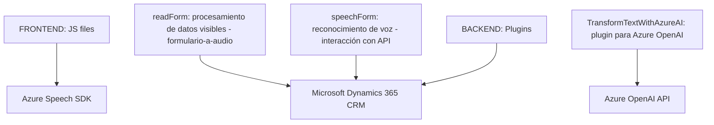

# Análisis Técnico

## Breve Resumen Técnico
El repositorio parece pertenecer a una solución empresarial que integra capacidades de reconocimiento y síntesis de voz (Azure Speech SDK) y procesamiento de lenguaje natural (Azure OpenAI API) con formularios de **Microsoft Dynamics 365**. La solución permite tanto ingresar datos mediante comandos de voz como sintetizar información visible de un formulario en sonido, proporcionando una interfaz accesible para usuarios. El conjunto de archivos se divide en desarrollo de Frontend y Backend. 

---

## Descripción de arquitectura
El sistema utiliza una arquitectura **n-capas**, donde se separan claramente las responsabilidades entre la lógica de presentación (**FRONTEND/JS**) y la lógica empresarial como plugins (**BACKEND/Plugins**) que interactúan con servicios externos como Azure Speech SDK y Azure OpenAI API. Además, los archivos JavaScript funcionan como un adaptador que transforma datos y conecta dinámicamente el servicio de síntesis/reconocimiento con Microsoft Dynamics 365.

---

## Tecnologías usadas

### Frontend:
1. **JavaScript**: Lenguaje principal para manipulación de funcionalidades de la vista.
2. **Azure Speech SDK**: Para implementar reconocimiento de voz y síntesis de texto a voz.
3. **Microsoft Dynamics 365 Xrm.WebApi**: Framework de APIs para gestionar datos en formularios y entidades dinámicas.
4. **Promesas JavaScript**: Para gestionar operaciones asincrónicas dentro de los flujos de reconocimiento de voz.

### Backend:
1. **C#**: Lenguaje de programación orientado a objetos utilizado para construir plugins en Dynamics CRM.
2. **Microsoft Dynamics CRM SDK**: Para crear plugins personalizados en el sistema CRM.
3. **Web API**: Sistema utilizado para la interacción entre servicios (Azure OpenAI y Dynamics 365).
4. **Azure OpenAI API**: Interfaz externa para transformación de texto en JSON mediante inteligencia artificial.
5. **Newtonsoft.Json**: Manipulación y deserialización de objetos JSON.
6. **System.Net.Http**: Realización de peticiones HTTP hacia APIs externas.
7. **Regex**: Limpieza y gestión de texto con expresiones regulares.

---

## Dependencias o Componentes Externos
1. **Azure Speech SDK**: Enlace para incluir la biblioteca prediseñada: https://aka.ms/csspeech/jsbrowserpackageraw.
2. **Azure OpenAI API**: Servicio para procesamiento de lenguaje natural.
3. **Microsoft Dynamics Xrm APIs**:
   - `Xrm.WebApi` (frontend): Para interactuar con entidades en CRM.
   - `Microsoft.Xrm.Sdk` (backend): Para emplear la API de plugins y servicios de datos del sistema Dynamics.
4. **Sistema de formularios dinámicos:** Los archivos dependen del acceso estructurado a formularios y entidades en el Dynamics CRM.

---

## Diagrama Mermaid (Diagram)

---

## Conclusión Final
La solución combina múltiples potentes servicios en la nube (Azure Speech SDK, Azure OpenAI API) y sistemas locales de Microsoft Dynamics 365 utilizando una arquitectura de **n-capas funcionales**. El **frontend** maneja la interfaz de usuario y las interacciones, y delega tareas técnicas al **backend** y las APIs externas. Este tipo de arquitectura promueve la modularidad y la escalabilidad en integraciones empresariales, siendo adecuado para organizaciones que buscan aprovechar servicios avanzados de IA en conjunto con sistemas CRM robustos como Dynamics 365.