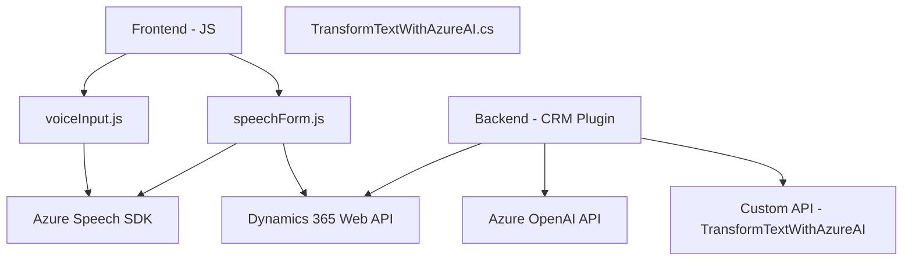

### Breve resumen técnico
El repositorio describe una solución que integra funcionalidades avanzadas de procesamiento de texto y voz en una plataforma CRM basada en Microsoft Dynamics 365. Está compuesto de componentes frontend desarrollados principalmente en JavaScript y un backend implementado como plugins (.NET), aprovechando el Azure Speech SDK para sintetización y reconocimiento de voz, y la Azure OpenAI API para transformación semántica de texto. Todo está diseñado bajo los principios de extensibilidad y escalabilidad.

---

### Descripción de arquitectura
**Tipo de solución:**  
- Combinación multi-layer:
  - **Frontend:** Scripts basados en JavaScript para manipulación de un CRM.
  - **Backend:** Plugin de Dynamics para transformación de datos mediante APIs externas.  

**Patrones arquitectónicos:**  
- **Componentes del frontend:**  
  - Modularización clara del código en funciones reutilizables (funcional).  
  - Implementación implícita del patrón Modelo-Vista-Controlador (MVC): Datos (Modelo) del formulario se vinculan con procesamiento (Controlador) y siguen la representación del usuario (Vista).  
- **Componentes del backend:**  
  - Plugin adherido a las prácticas recomendadas de Dynamics (separación de lógica de negocio, recuperación de servicios mediante dependencias como `IOrganizationService`).  
  - Diseño con patrón API Gateway para integrar servicios externos como Azure OpenAI.

**Tipo de arquitectura:**  
- **Monolito extensible:**  
  - En el backend, los plugins están adheridos a la arquitectura de Dynamics CRM (estructura monolítica extensible).  
  - En el frontend, la lógica de los scripts es destinada a una capa específica (interfaz de usuario), interactuando directamente con el contexto del formulario.  
  - Las interacciones dependen de servicios externos, no obstante, no se implementan como microservicios independientes.  

---

### Tecnologías usadas
1. **Frontend:**  
   - Lenguaje: JavaScript/ES6.  
   - SDK: Azure Speech SDK (synthesizing text-to-speech, recognizing spoken input).  
   - APIs: Dynamics CRM Web API para manipulación de formularios.  

2. **Backend:**  
   - Lenguaje: C#.  
   - Framework: Microsoft Dynamics CRM Plugin Model.  
   - Librerías: Newtonsoft.Json.Linq, System.Net.Http (HTTP client), System.Text.Json.  

3. **Servicios externos:**  
   - **Azure Speech SDK:** Síntesis de texto y reconocimiento de voz con soporte para español.  
   - **Azure OpenAI API:** Transformación semántica de texto en JSON mediante modelos avanzados.  

---

### Diagrama Mermaid válido para GitHub

---

### Conclusión final
El repositorio implementa un sistema visual y auditivo altamente interactivo para soportar flujos de trabajo en un entorno CRM. Con la integración de servicios de Azure, se crean funcionalidades adicionales como lectura automatizada de formularios y procesamiento de comandos hablados, lo que mejora significativamente la experiencia del usuario y la eficiencia de la plataforma. Aunque se maneja como una arquitectura monolítica extensible, esta puede ser adaptada a un diseño más modular (microservicios) si fuera necesario en el futuro.