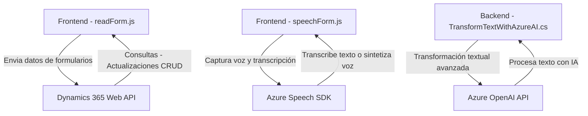

### Breve resumen técnico
El repositorio contiene tres archivos relevantes: `readForm.js`, `speechForm.js` y `TransformTextWithAzureAI.cs`, orientados a la interacción con formularios de Dynamics 365 y servicios de Azure (Speech SDK y OpenAI API). Reflejan un enfoque basado en eventos y cliente-servidor, con integración de servicios cognitivos de Azure.

---

### Descripción de arquitectura
1. **Tipo de solución**: 
   - La solución parece orientada a complementar una plataforma CRM (Dynamics 365), proporcionando funcionalidades adicionales mediante un **frontend interactivo en JavaScript** y extensiones del lado del servidor con un plugin (`TransformTextWithAzureAI.cs`) desarrollado en C#.

2. **Tipo de arquitectura**:
   - **Arquitectura de tres capas**:
     - Capa de presentación: Archivos JavaScript (`readForm.js`, `speechForm.js`) utilizados para capturar datos y realizar operaciones en Dynamics 365.
     - Capa de lógica de negocio: Plugin en C# (`TransformTextWithAzureAI.cs`) para procesar datos con Azure OpenAI.
     - Capa de datos: Consultas y mapeo de datos dentro de formularios y entidades en Dynamics 365.

   - **Integración de servicios externos**:
     - Azure Cognitive Services para voz a texto y síntesis de voz.
     - Azure OpenAI para transformación avanzada de texto.

   - **Patrón de cliente reforzado por eventos**:
     - Los archivos JavaScript manejan eventos de interacción del usuario en formularios (por ejemplo, captura de voz y transcripciones).

---

### Tecnologías usadas
1. **Frontend**:
   - **JavaScript**: Para lógica basada en cliente y manipulación de formularios en Dynamics 365.
   - **Azure Speech SDK**: Reconocimiento y síntesis de voz.
   - **AJAX/Dynamics Web API**: Interacción directa con formularios y consultas en Dynamics backend.

2. **Backend**:
   - **C#/.NET Framework**: Extensiones y lógica del servidor mediante el entorno CRM Dynamics 365.
   - **Azure OpenAI API**: Servicios de inteligencia artificial para procesamiento de texto.
   - **Newtonsoft.Json**: Manejo de estructuras JSON deserializadas.

3. **Servicios externos**:
   - Dynamics 365 Web API para consultas y operaciones CRUD.
   - Azure Cognitive Services y Azure OpenAI para reconocimiento de voz e IA.

---

### Dependencias y componentes externos
1. **Azure Speech SDK**:
   - Reconocimiento de voz y síntesis.
   - Interacción con el navegador mediante carga dinámica de scripts.

2. **Azure OpenAI API**:
   - Procesamiento lingüístico avanzado para la transformación de elementos de un formulario.

3. **Dynamics 365 Web API**:
   - Actualización de registros y ejecución de consultas en tiempo real.

4. **Librerías de terceros**:
   - **Newtonsoft.Json** y **System.Text.Json**: Para la serialización y deserialización de datos estructurados.

---

### Diagrama Mermaid compatible con GitHub Markdown

---

### Conclusión final
El repositorio se enfoca en integrar servicios cognitivos y de inteligencia artificial con la plataforma CRM Dynamics 365. Esto permite enriquecer la experiencia del usuario en formularios mediante interacción natural (voz y texto). La solución presenta una arquitectura de tres capas, con fuerte dependencia de servicios externos como Azure Speech SDK y Azure OpenAI. El diseño respeta principios como modularidad, asincronía y escalabilidad mediante APIs externas.