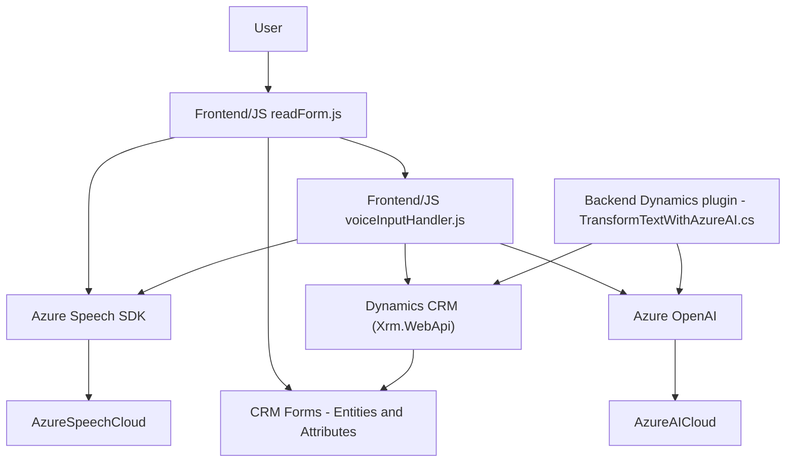

## Resumen técnico

Los archivos y componentes analizados por su funcionalidad son parte de un ecosistema destinado a interactuar con formularios, voz e inteligencia artificial en el contexto de Microsoft Dynamics 365 CRM. Esto involucra la integración externa con servicios como Azure Speech SDK y Azure OpenAI, además de dependencias propias del sistema CRM como `Xrm.WebApi` y el diseño de plugins para procesamiento específico.

## Descripción de la arquitectura

La solución representa una arquitectura **híbrida** orientada a servicios externos (Azure Speech y OpenAI), que integra funcionalidades de procesamiento de voz, reconocimiento de texto y transformación de valores en un entorno CRM (Dynamics 365). La arquitectura presenta claras separaciones de responsabilidades:

1. **Frontend/JS:** Gestiona la interacción visual del formulario y funcionalidades para la síntesis y entrada de voz.
2. **Backend/Plugins:** Ejecución de lógica avanzada, como procesamiento del texto mediante Azure y resultado estructurado vía plugin.
3. **Azure APIs:** Servicios externos para Speech-to-Text y AI-driven transformations.
4. **CRM Integration:** Directamente vinculado a Dynamics CRM mediante APIs como `Xrm.WebApi` y características estándar del sistema.

Predominan los patrones **modular**, **repository/service connectivity** (interacciones con APIs), y **dependency injection** (usa `IServiceProvider` en los plugins y carga dinámica del SDK).

## Tecnologías usadas

1. **Frontend:**
   - **JavaScript**: Idioma principal para interactuar con formularios y el SDK.
   - **Azure Speech SDK**: Posibilita la síntesis y el reconocimiento de voz.
   - **Documents API**: Manipulación de DOM.
   - **Customization APIs (Dynamics CRM)**: Utiliza `executionContext` y `Xrm.WebApi`.

2. **Backend (Dynamics CRM Plugin):**
   - **Microsoft Dynamics CRM SDK**: Para implementación de plugins con `IPlugin`.
   - **Azure OpenAI**: Para procesar y estructurar texto.
   - **HTTP Client**: Para comunicarse con el servicio externo.
   - **JSON Libraries**: `System.Text.Json` y `Newtonsoft.Json.Linq`.

3. **Architecture and patterns**:
   - **Dynamic Script Loading**: Carga de SDK externo desde una URL en tiempo de ejecución.
   - **Data Mapper Pattern**: Transformación de datos visibles a estructuras internas y viceversa.
   - **Plugin for CRM**: Implementación directa con Dynamics CRM como evento personalizado.
   - **Hybrid Cloud Integration**: Interconexión nativa entre servicios locales (CRM) y plataformas en la nube (Azure).

## Diagrama **Mermaid**

## Conclusión final

La solución está diseñada con una arquitectura **híbrida** que aprovecha servicios externos (Azure Speech/OpenAI) y funcionalidades nativas de Dynamics CRM para ofrecer capacidades avanzadas en formularios y procesamiento de datos. El uso de patrones como la modularidad, integración API y carga dinámica asegura flexibilidad, escalabilidad y mantienen la separación de responsabilidades entre el frontend, backend, y los servicios en la nube.

Sin embargo, el diseño podría beneficiarse de mejores prácticas, como externalizar claves de configuración y regiones en variables de entorno para elevar la seguridad. Este sistema, aunque bien estructurado, muestra una dependencia en servicios terceros que podría encarecer el mantenimiento a largo plazo.