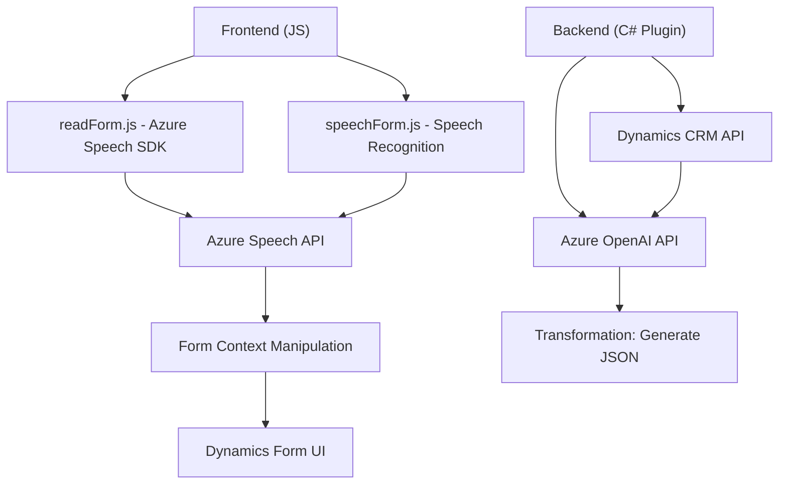

### Breve Resumen Técnico
El repositorio contiene una solución híbrida que combina funcionalidades de frontend y backend, integrándose con servicios de Microsoft Dynamics CRM y Azure AI (Speech y OpenAI). Proporciona dos componentes principales: reconocimiento de voz y síntesis de texto a voz en frontend (JavaScript), y un plugin escrito en C# para transformaciones contextuales mediante Azure OpenAI vinculadas con Dynamics 365.

### Descripción de Arquitectura
La arquitectura es una solución distribuida que incluye:
1. **Frontend**: Usa JavaScript en el navegador para interactuar con formularios de Dynamics CRM y delegar tareas de procesamiento a servicios de Azure Speech SDK.
2. **Backend CRM Plugin**: Implementa un plugin en C# que actúa como middleware entre Dynamics CRM y Azure OpenAI.
3. **API Integraciones**: Integración con APIs de Azure Speech y OpenAI configuradas como microservicios, potenciando la capacidad de procesamiento y operación.

**Tipo de arquitectura**: 
- **Distribuida** con componentes modulares para frontend y backend.
- La interacción con APIs y el desacoplamiento de funcionalidades específicas (transcripción, síntesis de voz, procesamiento AI) sugieren patrones como **microservicios**.

### Tecnologías Usadas
1. **Frontend**:
   - JavaScript con integración de Dynamics 365 API (`formContext`, `Xrm.WebApi.online.execute`).
   - Azure Speech SDK para síntesis y reconocimiento de voz.

2. **Backend**:
   - C# implementando un plugin para Dynamics CRM con la interfaz `IPlugin`.
   - Uso de `Newtonsoft.Json` y `System.Net.Http` para manejo de JSON y solicitudes HTTP.
   - Azure OpenAI API para transformación de datos.

### Dependencias y Componentes Externos
1. Azure Speech SDK: Para la síntesis y reconocimiento de voz.
2. Azure OpenAI API: Para la transformación textual avanzada.
3. Dynamics CRM Web API (`Xrm.WebApi.online.execute`): Para gestionar datos y ejecutar lógica de negocio del CRM.
4. Externos:
   - `HttpClient` y servicios cognitivos basados en la nube.
   - JSON manipulación con `Newtonsoft.Json.Linq` y `System.Text.Json`.

---

### Generación de Diagrama Mermaid

---

### Conclusión Final
La solución representa un sistema distribuido conectado al ecosistema Dynamics CRM utilizando componentes frontend y backend. Está orientada principalmente a la mejora de la experiencia del usuario con capacidades de inteligencia artificial como síntesis y reconocimiento de voz, junto con la transformación de información basada en reglas mediante Azure OpenAI. La arquitectura modular y la integración con servicios distribuidos (Speech SDK, OpenAI) hacen que la plataforma sea escalable y adaptable a diferentes necesidades empresariales.