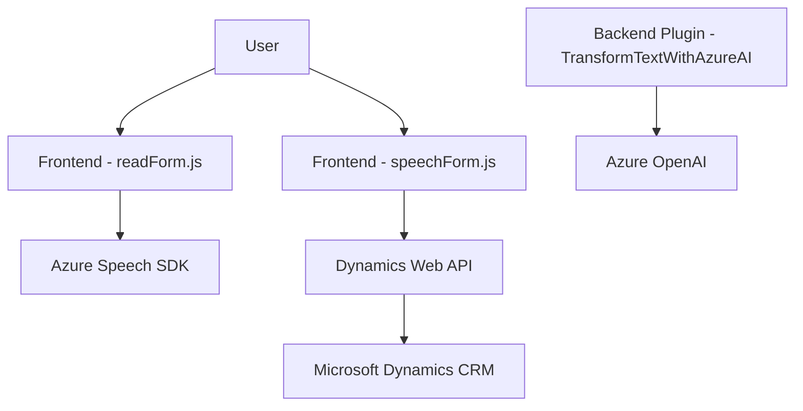

### Breve Resumen Técnico

El repositorio parece estar diseñado para extender la funcionalidad de Microsoft Dynamics CRM, integrándose con servicios de reconocimiento vocal (Azure Speech SDK), procesamiento de texto avanzado (Azure OpenAI) y manipulación de formularios. Implementa funcionalidades específicas para interactuar con usuarios mediante voz y realizar actualizaciones en formularios basadas en transcripciones de voz. También incluye un plugin personalizado para transformar texto en estructuras JSON usando inteligencia artificial.

---

### Descripción de Arquitectura

1. **Tipo de solución:**  
   Este sistema se compone de múltiples componentes enfocados en extender la funcionalidad de CRM:
   - **Frontend:** Scripts JavaScript (`readForm.js`, `speechForm.js`) que interactúan con el DOM y servicios externos como Azure Speech SDK.
   - **Backend:** Plugins como `TransformTextWithAzureAI.cs` diseñados para ejecutar lógica personalizada en Dynamics CRM.
   - **Servicios Externos:** Integra SDKs y APIs externas como Azure Speech y Azure OpenAI.

2. **Arquitectura:**  
   - **Modelo de Plugins:** El archivo `.cs` sigue el patrón de arquitectura basado en eventos, donde el código se ejecuta al activarse eventos dentro de Dynamics CRM.  
   - **N-Capas:** Existe separación conceptual entre frontend (interfaz y scripts), backend (API CRM y lógica del plugin) y servicios externos (Azure Speech y OpenAI).  
   - **Microservicios/Integración externa:** Por su interacción con APIs como Azure OpenAI y Azure Speech SDK, incluye características propias de una arquitectura basada en servicios.  

3. **Patrones y Tecnologías Utilizadas:**  
   - **Frontend:**  
     - **Modulación de código:** Código estructurado en funciones desacopladas.
     - **Event-driven:** Uso de eventos para reconocer voz y procesar formularios.  
     - **Azure Speech SDK:** Interacción vocal.  
   - **Backend:**  
     - **Microsoft Dynamics CRM Plugins:** Extensión del sistema.
     - **Integración con Azure OpenAI:** Uso intensivo de servicios externos de IA.
     - **RESTful API:** Comunicación mediante HTTP para obtener respuestas estructuradas de servicios IA.  
   - **Patrones:**  
     - **Facade Pattern:** Simplificación de operaciones complejas para síntesis de voz y manejo de formularios.
     - **Single Responsibility:** Cada módulo tiene un propósito claro.  
   - **Asincronía:** Promesas y eventos son fundamentales para garantizar el manejo ordenado de dependencias.  

4. **Dependencias o Componentes Externos:**  
   - **Frontend:**
     - Azure Speech SDK (carga dinámica mediante `<script>`).
     - Dynamics Web API para interacción con entidades y APIs personalizadas.
   - **Backend:**
     - Microsoft Dynamics SDK (IPlugin, IOrganizationService).
     - Azure OpenAI para procesamiento de texto avanzado.
     - HTTP Client (`System.Net.Http`) para comunicación con OpenAI.
   - **Otros:**  
     - JSON manipulation (e.g. `Newtonsoft.Json.Linq`, `System.Text.Json`) para manejo de datos estructurados.

---

### Diagrama Mermaid

---

### Conclusión Final

Este repositorio implementa una solución híbrida que extiende Dynamics CRM utilizando un enfoque modular. Combina integración vocal (a través de Azure Speech SDK) y procesamiento avanzado de texto (Azure OpenAI), todo ello alineado bajo una arquitectura basada en n capas con integración de servicios externos. Su diseño cumple con los principios de responsabilidad única, integración de eventos y desacoplamiento, lo que lo hace adaptable y extensible para futuras mejoras o soporte de otros contextos empresariales.