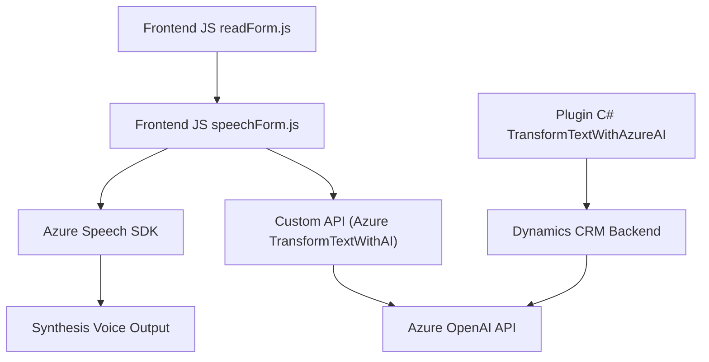

## Breve Resumen Técnico
La solución presentada parece ser un sistema que integra capacidades de síntesis de voz, reconocimiento de entrada por voz y procesamiento avanzado de texto a través de servicios externos (Azure Speech SDK y Azure OpenAI) en formularios interactivos dentro de Dynamics 365. Incluye tres componentes principales: 
1. Módulos de frontend para voz y formularios.
2. Un plugin en backend que interactúa con Dynamics CRM y Azure OpenAI para procesamiento avanzado.

---

## Descripción de Arquitectura
### Tipo de Solución
La solución integra tres dimensiones:
1. **Frontend interactivo**: Implementado en JavaScript, vinculado a la interfaz de formularios en Dynamics 365.
2. **Backend plugin**: Implementado en C#, diseñado para extender las capacidades de Dynamics CRM.
3. **Servicios Externos**: Usa el SDK de Azure Speech y la API de Azure OpenAI, delegando la lógica de síntesis y procesamiento de texto a servicios externos.

### Tipo de Arquitectura
La arquitectura global sigue un enfoque de **arquitectura basada en capas**:
1. **Frontend (capa de presentación)**: Maneja interacción con el usuario (formulario, entrada por voz).
2. **Backend plugin (capa de negocio)**: Procesa datos y lógica compleja dentro del CRM.
3. **Servicios externos (capa de integración)**: Realiza funciones avanzadas delegando a Azure Speech SDK y OpenAI servicios.

### Dependencias Internas y Externas:
- **Internas**:
  - Dynamics 365 XRM API: Manipulación de formularios y atributos.
  - Servicios JSON: Para serialización y deserialización de valores.
  - Modularidad entre funciones frontend: Reutilización del manejo de voz/datos.
- **Externas**:
  - Azure Speech SDK: Para síntesis y reconocimiento de voz.
  - Azure OpenAI API: Procesamiento de texto mediante GPT.
  - HTTP (System.Net.Http): Comunicación con APIs externas.

---

## Tecnologías Usadas
1. **Frontend:** 
   - **JavaScript**: Manipulación de datos de formulario y lógica interactiva.
   - **Azure Speech SDK**: Reconocimiento por voz y síntesis.
2. **Backend Plugin:**
   - **C#**: Implementación de lógica en plugins para Dynamics CRM.
   - **Newtonsoft.Json**: Serialización/deserialización de JSON.
   - **Dynamics CRM SDK (XRM)**: Extensión y manipulación de datos.
3. **Servicios Externos:**
   - **Azure OpenAI GPT API**: Procesamiento avanzado de texto.
   - **REST HTTP**: Comunicación entre componentes y servicios.

---

## Diagrama Mermaid
Diagrama que describe la interacción entre los componentes principales de la solución:

---

## Conclusión Final
La solución representa una **arquitectura en capas** que integra interacción en tiempo real del usuario mediante síntesis y reconocimiento de voz y procesamiento avanzado de texto. El frontend gestiona la experiencia gráfica y el reconocimiento de voz con Azure Speech, mientras que el backend maneja lógica de negocio y procesamiento profundo con OpenAI API. Esta arquitectura modular y escalable es ideal para formularios dinámicos y altamente interactivos en contextos empresariales como Dynamics 365.