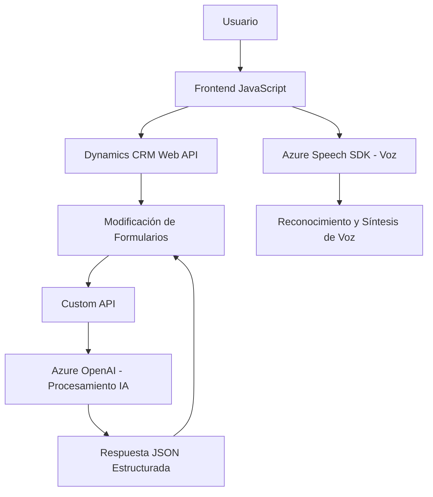

### Breve resumen técnico

El repositorio describe un conjunto de funcionalidades diseñadas para integrar procesamiento de voz y texto entre formularios dinámicos en Dynamics CRM y servicios externos, como Azure Speech SDK y Azure OpenAI. Esto facilita la interacción hablada y procesamiento basado en IA para datos de CRM, transformando entradas y salidas relevantes.

---

### Descripción de arquitectura

La arquitectura observable combina características de **n-capas** y **event-driven architecture**, con integración de servicios externos utilizando patrones de **API Gateway** y **external library dependency**. La solución se estructura en tres capas principales:

1. **Frontend (JavaScript)**: 
   - Procesa lógica interactiva del usuario. Utiliza el Azure Speech SDK para reconocer y sintetizar voz, y realiza manipulación directa en formularios de Dynamics CRM.

2. **Backend Plugins (C#)**:
   - Extiende la funcionalidad CRM implementada en Dynamics mediante el uso de plugins que invocan servicios de Azure OpenAI para personalizar y transformar datos de voz o texto a objetos JSON enriquecidos.

3. **Servicios Externos**: 
   - Se integran servicios como Azure Cognitive Services (Speech SDK, OpenAI) para reconocimiento avanzado de voz y procesamiento en lenguaje natural.

---

### Tecnologías usadas

1. **Frontend (JavaScript)**:
   - **Azure Speech SDK**: Reconocimiento y síntesis de voz.
   - **DOM API**: Manipulación dinámica del frontend.
   - **Dynamics CRM Web API**: Interacción con atributos de formularios CRM.

2. **Backend (C#)**:
   - **Azure OpenAI**: Procesamiento de texto y generación de JSON.
   - **Dynamics Plugin Framework**: Gestión de eventos de CRM.
   - **Newtonsoft.Json**: Serialización de datos JSON.
   - **System.Net.Http**: Comunicaciones con servicios externos mediante REST.

3. **Patrones de diseño**:
   - **Facade**: Usa funciones encapsuladas para manejar SDKs externos.
   - **Dependency Injection**: En el backend para desacoplar lógica del plugin.
   - **Event-Driven Architecture**: Basado en eventos de CRM y callbacks.

---

### Diagrama Mermaid válido para GitHub

---

### Conclusión final

Este repositorio presenta una solución integrada y avanzada para la interacción por voz con formularios en entornos Dynamics CRM, utilizando tecnologías modernas como Azure Speech SDK y OpenAI para ofrecer capacidades mejoradas de reconocimiento de lenguaje, síntesis de voz y procesamiento de datos en JSON. La estructura modular y la combinación de frontend, backend, y conexiones con servicios externos hacen que esta solución sea robusta, extensible y adecuada para escenarios empresariales interactivos. 

En general, la implementación es sólida y reutilizable, aunque podría beneficiarse de mejoras relacionadas con la seguridad (como evitar API Keys escritas en el código) y configuraciones dinámicas para endpoint y versiones de servicios.