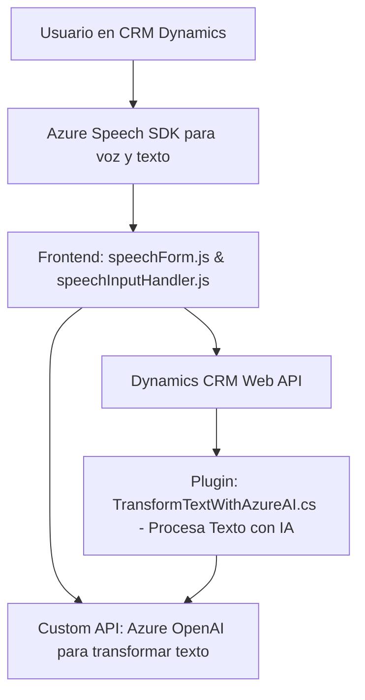

### Breve resumen técnico

El repositorio presenta una solución combinada que integra **tecnologías de inteligencia artificial** y **API externas** para la interacción con formularios mediante reconocimiento de voz (Azure Speech SDK) y procesamiento avanzado de texto (Azure OpenAI). Está orientado al trabajo en entorno **Dynamics 365 CRM**, manejando datos de usuarios en formularios y transformándolos mediante servicios de IA.

### Descripción de arquitectura

#### Tipo de solución
- Es un **sistema híbrido**, compuesto por una **capa frontend** que interactúa dinámicamente con formularios, una **capa backend plugin** para procesamiento avanzado mediante API externas (Azure OpenAI), y elementos de integración a **Dynamics CRM**.

#### Arquitectura
- Se observa una **arquitectura de n capas**:
  1. **Frontend (JavaScript)**: Trata la interacción de usuarios en el navegador con el SDK de Azure Speech y gestiona datos en formularios.
  2. **Backend (Dynamics Plugins)**: Procesa texto y lógica avanzada con Azure OpenAI, como parte del ciclo de negocio del CRM.
  3. **Servicios externos (Azure)**: SDKs y APIs que cuentan como servicios auxiliares modulares para reconocimiento de voz y generación de texto.
  
    Aunque hay una integración fuerte entre las capas, el diseño orientado a **modularización y desacoplo por servicios** hace que las capas sean flexibles.

#### Patrones utilizados
- **Modularidad**: Separación de responsabilidad por archivo y función, con funciones dedicadas para carga de SDKs, procesamiento de datos, integración de APIs, etc.
- **Capa Plugin**: Uso del patrón de plugin para extender funcionalidades dentro de Dynamics CRM.
- **Promesas y Asincronismo**: Integración dinámica de servicios externos utilizando callbacks y promesas.
- **Delegación Condicional**: Verificación de disponibilidad de dependencias antes de ejecutar procesos dependientes.

### Tecnologías usadas

1. Backend:
   - **C# con Microsoft Dynamics SDK**: Implementa plugins para la transformación de texto y la interacción con la base de datos del CRM.
   - **Azure OpenAI**: Servicio de inteligencia artificial (GPT-4o) para transformación de texto a JSON.
   - Utils: `HttpClient`, `System.Text.Json` (serialización/deserialización de JSON).

2. Frontend:
   - Frameworks:
     - **Azure Speech SDK**: Reconocimiento y síntesis de voz a texto.
   - SDK de integración con **Dynamics 365 CRM Web API**.
   - Modern ES6 JavaScript, promesas y asincronismo.

3. Servicios externos:
   - **Azure Speech SDK**: Para reconocimiento de voz y síntesis de texto a voz.
   - **Azure OpenAI**: Procesamiento de texto avanzado con inteligencia artificial.

### Diagrama Mermaid

### Conclusión final

El repositorio corresponde a un sistema de **integración avanzada de servicios externos** en Dynamics CRM. Se enfoca en la optimización del flujo de interacción en formularios mediante funciones innovadoras, como el reconocimiento de voz, la síntesis en tiempo real, y el procesamiento de texto basado en IA. La arquitectura modular y el uso de n capas (frontend, backend plugin, y servicios externos) garantiza flexibilidad y escalabilidad. Sin embargo, su dependencia de servicios de Azure requiere una configuración externa robusta y podría influir en costos operativos.