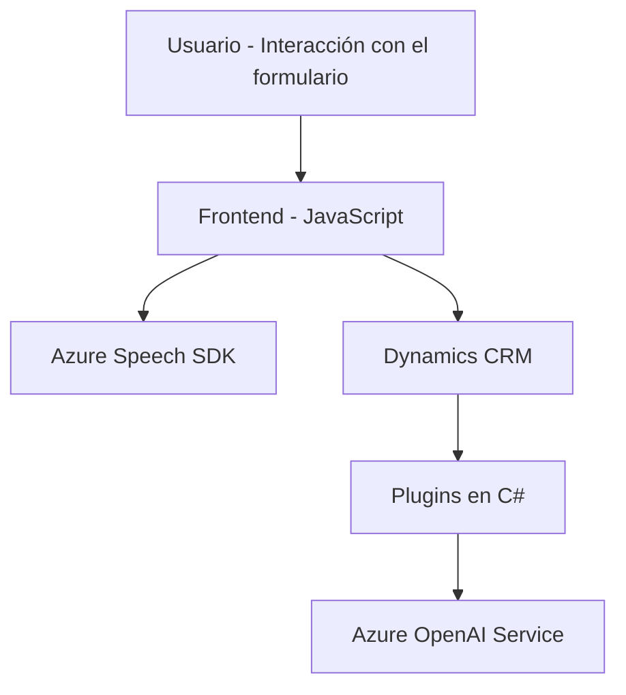

### Breve resumen técnico

El repositorio presenta una solución orientada a la interacción con Dynamics CRM. Principalmente, implementa funcionalidad para el manejo de formularios y reconocimiento de voz, junto con un plugin para transformación de texto. Utiliza Azure Speech SDK para síntesis y reconocimiento de voz, y Azure OpenAI para procesamiento de texto. Los componentes muestran una arquitectura compartimentada que integra una interfaz de frontend con lógica en el backend.

---

### Descripción de arquitectura

La solución utiliza una arquitectura modular de **n capas**, con distintas responsabilidades distribuidas entre frontend, lógica de negocio (CRM plugins), y servicios externos (Azure Speech SDK y Azure OpenAI). 

1. **Frontend**:
   - Permite la interacción directa con usuarios mediante funciones JavaScript que procesan formularios y manejan reconocimiento vocal.  
   - Se comunica con Dynamics CRM y Azure Speech SDK.  
2. **Backend (CRM plugins)**:
   - Ejecuta lógica de negocio en Dynamics CRM mediante plugins como `TransformTextWithAzureAI.cs`.  
   - Interactúa con **Azure OpenAI** para transformar texto y devolver resultados estructurados.  
   
Los patrones usados garantizan separación de responsabilidades, integración API, y escalabilidad a través de servicios externos. Además, la modularidad facilita el mantenimiento y expansión de la solución.

---

### Tecnologías usadas

1. **Frontend**:
   - **JavaScript/ES6**: Manipulación de DOM y procesos en tiempo real.
   - **Azure Speech SDK**: Funcionalidad de síntesis de voz y reconocimiento vocal.
   - **JSON**: Intercambio de datos desde API.

2. **Backend (CRM plugins)**:
   - **C# .NET**: Desarrollo de plugins para Dynamics CRM.
   - **Azure OpenAI Service**: Procesamiento y transformación de texto.  
   - **Newtonsoft.Json**, **System.Text.Json**: Manejo de datos JSON.  
   - **Microsoft Dynamics SDK**: Interacción directa con los formularios del CRM.  

---

### Diagrama Mermaid

---

### Conclusión final

La solución integra servicios avanzados de inteligencia artificial (Azure Speech SDK y Azure OpenAI) con la plataforma Dynamics CRM, diseñando una arquitectura modular basada en un modelo de **n capas**. La separación clara de responsabilidades entre la interfaz de usuario, lógica de negocio, y servicios externos asegura escalabilidad y facilita la integración con nuevas tecnologías.