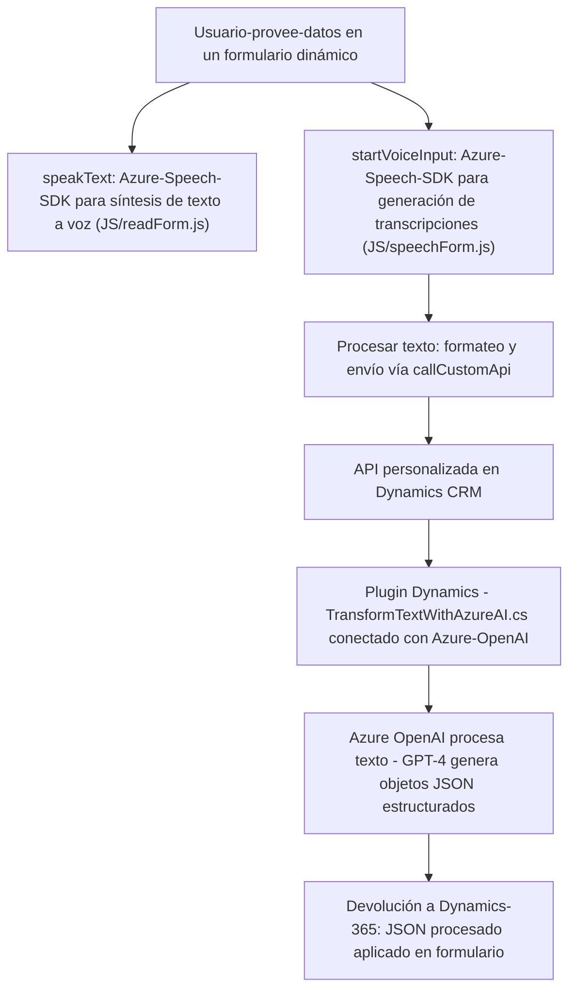

### Breve resumen técnico:
El repositorio contiene implementaciones para funciones que integran el **Azure Speech SDK** y **Azure OpenAI** con **Microsoft Dynamics 365 CRM**. Los scripts permiten la interacción entre formularios dinámicos del cliente, entrada y salida mediante comandos de voz, y procesamiento de dicho texto utilizando modelos de IA para transformarlo en datos estructurados y manipular información en los formularios.

---

### Descripción de arquitectura:
La solución parece seguir una arquitectura desacoplada de tipo **n capas**. La integración con servicios externos (Azure Speech SDK y Azure OpenAI API) complementa la lógica principal de manipulación de datos en CRM. Los módulos JavaScript están implementados con modularidad y dependen principalmente de estos servicios. El **plugin** de Dynamics CRM sigue el patrón de **Plugin Pattern**, integrándose directamente en el ecosistema CRM. Esta arquitectura facilita la evolución del sistema y la adición de nuevas funcionalidades.

---

### Tecnologías usadas:
#### Lenguajes y frameworks principales:
1. **JavaScript**: Para la integración con los formularios y operaciones del cliente.
2. **C# (ASP.NET Framework)**: Aplicado en el archivo de plugin para Microsoft Dynamics CRM.
3. **Azure Speech SDK**: Para operaciones de reconocimiento de voz y síntesis de texto a voz.
4. **Azure OpenAI (GPT-4)**: Para procesamiento del texto transcrito en JSON estructurado y otras transformaciones mediante modelos de IA.
5. **Dynamics 365**: Utilizado como API backend para manipulación de formularios y datos del CRM.

#### Patrones de diseño:
1. **Facade**: Las funciones JavaScript actúan como capas que ordenan la interacción entre múltiples servicios.
2. **Plugin Pattern**: Usado para la integración del plugin `TransformTextWithAzureAI.cs`.
3. **Encapsulación**: Lógica de Azure OpenAI, síntesis de voz y manipulación de datos dividida en funciones individuales y reutilizables.
4. **API Gateway**: Mediación entre servicios externos como Azure Speech SDK, Azure OpenAI, y el CRM para manejar comunicaciones.

#### Dependencias externas:
1. **Azure Speech SDK**: Para reconocimiento y síntesis de voz.
2. **Azure OpenAI API**: Consumo de un servicio de generación de texto con IA para transformar la entrada de voz en JSON.
3. **Microsoft Dynamics CRM Web API**: Manipulación de datos en formularios y búsqueda de información en el CRM.

---

### Diagrama Mermaid (válido para GitHub Markdown):

---

### Conclusión final:
Este repositorio es una solución orientada a facilitar la interacción de datos en formularios dinámicos dentro del entorno de **Microsoft Dynamics CRM** mediante la integración de reconocimiento de voz (**Azure Speech SDK**) y modelos avanzados de IA (**Azure OpenAI - GPT-4**). La arquitectura es de tipo **n capas** y demuestra un enfoque modular que encapsula las responsabilidades dentro de diferentes componentes, lo que resulta útil para mantener el código y extender la funcionalidad hacia nuevos servicios en el futuro.

Esta solución puede ser fácilmente reutilizable en otros proyectos que requieran integración con servicios de Azure o funcionalidades personalizadas dentro del ecosistema Microsoft Dynamics CRM. Sin embargo, sería recomendable realizar mejoras en la gestión de credenciales sensibles y someter el código a pruebas exhaustivas en casos de error dentro de los servicios externos.