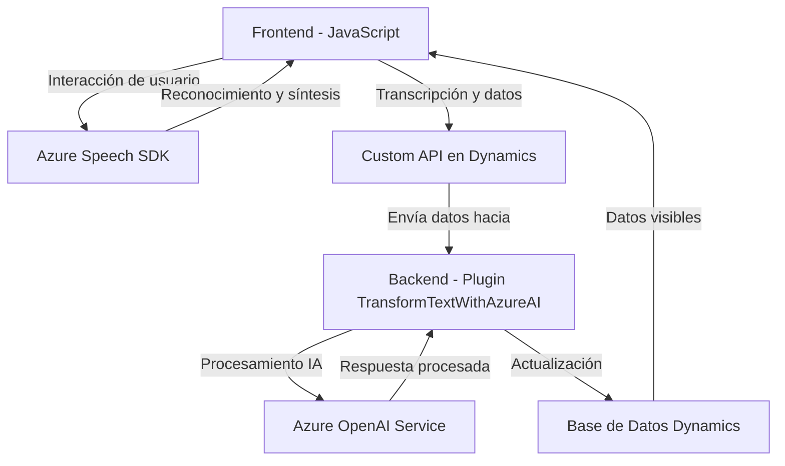

### Breve resumen técnico

Este repositorio parece ser parte de una solución empresarial, notablemente orientada al manejo de formularios en Dynamics 365, potenciando la interacción por voz y la optimización de datos mediante inteligencia artificial (IA). Las tres piezas observadas (dos componentes frontend y un plugin de servidor) utilizan servicios externos como Azure Speech SDK y Azure OpenAI Service para interacción por voz y transformación de datos.

---

### Descripción de arquitectura

#### Tipo de solución
La solución parece combinar un **frontend** (interfaz para interacción del usuario con formularios) con lógica compleja de IA en el backend. Este backend se integra con Dynamics 365 y usa un plugin personalizado para extender su funcionalidad mediante Azure AI.

#### Arquitectura detectada
1. **Arquitectura de N Capas**:
   - Frontend en JavaScript, cuya responsabilidad es interactuar con el usuario.
   - Conexión con APIs que procesan datos transcritos e interactúan con Dynamics 365 (capa de lógica de aplicación).
   - Plugin en C# que actúa sobre la capa de servidor de Dynamics 365.

2. **Patrones identificados**:
   - **Facade Pattern**: En el código JavaScript, las funciones encapsulan la complejidad del SDK y su configuración, simplificando el flujo para integradores.
   - **Plugin Architecture**: En el backend, el plugin se ejecuta bajo reglas predefinidas en el contexto de Dynamics CRM.
   - **External Service Integration**: Fuerte dependencia hacia servicios externos de Azure (Speech SDK y OpenAI).

#### Interacción del flujo
1. El usuario interactúa con el frontend. Los componentes se encargan del reconocimiento de voz, síntesis y lectura de datos del formulario local.
2. Los datos procesados pueden ser enviados a una API personalizada (Dynamics 365) o al plugin en el backend.
3. El plugin transforma los datos con ayuda del Azure OpenAI Service, devolviendo una respuesta al usuario.

---

### Tecnologías usadas

1. **Frontend**:
   - Lenguaje: JavaScript.
   - Servicios: Azure Speech SDK.
   
2. **Backend (Plugin)**:
   - Lenguaje: C#.
   - Framework: Dynamics CRM SDK.
   - Servicios: Azure OpenAI.

3. **Integración API**:
   - Web API de Dynamics 365 (para enviar y recuperar datos estructurados).

4. **Servicios externos**:
   - Azure Speech SDK: Para texto a voz y reconocimiento de voz.
   - Azure OpenAI Service: Transformación textual con el modelo GPT.
   
5. **Dependencias generales**:
   - JSON: Estructuración y manipulación de datos.
   - HTTP: Uso intensivo de solicitudes API (Azure).

---

### Diagrama Mermaid válido en GitHub

---

### Conclusión final

Este repositorio presenta una solución que cumple con los principios de modularidad y extensibilidad, utilizando una arquitectura de **N capas** sobre Dynamics 365. El uso de tecnologías modernas como **Azure Speech SDK** y **Azure OpenAI Service** resalta su enfoque innovador hacia la inclusión de IA y procesamiento basado en voz. Aunque se integra fuertemente con plataformas externas, su estructura garantiza cohesión y desacoplamiento entre los elementos del frontend y el backend.