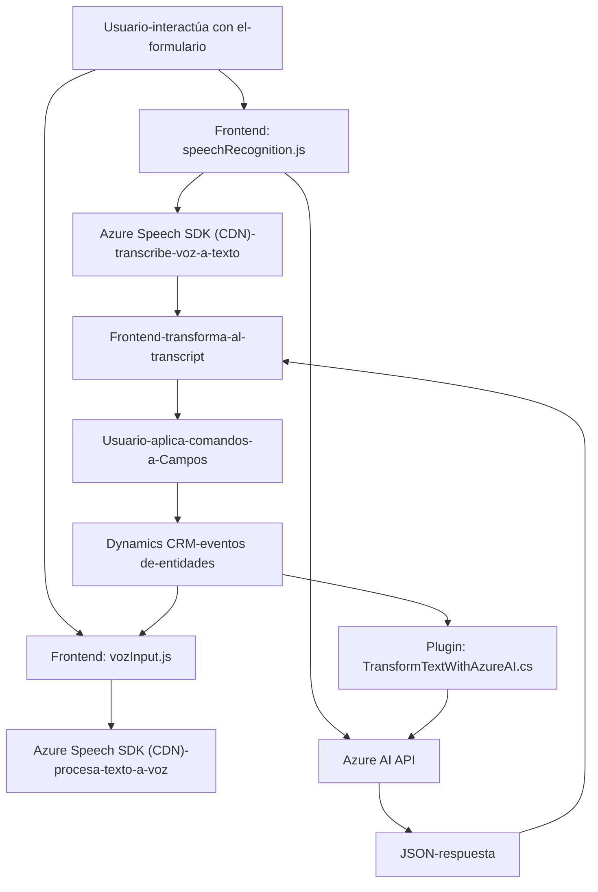

### Breve resumen técnico
Los archivos analizados forman parte de una solución orientada a la integración entre Microsoft Dynamics CRM y servicios de Azure, específicamente Azure Speech SDK y Azure OpenAI. El sistema facilita la interacción por voz con formularios de entidad en Dynamics y ofrece procesamiento avanzado de texto mediante inteligencia artificial.

---

### Descripción de arquitectura
La solución utiliza una **arquitectura n-capas**:
1. **Frontend (JavaScript)**:
   - Gestiona la interacción con el formulario en Dynamics CRM.
   - Proporciona funcionalidades de entrada por voz, procesamiento de texto y actualización dinámica de atributos en los formularios.
   - Carga y utiliza dinámicamente el SDK de Azure Speech.
2. **Integración de plugins (C#)**:
   - Ejecuta lógica personalizada basada en eventos definidos en Dynamics CRM.
   - Conecta Dynamics con Azure OpenAI para transformar texto en estructuras JSON mediante un modelo de IA.
3. **Servicios externos**:
   - Azure Speech SDK: sintetización de voz y transcripción de audio en tiempo real.
   - Azure OpenAI: procesamiento y transformación avanzada de texto mediante modelos de inteligencia artificial.

---

### Tecnologías usadas
1. **Microsoft Dynamics CRM**: Proporciona el contexto y APIs para formularios y datos de entidad.
2. **JavaScript ES6+**: Implementa las funciones frontend para voz y análisis de comandos.
3. **Azure Speech SDK**: Para sintetización de voz y reconocimiento de audio.
4. **Azure OpenAI**: Procesamiento de texto basado en inteligencia artificial.
5. **C# (.NET Framework)**: Para lógica de plugin y conexión backend con Dynamics.
6. **APIs HTTP**: Comunicaciones con Azure OpenAI, utilizando `HttpClient` en C#.

---

### Diagrama Mermaid válido para GitHub

---

### Conclusión final
La solución integra un ecosistema híbrido que extiende las capacidades de Microsoft Dynamics CRM mediante una arquitectura n-capas centrada en servicios externos (Azure). En el **Frontend**, los archivos JavaScript se ocupan de la interacción de voz y la manipulación dinámica del formulario, mientras que en el **Backend**, un plugin en C# actúa como middleware entre Dynamics y Azure OpenAI.

Los patrones de diseño, como modularización funcional, llamadas asíncronas y orientación a microservicios, garantizan una solución escalable y adaptable a distintos requisitos empresariales. La integración con APIs de alta disponibilidad como Azure Speech SDK y Azure OpenAI asegura una experiencia robusta para el usuario final. Sin embargo, se debe revisar la gestión de credenciales y evaluar los costos asociados con el uso de los servicios de Azure.