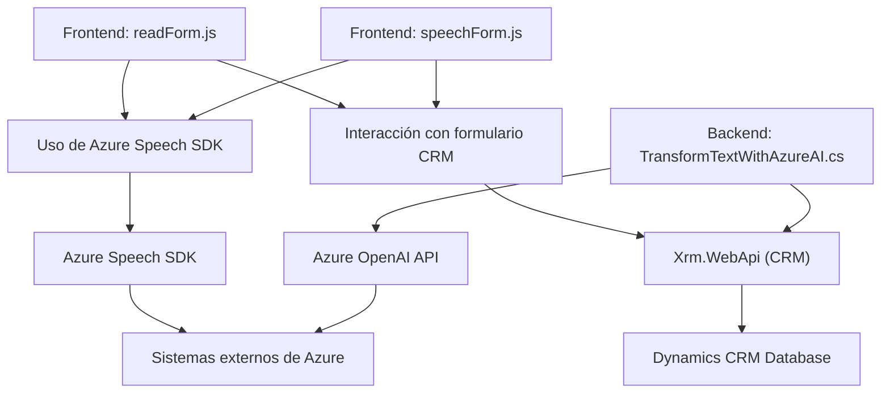

### Breve resumen técnico

El repositorio describe una solución enfocada en la integración de servicios en un entorno CRM (como Dynamics 365), con funcionalidades centradas en el reconocimiento de voz y síntesis de texto mediante **Azure Speech SDK** y procesamiento avanzado con **Azure OpenAI API**. Los archivos muestran dos principales enfoques: interacción con formularios dinámicos a través de JavaScript y un plugin en C# para transformación de texto.

---

### Descripción de arquitectura

La arquitectura presentaría una **aproximación multicapa** o **n-capas** basada en componentes organizados funcionalmente:

1. **Frontend/Interacción dinámica**:
   - Archivos `readForm.js` y `speechForm.js` proporcionan lógica del cliente para manipulación y procesamiento de formularios dinámicos.
   - Uso de voz (sintetización y reconocimiento) para interactuar con datos y formularios CRM.

2. **Backend/Procesamiento avanzado**:
   - `TransformTextWithAzureAI.cs` funciona como un plugin para transformar datos texto entrantes en JSON estructurado utilizando Azure OpenAI.

3. **Servicios externos**:
   - **Azure Speech SDK**: Funcionalidades para síntesis y reconocimiento de voz.
   - **Azure OpenAI API**: Procesamiento avanzado de texto.

---

### Tecnologías usadas

- **Frontend**:
  - *Lenguaje*: JavaScript.
  - *Frameworks y SDK*: 
    - Azure Speech SDK.
    - Dynamics CRM Scripts (e.g., `formContext`, `Xrm.WebApi`).
  - *Patrones*: Modularidad funcional, callbacks para eventos asincrónicos, separación de responsabilidades para facilitar integración con SDK.

- **Backend**:
  - *Lenguaje*: C#.
  - *Frameworks y SDK*: 
    - Microsoft Dynamics SDK (`IPlugin`, `IServiceProvider`).
    - Azure OpenAI API (GPT-4.0).
  - *Patrones*: Plugin Pattern, integración con APIs externas, separación SRP (Single Responsibility Principle).

---

### Dependencias externas y componentes

1. **Azure Speech SDK** (Frontend):
   - Para síntesis de texto en voz y reconocimiento de comandos de voz.
   - Depende de una clave API y configuración de región de Azure.

2. **Azure OpenAI API** (Backend):
   - Procesamiento de texto según reglas definidas.
   - Configuración del endpoint y clave de acceso en Azure.

3. **Xrm.WebApi**:
   - API nativa de Dynamics para manipulación de datos y formularios (CRM).

4. **HTTP client libraries**:
   - `System.Net.Http` y `Json` para comunicación con OpenAI API desde el plugin C#.

---

### Diagrama Mermaid válido para GitHub

---

### Conclusión final

Esta solución presenta una arquitectura **modular de múltiples capas**, con integración de APIs externas (Azure Speech SDK y Azure OpenAI API) y foco en la interacción con un CRM. Los archivos cumplen roles específicos, dividiendo la responsabilidad entre frontend dinámico (formulario, síntesis, reconocimiento de voz) y backend especializado (transformación avanzada de datos con IA). Esto garantiza una separación clara y escalabilidad para soluciones empresariales basadas en voz y texto.