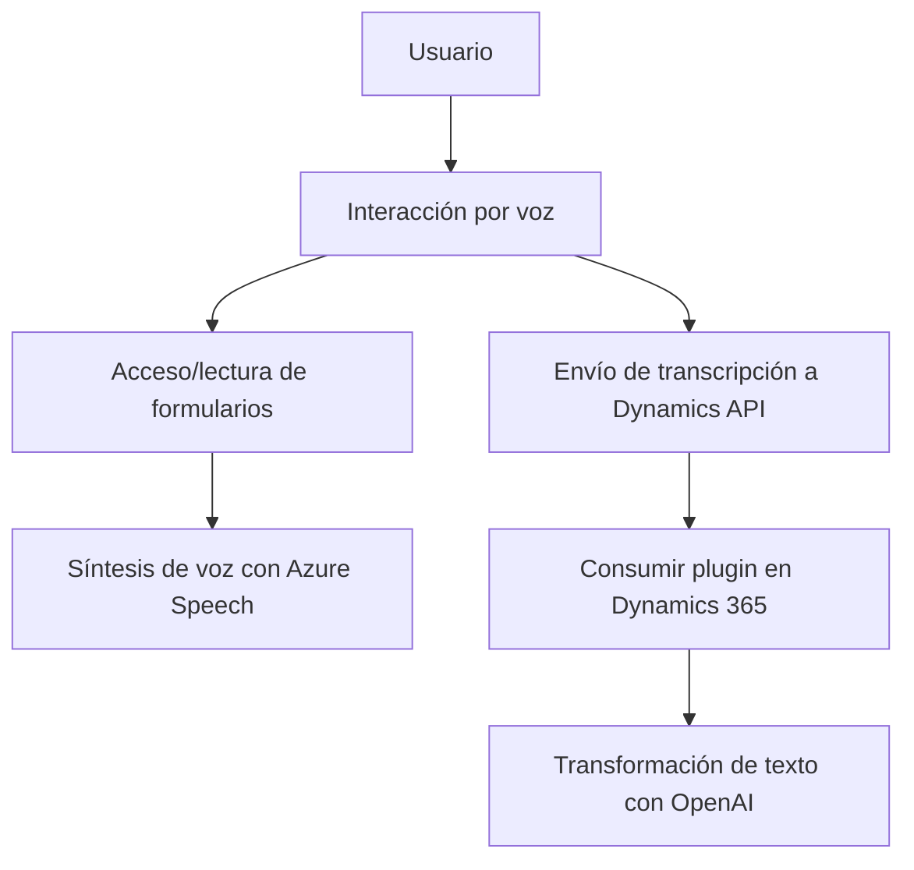

### Análisis técnico

#### Breve resumen técnico
El repositorio describe componentes de una solución que integra reconocimiento de voz, síntesis de texto a voz, y un plugin para manipulación avanzada de texto utilizando inteligencia artificial (Azure OpenAI). Se enfoca en la interacción entre un frontend y una arquitectura basada en Dynamics CRM y servicios de Azure.

#### Descripción de arquitectura
La solución implementa una arquitectura **n-capas** donde cada capa se encarga de responsabilidades específicas:
1. **Frontend (JavaScript)**: Provee interacción con formularios y utiliza Azure Speech SDK para el reconocimiento de voz y síntesis de texto a voz.
2. **Backend (Dynamics Plugins)**: Un plugin que extiende la funcionalidad de Dynamics CRM para permitir transformaciones de texto dinámicas mediante un servicio externo (Azure OpenAI).
3. **Servicios externos**:
   - **Azure Cognitive Services**: Para procesamiento de síntesis de texto a voz y reconocimiento de voz.
   - **Azure OpenAI API**: Para procesamiento avanzado de texto con capacidad de IA.

Aunque hay separación entre componentes, las capas dependen entre sí, lo que implica algunas características propias de un sistema **cliente-servidor** en lugar de ser puramente basado en microservicios o arquitectura hexagonal.

La solución sigue principios de arquitectura modular, dividiendo su lógica por responsabilidades en el cliente y el servidor.

#### Tecnologías usadas
1. **Frontend (JS)**:
   - JavaScript (vanilla), utilizado para manipulación de DOM, extracción de datos de formularios y conexión con servicios externos.
   - Azure Speech SDK para reconocimiento de voz y síntesis de texto a voz.
   - Uso de lógica orientada a eventos mediante callbacks y promesas.
2. **Backend**:
   - Microsoft Dynamics CRM SDK para la interacción directa con la plataforma Dynamics CRM.
   - Microsoft Azure OpenAI API para transformar texto con inteligencia artificial.
   - API externas manejadas utilizando `HttpClient` para solicitudes REST.
3. **Librerías adicionales**:
   - `Newtonsoft.Json` y `System.Text.Json` para gestionar JSON.
   - `Xrm.WebApi.online` para las operaciones con Dynamics 365 desde el cliente.

#### Dependencias o componentes externos
1. **Azure Speech SDK**: Utilizado para la síntesis de texto y reconocimiento de voz. Se carga dinámicamente en el frontend.
2. **Azure OpenAI API**: Procesa texto mediante IA, utilizando el modelo GPT-4 de OpenAI, específicamente desplegado en Azure.
3. **Dynamics 365 Web API y Plugins**:
   - Para ejecutar operaciones sobre formularios dinámicos y entidades relacionadas.
   - Personalización a través de integraciones como `TransformTextWithAzureAI`.

#### Diagrama Mermaid válido para GitHub

### Conclusión final
La solución es una integración de frontend (JavaScript) con funcionalidades avanzadas de reconocimiento de voz y síntesis de texto a voz utilizando **Azure Cognitive Services Speech SDK**, conectado a un **backend de Dynamics CRM** mediante una **Custom API** y un **plugin C#**. El backend utiliza el Azure OpenAI API para transformar y procesar datos con IA. Aunque no se implementa una arquitectura completamente desacoplada como la microservicios o hexagonal, tiene una separación entre capas que sigue buenas prácticas de modularización y responsabilidades, además de emplear servicios externos.