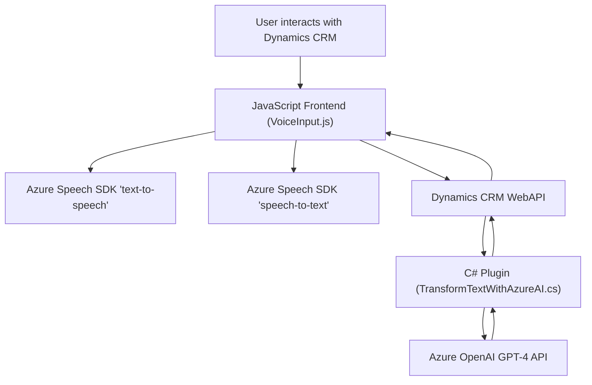

### Breve resumen técnico
El repositorio contiene una solución basada en la integración entre un frontend construido en JavaScript y un Microsoft Dynamics CRM utilizando plugins en .NET y servicios inteligentes de Microsoft Azure como Azure Speech SDK y Azure OpenAI GPT-4. El propósito principal es habilitar funcionalidades relacionadas con el reconocimiento y síntesis de voz, extracción de datos de formularios, y procesamiento semántico mediante APIs externas.

---

### Descripción de arquitectura
La solución exhibe en general una **arquitectura de n-capas** con componentes distribuidos de la siguiente manera:
- **Frontend**: Maneja la interacción del usuario en el navegador (integrado en Dynamics CRM). Implementa reconocimiento y síntesis de voz usando APIs externas.
- **Backend**: Basado en un plugin (C# + .NET) que interactúa directamente con Azure OpenAI y Dynamics CRM APIs. Este plugin aplica un patrón **delegate** hacia una API externa para realizar la transformación semántica de texto.

La interacción entre el frontend y el backend se realiza principalmente a través de **APIs de Dynamics 365 WebAPI**, utilizando un modelo Request-Response. 

La solución también utiliza una estrategia de **carga dinámica de SDKs**, donde los scripts externos son cargados en tiempo de ejecución para garantizar un acoplamiento flexible con Azure Speech SDK.

---

### Tecnologías usadas
1. **Frontend (JavaScript)**:
   - ECMAScript (modern JavaScript).
   - **Azure Speech SDK**: Habilita la integración de procesos de texto a voz y reconocimiento de voz.
   - Codificación modular y funciones reutilizables.
2. **Backend (.NET)**:
   - C# con .NET Framework, siguiendo el modelo de plugins de Dynamics CRM (`IPlugin`).
   - Azure OpenAI para integración con modelos GPT-4.
3. **Servicios externos**:
   - **Azure Speech Services**: Para reconocimiento y síntesis de voz.
   - **Azure OpenAI Services**: Para transformación y estructuración de textos con GPT-4.
4. **Microsoft Dynamics CRM**:
   - Web API y Dynamics SDK (`Xrm.WebApi`).
5. **Azure Cloud Platform**:
   - APIs de Azure Speech y OpenAI accesibles a través de claves y regiones.

---

### Patrones usados
1. **Modularización**: Dividido en múltiples funciones independientes en el frontend y clases/métodos focalizados en el backend.
2. **Dynamic Loading**: Carga de SDKs solo cuando es necesario, optimizando el rendimiento.
3. **Dependency Injection**: En el plugin, `IServiceProvider` inyecta los servicios de Dynamics.
4. **Plugin Framework**: Configuración orientada a eventos de Dynamics CRM.
5. **Adapter Pattern**: Translate entre estructuras internas y externas en la comunicación con Azure OpenAI API.
6. **N-capas**: Separación entre frontend, APIs externas y backend empresarial.

---

### Diagrama **Mermaid**

- **A**: Representa al usuario interactuando dentro de Dynamics CRM, posiblemente completando formularios o comandos de voz.
- **B**: Es el módulo JavaScript del frontend (VoiceInput.js), el cual se encarga de comunicar instrucciones entre el usuario y los servicios externos.
- **C** y **D**: Representan las funcionalidades de `Text-to-Speech` y `Speech-to-Text` de Azure Speech SDK respectivamente.
- **E**: Es el Dynamics CRM WebAPI, que actúa como puente entre frontend y backend.
- **F**: Plugin transformador basado en C# que extiende la lógica de Dynamics CRM.
- **G**: El punto final de Azure OpenAI para habilitar el procesamiento avanzado mediante GPT-4.

---

### Conclusión final
La solución implementada en este repositorio puede clasificarse como una integración de API externa enriquecida en un entorno de Dynamics CRM a través de un frontend en JavaScript y un backend con .NET plugins. Su arquitectura basada en **n-capas**, combinada con la modularización y patrones como **Dynamic Loading** y **Adapter**, logra una solución flexible y fácilmente extensible que permite sincronizar reconocimiento y síntesis de voz, así como la transformación semántica asistida por IA. Las dependencias principales son los servicios de Azure (Speech SDK y OpenAI) y las APIs de Dynamics CRM.