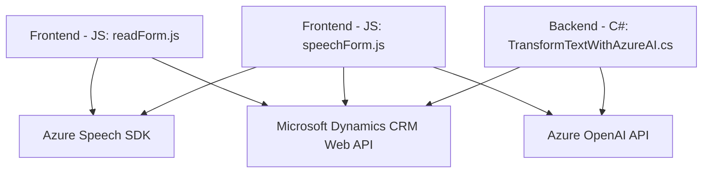

### Breve resumen técnico

Este repositorio parece implementar una solución integral que combina reconocimiento de voz, síntesis de voz y procesamiento de texto mediante inteligencia artificial con integración en Microsoft Dynamics CRM. Contiene funcionalidades claramente separadas en distintos componentes.

---

### Descripción de arquitectura

#### Tipo de solución:
- **Principal enfoque:** APIs y funcionalidades extendidas para aplicaciones empresariales (específicamente para Microsoft Dynamics CRM).
- **Componentes:** 
  - Un módulo de frontend (JavaScript) que opera como extensión del CRM para la interacción con formularios mediante reconocimiento y síntesis de voz.
  - Un plugin backend (C#) que realiza transformación de texto con integración del servicio Azure OpenAI.

#### Tipo de arquitectura:
- **Arquitectura de N Capas (mixta con SOA):** 
  - La solución se construye en capas o módulos específicas para el procesamiento del frontend (interacción con usuarios), servicios externos (Azure Speech y Azure OpenAI) y backend (plugin basado en Dynamics CRM).
  - Uso de **Service-Oriented Architecture** (SOA): Se basa en servicios externos para la funcionalidad principal y trata a Dynamics CRM como un servicio.

---

### Tecnologías usadas

1. **Frontend:**
   - **JavaScript ECMAScript 6**: Implementación modular con programación asincrónica (promesas y callbacks).
   - **Azure Speech SDK**: Para reconocimiento y síntesis de voz.
   - **Microsoft Dynamics CRM Web API**: Interacción directa con el framework CRM.

2. **Backend:**
   - **C#**: Para la creación del plugin.
   - **Microsoft Dynamics CRM SDK**: Para la integración con entidades de CRM.
   - **Azure OpenAI API**: Para procesamiento de lenguaje natural.
   - **Bibliotecas de .NET**: `System.Text.Json`, `System.Net.Http` y `Newtonsoft.Json.Linq` para gestión de datos y solicitudes HTTP.

---

### Dependencias o componentes externos

1. **Azure Speech SDK:** Gestión de reconocimiento de voz y generación de texto a voz.
   - URL dinámico: `https://aka.ms/csspeech/jsbrowserpackageraw`.

2. **Microsoft Dynamics CRM Web API:** Para manipulación de formularios en CRM.

3. **Azure OpenAI API:** Procesamiento de lenguaje natural.
   - Endpoint configurado como: `https://openai-netcore.openai.azure.com/`.

4. **Bibliotecas de .NET:** Para serialización, deserialización JSON y gestión de conexión HTTP:
   - `System.Text.Json`.
   - `System.Net.Http`.
   - `Newtonsoft.Json.Linq`.

---

### Diagrama Mermaid

Aquí está tu diagrama ilustrando los componentes de la solución y sus conexiones, siguiendo la sintaxis requerida.

---

### Conclusión final

El repositorio implementa una solución extensible y modular para mejorar la interacción y procesamiento en Microsoft Dynamics CRM mediante reconocimiento de voz, síntesis de texto a voz y análisis basado en inteligencia artificial. La arquitectura de N capas y el uso de una SOA permiten una integración eficiente entre múltiples servicios externos, como Azure Speech SDK y Azure OpenAI, además de aprovechar el API de Dynamics CRM para manipular datos y formularios.

Si bien la solución es dependiente de servicios externos como los proporcionados por Azure, esta dependencia se maneja mediante técnicas comunes como la programación asíncrona en el frontend y llamadas HTTP en el backend usando el plugin pattern, permitiendo una alta cohesión entre los componentes y baja acoplamiento. 

El diseño del código es limpio, modular y aplica principios sólidos de arquitectura y diseño como responsabilidad única. Para futuras mejoras, se podrían incluir pruebas automatizadas más robustas y explorar la implementación de patrones como diseño hexagonal para mejorar la independencia de los módulos frente a servicios específicos.