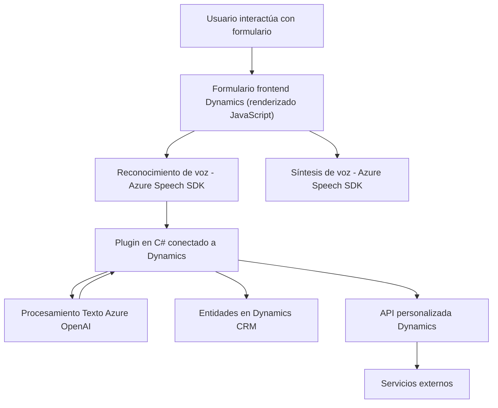

### Breve resumen técnico
El repositorio representa una solución que permite la interacción con el **Microsoft Dynamics 365** mediante un frontend basado en JavaScript y un plugin en C# que se integra con **Azure Speech SDK** y **Azure OpenAI**. Su principal objetivo es captar datos mediante comandos de voz, realizar transcripciones, y transformar o leer texto utilizando la síntesis y procesamiento de lenguaje natural. Está diseñado para ser extensible y modular, adecuado para aplicaciones empresariales.

---

### Descripción de arquitectura
1. **Tipo de solución:**
   - Principalmente una integración de servicios y plataforma: (Frontend con JavaScript, Microsoft Dynamics 365 y Plugins).
   - Presenta características de **API**, **plugin** y **frontend dinámico**, donde los componentes interactúan para procesar y actualizar datos en un entorno CRM.
   - Utiliza el **Speech-to-Text** y **Text-to-Speech** para la interacción con el usuario.

2. **Arquitectura:**
   - **N capas (Multicapa):**
     - Logra una separación lógica en diferentes capas donde:
       - La capa de presentación maneja la interacción entre el usuario y el formulario dinámico (JavaScript).
       - La capa lógica de negocio reside en el plugin C# y lógica procedimental del frontend.
       - La capa de integración consume servicios externos, como el SDK de Azure Speech y Azure OpenAI.
   - **Clientes API consumidores**:
     - Mediante llamadas a APIs personalizadas y consumo de SDKs REST como Azure Speech y OpenAI.
   - Uso de **patrón Plugin** para extender Microsoft Dynamics 365 con lógica personalizada.
   - **Dependencia fuerte en SDK externo (Azure Speech y Dynamics Framework)**.

---

### Tecnologías usadas
- **Plataforma principal:** 
  - **Microsoft Dynamics 365**: Framework CRM para manipulación detallada de entidades.
- **Frontend:** 
  - JavaScript, que interactúa directamente con Dynamics 365 mediante `Xrm.WebApi` y llama a APIs externas si es necesario.
  - Manipulación del DOM y programación asíncrona (`callbacks`).
- **Backend plugin:**
  - **C#** y .NET Framework en la definición de plugins dentro del entorno Dynamics 365.
- **Terceros servicios y SDKs:**
  - **Azure Speech SDK**: Para síntesis y reconocimiento de voz en un navegador Web.
  - **Azure OpenAI API**: Procesamiento avanzado de lenguaje natural.
- **Dependencias adicionales:**
  - `Newtonsoft.Json.Linq` y `System.Text.Json` para manipulación JSON en el plugin C#.

---

### Diagrama Mermaid válido en GitHub Markdown

---

### Conclusión final
La estructura del repositorio corresponde a una solución híbrida centrada en la integración de servicios externos con **Microsoft Dynamics 365**. Implementa una arquitectura **n capas**, separando lógica de presentación, procesamiento y datos. Se destacan patrones como el **Observer**, **Adapter SDK**, y la integración de servicios externos con el propósito de potenciar funcionalidades de voz y procesamiento de lenguaje natural. Su diseño modular permite adaptarlo fácilmente a nuevos requisitos empresariales evolutivos.