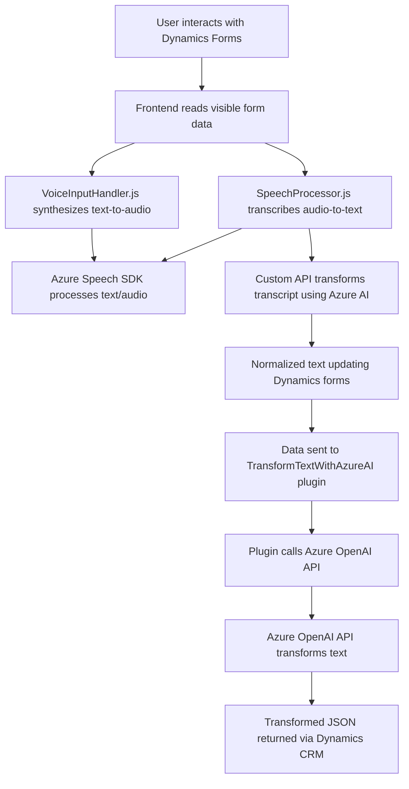

### Breve Resumen Técnico
El repositorio contiene módulos y plugins diseñados para interactuar con formularios contextuales en sistemas como Dynamics CRM, incorporando capacidades avanzadas de procesamiento de voz y texto mediante servicios de Azure AI y Speech SDK.

#### Principales funcionalidades
1. **Front-end (JavaScript)**:
   - Captura y síntesis de voz (de texto visible en formularios a audio).
   - Transcripción de voz (grabación y transformación de audio en texto procesado).
   - Integración con APIs personalizadas y soporte para transformación vía IA.

2. **Back-end (C# Plugin)**:
   - Transformación de texto basado en normas predefinidas utilizando Azure OpenAI.
   - Despliegue como complemento de Dynamics CRM para manipulaciones automáticas de datos a nivel de servidor.

---

### Descripción de Arquitectura

1. **Tipo de Solución**:
   - **Híbrida**: Incluye componentes **frontend (JavaScript)** y **back-end (C#)** dentro de una arquitectura de integración con Dynamics CRM y Azure AI.

2. **Patrones**:
   - **Facades**: Simplificación de interacción con servicios Azure mediante módulos dedicados.
   - **Microservicio orientado a eventos**: Procesamiento basado en disparadores de formularios y grabación por evento.
   - **Adaptadores**: Traducción de formatos de voz y texto hacia estructuras consumibles por formularios.
   - **Injectores de dependencias**: Carga dinámica de SDK externos como Speech SDK.

3. **Arquitectura General**:
   - **Mixta**:
     - Frontend: Modular con patrones de integración.
     - Backend: Plugin de Dynamics CRM, monolítico con puntos de extensión.

---

### Tecnologías Utilizadas

- **Frontend**:
  - JavaScript ES6+.
  - Azure Speech SDK.
  - Eventos y APIs de Dynamics CRM (Xrm.WebApi).

- **Backend**:
  - C# (.NET Framework).
  - Dynamics CRM SDK (Microsoft.Xrm.Sdk).
  - Azure OpenAI Service (vía HTTP).

- **Servicios Externos**:
  - Azure Speech SDK.
  - Azure OpenAI.
  - Dynamics CRM.

---

### Diagrama **Mermaid**

---

### Conclusión Final

**Strengths (Fortalezas):**
- La solución utiliza una combinación efectiva de tecnologías modernas para habilitar interacción dinámica con formularios mediante voz y texto procesado por IA.
- El uso del Azure Speech SDK y OpenAI API asegura un nivel avanzado de funcionalidad.
- Los patrones como Facade y Microservicio orientado a eventos hacen que el sistema sea extensible y modular.

**Opportunities for Improvement (Mejoras):**
- **Seguridad**: Las claves de API deberían gestionarse de forma segura (e.g., Key Vault de Azure) para garantizar la confidencialidad.
- **Documentación**: Detalles más precisos sobre configuración y requisitos de los dependencias pueden favorecer la reutilización del repositorio.
- **Escalabilidad**: Aunque los módulos son independientes, la arquitectura podría evolucionar hacia una estructura de microservicios más definida en el backend.

La solución muestra una arquitectura robusta y preparada para integraciones futuras en sistemas empresariales basados en servicios cognitivos.