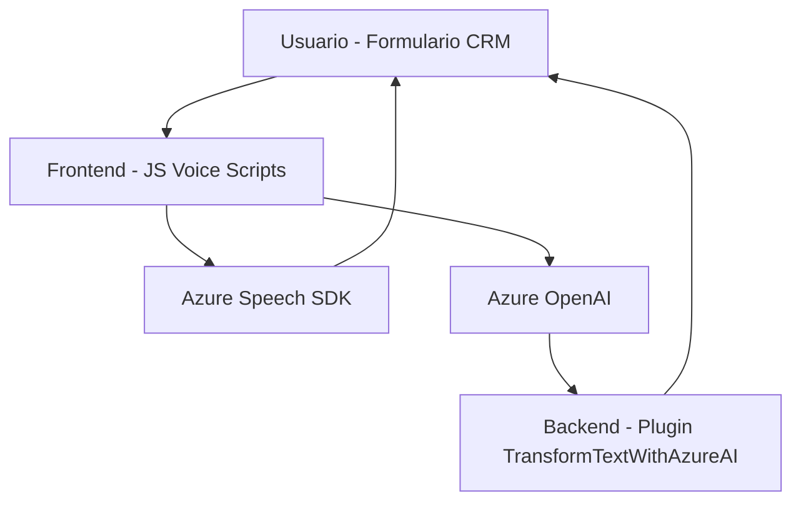

---

### **Breve resumen técnico**

Este repositorio parece ser una solución destinada a integrar funcionalidades de reconocimiento y síntesis de voz, como también procesamiento de texto por inteligencia artificial, para su uso dentro de un sistema basado en Dynamics CRM. Posee archivos específicos para tareas frontend orientadas a la interacción del usuario con formularios mediante comandos de voz, así como plugins backend para procesamiento avanzado del texto, transformándolo en datos estructurados (JSON) usando Azure OpenAI.

---

### **Descripción de arquitectura**

El sistema combina una arquitectura **Cliente-Servidor** que se divide funcionalmente entre:

1. **Frontend/scripts:** Implementación de soluciones que trabajan en el navegador, interactúan con el entorno del formulario en Dynamics CRM y consumen componentes como **Azure Speech SDK** para reconocimiento/síntesis de voz. Este enfoque orienta la interacción del usuario con campos del formulario tanto en escritura como en voz.

2. **Backend/Plugins:** Uso de una capa de procesamiento mediante un **plugin** en Dynamics CRM que invoca servicios externos (Azure OpenAI) para transformar texto en estructuras JSON. La ejecución de este procesamiento tiene reglas específicas dictadas por las normas del sistema CRM.

**Arquitectura general:**  
El diseño sigue principalmente un modelo de **Arquitectura en capas**:
- **Capa de presentación** en el navegador (frontend).
- **Capa de procesamiento** mediante API externa (Azure Speech SDK y OpenAI).
- **Capa de integración en backend** (plugin en Dynamics CRM).

---

### **Tecnologías usadas**
1. **Frontend:**  
   - JavaScript (funciones de interacción con DOM y Azure Speech SDK).  
   - Azure Speech SDK (para reconocimiento y síntesis de voz).  
   - Navegador (interacción DOM y lógica del formulario).

2. **Backend (Dynamics CRM Plugins):**  
   - **C#** (Microsoft Xrm SDK).  
   - Azure OpenAI (procesamiento de texto mediante inteligencia artificial).  
   - `Newtonsoft.Json` (serialización/deserialización de JSON).  
   - `System.Net.Http` (envío de solicitudes REST a servicios externos).

---

### **Diagrama Mermaid válido para GitHub**

---

### **Conclusión final**
El repositorio representa una **solución híbrida** que fusiona interacciones dinámicas en navegador (frontend JavaScript) con potentes capacidades de procesamiento backend (Dynamics CRM + Azure OpenAI). Sigue patrones bien definidos como modularidad, diseño basado en plugins y consumo de API externa. Aunque su estructura es mayormente funcional y de cliente-servidor, su uso extensivo de SDKs y APIs lo acerca a un modelo distribuido. La dependencia está principalmente ligada a los servicios de Azure y Dynamics CRM, haciendo que este diseño sea especializado y fuertemente cohesionado.