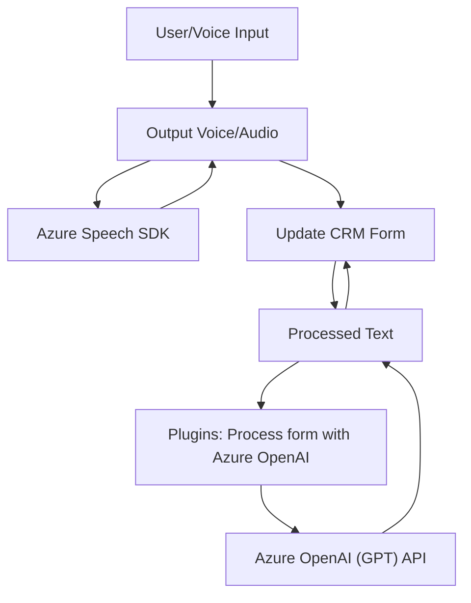

### Breve Resumen Técnico
El repositorio analiza fragmentos de código centrados en la integración entre formularios web, voz como entrada/salida, servicios externos como Azure Speech SDK y Dynamics CRM, y Azure OpenAI. La solución combina funcionalidades en frontend, manejo de voz, y procesamiento avanzado mediante inteligencia artificial.

---

### Descripción de la Arquitectura
1. **Arquitectura del sistema general**:
   - **Multicapa (n-capas)**: Hay una separación clara entre frontend (interacción de usuario y lógica de cliente) y backend (procesamiento avanzado y almacenamiento en Dynamics CRM).
   - **SOA (Service-oriented Architecture)**: Se incluye comunicación explícita con servicios externos: Azure Speech SDK para voz y Azure OpenAI para procesamiento de texto.

2. **Arquitectura interna de los componentes**:
   - **Frontend**: Modular y basado en eventos. Cada función del frontend realiza tareas como entrada de voz, generación de salida de voz, y manipulación DOM.
   - **Plugins (Dynamics CRM)**: Implementación según el patrón de plugins propio de Dynamics CRM. Encapsula lógica para procesamiento basado en eventos, interactuando con Azure OpenAI.

---

### Tecnologías Usadas
1. **Frontend**:
   - Azure Speech SDK (`window.SpeechSDK`): Usado para síntesis de voz y reconocimiento.
   - JavaScript modular: Separación de funciones basada en responsabilidades específicas.
   - Navegación/formularios dinámicos: Manipulación del DOM para interacción con Dynamics CRM.

2. **Backend (Plugins)**:
   - Dynamics CRM SDK (`IPlugin`, `Microsoft.Xrm.Sdk`).
   - Azure OpenAI para procesamiento de texto avanzado (GPT).
   - HTTP para invocación de servicios REST.
   - Serialización JSON (`Newtonsoft.Json`, `System.Text.Json`).

3. **Patrones Implementados**:
   - **Plugin Pattern**: Para ejecución desacoplada en Dynamics CRM.
   - **Cargador Dinámico**: En el frontend para la carga de dependencias (Azure SDK).
   - **Fachada y Delegación**: Métodos encapsulan lógica específica y delegan tareas secundarias a funciones o APIs externas.
   - **SOA (Service-Oriented Architecture)**: Backend realiza tareas específicas delegadas a servicios externos mediante APIs REST.

---

### Dependencias o Componentes Externos Posibles
1. **Azure Speech SDK**: Para reconocimiento y síntesis de voz.
2. **Azure OpenAI**: Procesamiento GPT avanzado.
3. **Microsoft Dynamics CRM**: Como base CRM integrada con front y back.
4. **HTTP APIs**: Utilizadas desde backend para integrarse con Azure.
5. **Librerías JSON**: Para procesar y serializar datos.

---

### Diagrama Mermaid 100% Compatible con GitHub Markdown

---

### Conclusión Final
El repositorio representa una solución que combina funcionalidades avanzadas de interacción por voz con formularios dinámicos y procesamiento inteligente mediante APIs de terceros, como Azure Speech y Azure OpenAI. Su arquitectura modular garantiza extensibilidad, y las integraciones con Dynamics CRM lo hacen ideal para aplicaciones empresariales. El uso de patrones como plugins y carga dinámica asegura un diseño flexible y eficiente frente a necesidades futuras.