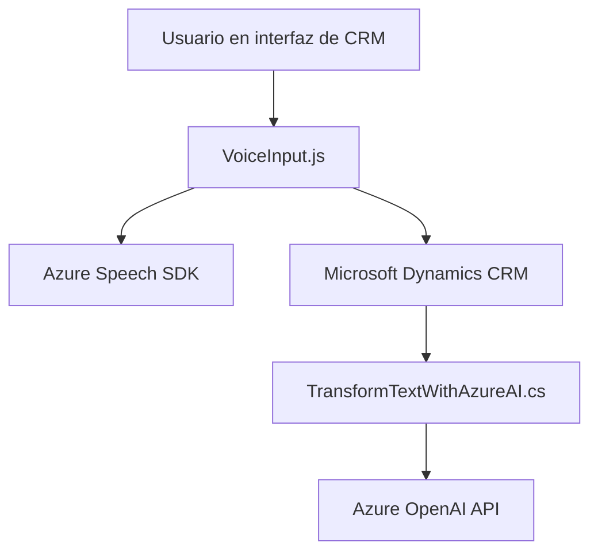

### Breve resumen técnico
Los archivos del repositorio representan fragmentos de una solución que integra servicios cognitivos de Azure con formularios de Dynamics CRM. Proveen funcionalidades de síntesis de voz, reconocimiento de voz e interpretación avanzada vía inteligencia artificial.

### Descripción de arquitectura
La solución corresponde a una arquitectura híbrida:
1. **Front-end**: Aplicación modular que interactúa con formularios dentro de Dynamics CRM para reconocer voz y sintetizar texto utilizando servicios externos como Azure Speech SDK. Esto provee funciones de entrada y salida por voz, además de autocompletado de formularios.
2. **Plugin Back-end**: Componen un plugin en Dynamics CRM para extender la funcionalidad al procesar texto con Azure OpenAI, transformándolo en JSON estructurado. Implementa el patrón de integración con servicios externos.

**Arquitectura general**: La solución está basada en una arquitectura de capas adaptadas:
- **Capa de presentación**: Código del cliente (`VoiceInput.js`) interactúa directamente con formularios y servicios Azure Speech.
- **Capa de plugin**: `TransformTextWithAzureAI.cs` actúa como extensión para CRM, procesando transformaciones de back-end.
- **Servicios externos**: Utiliza APIs cognitivas de Azure, configurándose como dependencias externas.

### Tecnologías y frameworks usados
1. **Azure Cognitive Services (Speech SDK)**:
   - Provee reconocimiento de voz y síntesis de texto mediante APIs.
   - Cargado dinámicamente en el cliente.
2. **Microsoft Dynamics CRM**:
   - Utilizado como base para la interacción de formularios y la lógica del plugin.
3. **Azure OpenAI API**:
   - Enfocado en procesamiento avanzado del texto basado en GPT.
4. **JavaScript (ES6)**:
   - Implementación del cliente para funcionalidades de input/output/delegación.
5. **C# y .NET Framework**:
   - Extendiendo la lógica de plugins mediante `IPlugin` en Dynamics CRM.

### Dependencias y componentes externos
1. **Azure Speech SDK**: Reconocimiento y síntesis de voz.
2. **Azure OpenAI API**: Procesamiento de texto con tecnologías GPT.
3. **Microsoft Dynamics CRM API**: Manejo de formularios y operaciones de datos.
4. **Newtonsoft.Json**: Para manipulación de JSON en el lado del plugin.
5. **HttpClient**: Comunicación entre el plugin de Dynamics CRM y servicios externos.

---

### Diagrama Mermaid válido para GitHub

---

### Conclusión final
La solución combina de manera eficiente tecnologías modernas como Azure Cognitive Services y Dynamics CRM para mejorar la experiencia del usuario mediante voz y procesamiento inteligente. Su arquitectura modular facilita la escalabilidad y adaptabilidad entre distintas funcionalidades, integrándose con APIs externas y adoptando patrones modernos como carga dinámica y delegación.