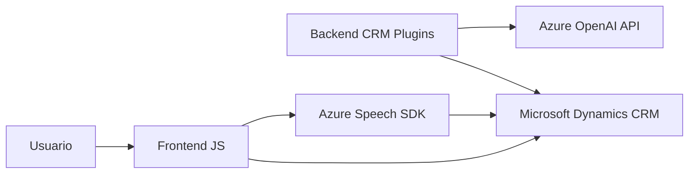

### Breve resumen técnico
El repositorio se centra en la implementación de una solución tecnológica que permite la interacción vocal con formularios dinámicos, combinando reconocimiento de voz, síntesis de voz y capacidades de inteligencia artificial. Utiliza Azure Speech SDK para el procesamiento de voz y transformación de texto a voz, además de Azure OpenAI para realizar operaciones avanzadas de manipulación de textos.

---

### Descripción de arquitectura
La solución sigue una **arquitectura híbrida** orientada al uso de servicios en la nube mediante APIs externas y SDKs, acoplada a Microsoft Dynamics 365 para la gestión de datos y ejecución de plugins. Los componentes están organizados modularmente con una separación clara entre frontend para comunicación con el usuario y backend para lógica empresarial y procesamiento externo, respetando un enfoque de **arquitectura de capas n**.

---

### Tecnologías usadas
1. **Frontend:**
   - **JavaScript:** Lenguaje de programación para funcionalidades del frontend.
   - **Azure Speech SDK:** Procesa reconocimiento y síntesis de voz, permitiendo interacción vocal con formularios.
   - **Microsoft Dynamics API (XRM):** Interacción directa con formularios y datos del sistema CRM.

2. **Backend:**
   - **C#:** Lenguaje utilizado para los plugins.
   - **Microsoft Dynamics SDK:** Manejo de plugins y datos CRM en backend.
   - **Azure OpenAI API:** Procesamiento directo de texto mediante servicios de OpenAI.
   - **Newtonsoft.Json:** Para el procesamiento de JSON en el backend.

3. **Dependencias externas:**
   - Azure Cloud Services: Para SDK de Speech y API de OpenAI.
   - HTTPClient (en C#): Comunicación directa con servicios web.

4. **Patrones usados:**
   - SDK-driven architecture: Interacción directa con SDKs y APIs.
   - Modularización de funciones: Cada función tiene roles específicos como síntesis o mapeo de datos.
   - Event-driven programming: Utiliza de eventos para ejecutarse (en plugins y frontend).
   - Extensiones mediante plugins (en Dynamics 365): Modelo de integración estándar.

---

### Diagrama Mermaid

---

### Conclusión final
Este repositorio es parte de una solución conectada que **facilita la interacción vocal con formularios dinámicos** y **optimiza la manipulación de datos mediante servicios de inteligencia artificial en la nube**. La arquitectura emplea una combinación de **n capas con integración directa** de SDKs y APIs de Azure, mostrando un diseño robusto y sostenible para sistemas CRM que necesitan agregar capacidades avanzadas como reconocimiento, síntesis de voz y procesamiento de texto enriquecido.

Sin embargo, existen algunas áreas que pueden mejorarse:
- **Seguridad:** Los datos sensibles (como claves API) están expuestos en el código, lo que representa un riesgo de seguridad. Se recomienda usar variables de entorno o Azure Key Vault.
- **Adaptabilidad:** Aunque modular, la separación para facilitar pruebas unitarias y de integración podría ser más destacada, especialmente en el frontend que mezcla lógica en grandes funciones.