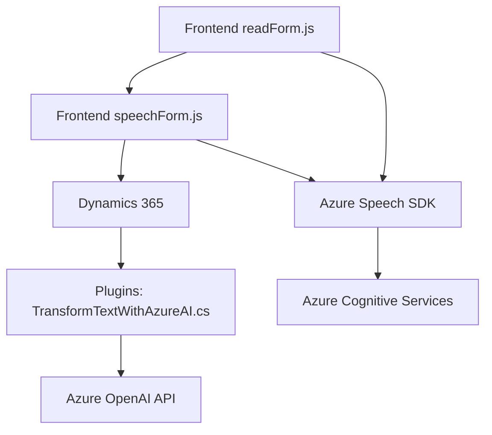

### Breve resumen técnico:
El repositorio consiste en tres componentes principales:
1. **Frontend (JavaScript):** Dos archivos (`readForm.js`, `speechForm.js`) que implementan integración entre formularios dinámicos (Dynamics 365) y el servicio Azure Speech SDK para síntesis y reconocimiento de voz.
2. **Backend Plugin (C#):** Un archivo (`TransformTextWithAzureAI.cs`) que actúa como un plugin en Dynamics CRM, utilizando Azure OpenAI para transformar texto y realizar procesamiento avanzado.

### Descripción de arquitectura:
La solución combina varios paradigmas arquitectónicos:
1. **N-capas:** La arquitectura general sigue un enfoque de separación de responsabilidades entre:
   - **Frontend:** Realiza captura y transformación de datos en el navegador.
   - **Backend (plugin):** Procesa datos y realiza tareas específicas (llamadas OpenAI, transformaciones).
   - **Servicios externos (Azure Cognitive Services):** Procesamiento de voz e inteligencia artificial.
2. **Integración con Dynamics 365:** Utiliza APIs internas del sistema (`Xrm.WebApi`) para manejar datos del formulario en tiempo real.
3. **Patrones específicos:**
   - **Carga dinámica:** En el caso de los archivos JS, el SDK de Azure se carga dinámicamente.
   - **Plugin-based architecture:** El componente en C# extiende las capacidades de Dynamics mediante el interfaz `IPlugin`.

### Tecnologías y frameworks usados:
1. **Frontend:**
   - **JavaScript:** Desarrollo en Vanilla JS con funciones modulares.
   - **Azure Speech SDK:** Integración para reconocimiento y síntesis de voz.
   - **Dynamics 365 API (Xrm.WebApi):** Manipulación de datos del formulario.

2. **Backend (Plugin):**
   - **C# .NET Framework:** Desarrollo de plugins en Dynamics CRM.
   - **Microsoft.Xrm.Sdk:** Biblioteca oficial para desarrollo en Dynamics CRM.
   - **Azure OpenAI API:** Uso de inteligencia artificial para transformar texto.

3. **Dependencias externas:**
   - **Azure Cognitive Services:** Base para Speech SDK y OpenAI.
   - **HTTP Clients/FormData:** Envía solicitudes REST a APIs externas (como Azure).

### Diagrama Mermaid:
El diagrama representa los componentes y su interacción básica.

### Conclusión final:
Este repositorio implementa una **integración avanzada entre Dynamics 365 y Azure Cognitive Services**. Utiliza un enfoque modular y extensible, con separación de responsabilidades entre frontend (JavaScript para UI interaction), backend (C# plugins for processing), y servicios externos (Azure Speech & OpenAI). La arquitectura sigue un enfoque de **n-capas** con fuerte integración mediante APIs internas del CRM y servicios externos. La solución está diseñada para manejar interacción usuario-servicio en tiempo real, permitiendo la mejora de operaciones CRM mediante automatización e inteligencia artificial.