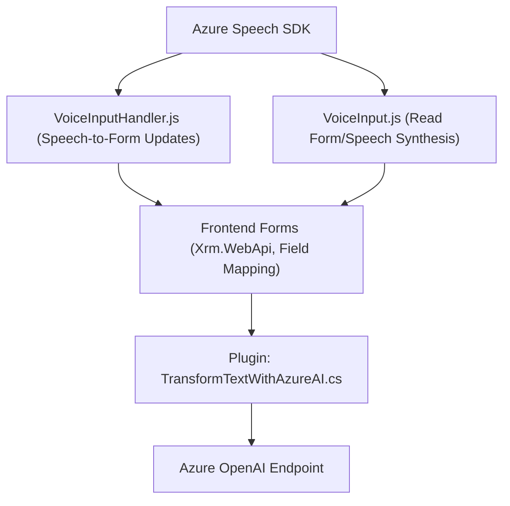

### Breve resumen técnico

El repositorio alberga tres componentes principales:
1. **Frontend y lógica de voz** (`readForm.js`, `speechForm.js`): Módulos de JavaScript enfocados en la integración de formularios con reconocimiento de voz y síntesis de texto a voz usando el SDK de Azure Speech. Esto permite la captura, procesamiento y conversión entre texto y voz en aplicaciones web.
2. **Backend y lógica con AI** (`TransformTextWithAzureAI.cs`): Plugin para un sistema CRM (Microsoft Dynamics) que utiliza Azure OpenAI para transformar texto en un formato estructurado.

Estos elementos trabajan en conjunto como partes de una solución integrada que combina frontend y backend, demostrando una arquitectura centrada en la interacción del usuario y procesamiento cognitivo basado en voz y texto.

---

### Descripción de la arquitectura

La arquitectura combina componentes frontend y backend y se puede clasificar como **Híbrida**:
- **Frontend:** Presenta elementos de una arquitectura **Modular de n-capas**, con funciones claramente separadas para interacción con formularios, reconocimiento de voz y síntesis de texto.
- **Backend:** Implementa arquitectura orientada a servicios (**SOA**) mediante la división funcional entre Dynamics CRM y servicios de Azure OpenAI. Este diseño también introduce una capa de plugins que extienden la lógica del sistema CRM y lo integran con servicios externos.

--- 

### Tecnologías, frameworks y herramientas presentes

1. **Frontend:**
   - **JavaScript:** Lenguaje principal para el desarrollo de los módulos.
   - **Dinamics 365 SDK:** Usado en combinación con Xrm APIs para manipulación de datos en formularios.
   - **Azure Speech SDK:** Para reconocimiento y síntesis de voz, cargado dinámicamente con scripts del SDK oficial.
  
2. **Backend:**
   - **Microsoft Dynamics SDK:** Base del plugin para extender funcionalidades del CRM mediante sus interfaces.
   - **Azure OpenAI y Azure REST API:** Servicios para transformación de texto utilizando inteligencia artificial avanzada.
   - **C# (.NET):** Lenguaje de desarrollo para el plugin del CRM.
   - **JSON Libraries:** Usadas en backend para manipulación de datos de entrada o salida (Newtonsoft.Json / System.Text.Json).

---

### Diagrama mermaid (100 % compatible con GitHub Markdown)

---

### Conclusión final

La solución del repositorio combina capacidades de reconocimiento y síntesis de voz con inteligencia artificial mediante Azure Speech y OpenAI, integrándose en sistemas orientados a formularios como Microsoft Dynamics CRM. Su arquitectura modular facilita la responsabilidad única de cada componente (procesamiento, actualización de formularios, lógica oral-textual). Además, aprovecha APIs externas y plugins diseñados bajo estándares modernos para extender capacidades. Por último, su diseño híbrido habilita interoperabilidad entre dispositivos y servicios, lo que la hace ideal para entornos empresariales enfocados en interacción cognitiva y automatización.