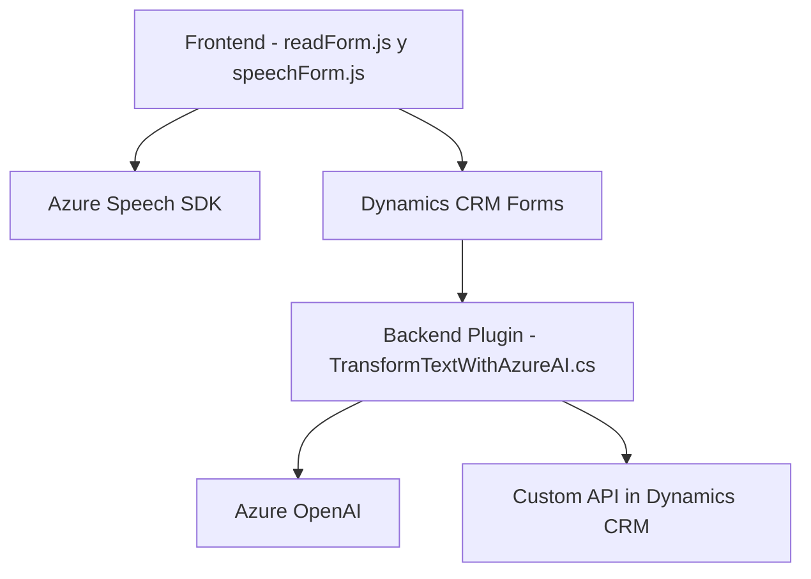

### Breve resumen técnico

El repositorio se centra en la integración de servicios mediante interacción entre aplicaciones frontend (archivos `readForm.js` y `speechForm.js`), backend (`TransformTextWithAzureAI.cs`), y servicios externos como Azure Speech SDK y Azure OpenAI. Su propósito es habilitar reconocimiento y síntesis de voz, procesamiento de formularios, y análisis de datos con IA en el contexto de Dynamics 365 CRM.

---

### Descripción de arquitectura

La solución implementa una arquitectura híbrida basada en **integración de servicios** con un **patrón de capas** adaptado al entorno de Dynamics CRM. El frontend utiliza **modular design** para manejar responsabilidades específicas como síntesis de voz y procesamiento de formularios, y el backend implementa funcionalidad especializada en Dynamics CRM a través de un **plugin design pattern**.

La funcionalidad principal se basa en:
1. Un **frontend dinámico** que interactúa con formularios de Dynamics 365, captura voces y síntesis de audio vía Azure Speech SDK.
2. Un **plugin CRM orientado a procesar texto y estructurarlo en JSON utilizando Azure OpenAI**.

Se aprovechan patrones como:
- **Orientación a eventos:** Interacción basada en eventos del usuario.
- **Proxy y Adapter:** Adaptación de datos en distintas capas (formulario, plugin, APIs externas).
- **Service orchestration:** Combinación de servicios de Azure para mejorar la funcionalidad del sistema.

---

### Tecnologías usadas
1. **Frontend (JavaScript):**
   - **Azure Speech SDK:** Para síntesis de voz y reconocimiento.
   - **Dynamics 365 Context API:** Para acceder a la información del formulario (`executionContext`).
2. **Backend (C#):**
   - **Azure OpenAI:** Procesamiento avanzado de texto (GPT, definiciones específicas).
   - **Microsoft.Xrm.Sdk:** Extensión estándar para plugins en Dynamics CRM.
   - **Newtonsoft.Json.Linq:** Manipulación de JSON.
   - **System.Net.Http:** Envío de solicitudes a REST APIs externas.
3. **Microsoft Dynamics 365 CRM:**
   - Plataforma central de la solución.

---

### Diagrama Mermaid válido para GitHub
Representamos la relación entre las capas de la aplicación y los servicios externos.

---

### Conclusión final

La solución es una **aplicación distribuida** centrada en el entorno Dynamics CRM con la integración de dos componentes principales: **frontend en JavaScript** y **backend en C#**. Su arquitectura aprovecha patrones como **capas**, **integración de servicios** y **event-driven design**, apoyándose en servicios accionables como **Azure Speech SDK** y **Azure OpenAI** para funcionalidad avanzada de reconocimiento de voz, síntesis y procesamiento con IA.

Este diseño muestra un fuerte enfoque en modularidad y la extensión de características de Dynamics CRM, ideal para escenarios donde los datos deben ser estructurados, analizados y presentados eficientemente.