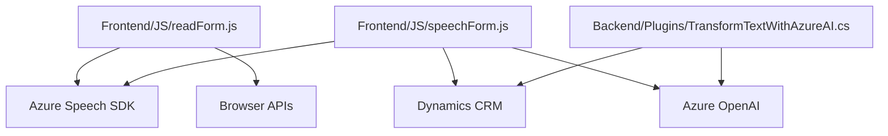

### Breve Resumen Técnico
El repositorio presenta una solución que combina funcionalidades de entrada/salida de voz mediante Azure Speech SDK, reconocimiento y procesamiento de transcripciones hacia un sistema CRM, y transformación de texto con ayuda de Azure OpenAI en un plugin para Microsoft Dynamics CRM. El diseño se basa en una arquitectura de cliente-servidor, que integra distintos componentes especializados para lograr un sistema extensible y modular.

---

### Descripción de Arquitectura
**Arquitectura principal:**  
La solución sigue una arquitectura de **cliente-servidor**, donde el cliente (frontend) se encarga de la interacción con el usuario y el procesamiento primario, mientras que un backend (plugin en Dynamics CRM) realiza el procesamiento avanzado con IA y la comunicación con APIs externas (Azure OpenAI).  

1. **Frontend:**
   - Diseño modular basado en funciones para mantener responsabilidades claras.
   - Integración con Azure Speech SDK para síntesis y reconocimiento de voz.
   - Habilidad de interactuar dinámicamente con formularios de un CRM.
   - Modularidad en las funciones dedicadas a la extracción, procesamiento y aplicación de valores.

2. **Backend:**
   - Plugin de Dynamics CRM para transformar texto utilizando Azure OpenAI.
   - Decoupling de lógica avanzada al utilizar una llamada a un servicio externo como microservicio independiente.
   - Estilo basado en denominaciones típicas de los plugins del ecosistema de Microsoft Dynamics.

En conjunto, el sistema utiliza un enfoque orientado a servicios, pero no tiene una arquitectura completamente distribuida como **microservicios**. Es más una arquitectura **cliente-servidor** y **modular**, adaptada a las normativas del entorno Dynamics CRM y Azure.

---

### Tecnologías Usadas
1. **Frontend:**
   - **Lenguajes:** JavaScript.
   - **Frameworks:** No hay uso de frameworks front-end explícitos (como React o Angular).
   - **Servicios de terceros:** Azure Speech SDK (para reconocimiento y síntesis de voz), integración con Microsoft Dynamics CRM.

2. **Backend:**
   - **Lenguaje:** C#.
   - **Framework:** Microsoft Dynamics SDK (CRM).
   - **Servicios de terceros:** Azure OpenAI (para procesamiento de lenguaje natural).

3. **Dependencias:**
   - SDKs y APIs:
     - Azure Speech SDK (síntesis y reconocimiento de voz).
     - API personalizada (posiblemente basada en Xrm.WebApi del sistema CRM de Dynamics).
     - Azure OpenAI para generar JSON estructurado.
   - Paquetes:
     - `Newtonsoft.Json` para JSON dinámico.
     - `System.Net.Http` y `System.Text.Json` para solicitudes HTTP.

4. **Patrones:**
   - Gestión dinámica de dependencias (SDK cargado en tiempo de ejecución).
   - División modular de funciones.
   - Arquitectura orientada al desacoplamiento entre cliente (frontend) y servicios externos (Azure Speech/OpenAI).

---

### Diagrama Mermaid Compatible con GitHub Markdown

---

### Conclusión Final
Este repositorio implementa una solución modular y client-server que cierra la brecha entre el cliente (frontend) y un sistema CRM (Dynamics CRM) con servicios avanzados como Azure Speech y Azure OpenAI. Las tecnologías utilizadas evidencian la incorporación de inteligencia artificial y síntesis/reconocimiento de voz para optimizar la experiencia del usuario y manipular formularios dinámicamente. Aunque no adopta completamente una arquitectura de microservicios, destaca por su claro enfoque hacia modularidad, extensibilidad e interoperabilidad.