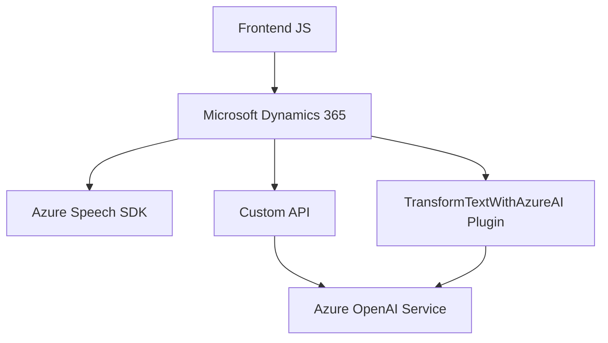

### Breve resumen técnico

El repositorio analiza componentes enfocados en integrar funcionalidades de procesamiento de texto y voz en el entorno de **Microsoft Dynamics 365**. Los archivos descritos implementan dos áreas principales: lectura/escritura de datos en formularios mediante voz y procesamiento de texto usando inteligencia artificial de Azure OpenAI. La solución abarca tanto funcionalidades *frontend* (integradas al cliente Dynamics) como *backend* (plugins para manipulación de datos en Dynamics).

---

### Descripción de arquitectura

La arquitectura general puede clasificarse como **cliente-servidor**, complementada con un uso indirecto de una arquitectura **microservicios** basada en Azure para acceder a servicios externos (Azure Speech y OpenAI). En el lado del cliente (*frontend*), se utiliza un enfoque **n-capas**, donde los datos son obtenidos desde el modelo del formulario de Dynamics, procesados con funciones y luego enviados a Azure para síntesis o análisis. Por otro lado, el *backend* utiliza un **plugin extensible** dentro de Dynamics CRM, el cual sigue el patrón de invocación de APIs externas y transformación de datos.

---

### Tecnologías y componentes usados

#### Tecnologías y Frameworks:
1. **Microsoft Dynamics 365 SDK**: Interacción con entidades y formularios en Dynamics CRM.
2. **Azure Speech SDK**: Reconocimiento y síntesis de voz.
3. **Azure OpenAI Service**: Procesamiento de datos mediante inteligencia artificial (GPT).
4. **Newtonsoft.Json / System.Text.Json**: Manejo de objetos JSON.
5. **HTTP Client**: Comunicación con servicios externos en el plugin .NET.

#### Patrones de Arquitectura:
1. **Cliente-Servidor**: Procesos en el cliente mediante JavaScript interactúan con servicios backend de Dynamics y APIs externas.
2. **N-capas en frontend**: Separación de responsabilidades mediante módulos funcionales.
3. **Delegación mediante Callbacks**: Verificación de dependencias (e.g., SDK cargado) antes de ejecutar lógica.
4. **Extensibilidad basada en Plugins para CRM**: Integración específica de Dynamics mediante `IPlugin`.

---

### Diagrama Mermaid

---

### Conclusión final

Este repositorio representa una solución híbrida con componentes *frontend* y *backend*, diseñada para enriquecer la experiencia de usuario en Microsoft Dynamics 365 mediante la integración de tecnología avanzada. En el *frontend*, se utiliza el Azure Speech SDK para habilitar la interacción por voz, permitiendo leer datos y dictar comandos en formularios. En el *backend*, los plugins actúan como capas de transformación que hacen uso de servicios avanzados de IA, como Azure OpenAI, para manipular texto y ajustarlo a necesidades específicas.

La arquitectura exhibe una estructura **modular** y altamente extensible, con un enfoque central en la integración de servicios externos mediante APIs, una solución bien adaptada para entornos empresariales basados en Dynamics y Microsoft Azure.