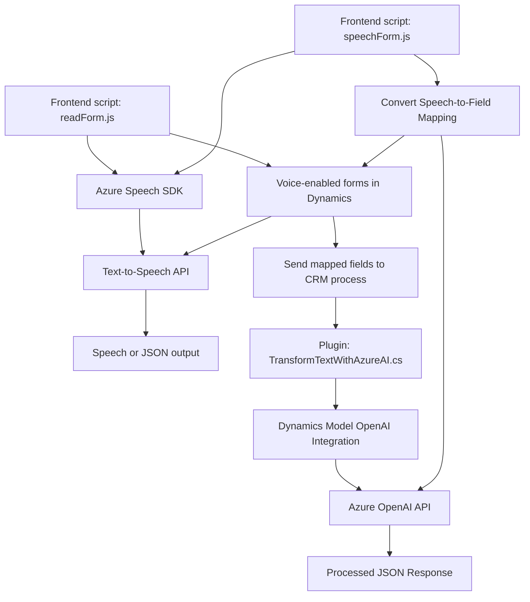

### Breve Resumen Técnico
El repositorio presenta varios módulos diseñados para una solución que utiliza servicios de voz y procesamiento de texto en integración con Microsoft Dynamics CRM y Azure. Combina frontend JavaScript interactivo y plugins en C# para extender la funcionalidad del CRM con tecnologías de reconocimiento de voz y modelos de inteligencia artificial alojados en Azure.

---

### Descripción de Arquitectura
La arquitectura de la solución tiene elementos híbridos. Por un lado, en el frontend aboga por un modelo orientado a componentes modulares con integración a APIs externas, mientras que en el backend se ajusta al **patrón Plugin** típico de Dynamics CRM. Además, muestra una arquitectura **orientada a eventos** en el frontend (basado en promesas y callbacks) y patrones **SOA (Service-Oriented Architecture)** en el backend con una estrecha interacción con Azure.

La arquitectura general podría clasificarse como **n capas**, donde el frontend interactúa con logica en backend a través de APIs Dynamics o de Azure, y se delega el procesamiento más complejo hacia servicios externos como Azure Speech SDK y OpenAI.

---

### Tecnologías Usadas
1. **Frontend**:
   - **JavaScript** (ES6+).
   - **Azure Speech SDK**: Reconocimiento y síntesis de voz.
   - **Dynamics 365 API**: Acceso a funcionalidades del CRM.

2. **Backend**:
   - **C#** (Plugin para Dynamics).
   - **Microsoft Dynamics SDK** (Manipulación de datos y eventos del CRM).
   - **Azure OpenAI API** (Transformación de texto con modelos GPT).
   - **JSON Libraries**:
     - `Newtonsoft.Json.Linq`.
     - `System.Text.Json`.
   - **HTTP Libraries**: `HttpClient`.

3. **Patrones**:
   - Modularización y delegación en funciones específicas (Frontend).
   - Plugin Pattern en Dynamics CRM.
   - Arquitectura SOA basada en HTTP para interacción con Azure.

---

### Diagrama Mermaid Compatible con GitHub

---

### Conclusión Final
La solución es una combinación de frontend y backend que integra tecnologías avanzadas como procesamiento de voz con Azure Speech SDK y generación de contenido estructurado con Azure OpenAI en un entorno Dynamics CRM. Se implementa una arquitectura híbrida de **n capas orientada a servicios**, donde el frontend se maneja con componentes modulares y delegación, mientras que el backend utiliza el patrón Plugin para extender la funcionalidad del CRM. Esto permite un diseño escalable y altamente integrable con servicios en la nube.