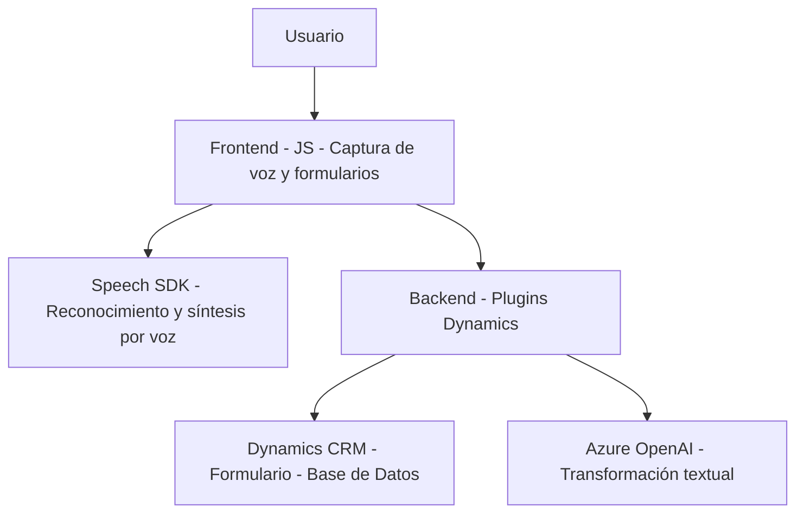

### **Breve Resumen Técnico**
La solución presentada parece ser una implementación de **integración avanzada entre una frontend (interfaz web) y un backend basado en Microsoft Dynamics CRM**. Utiliza las capacidades de **Azure Speech SDK** para realizar tareas de reconocimiento y síntesis de voz, junto con **Azure OpenAI Services** para transformar texto en un formato definido. El propósito principal radica en mejorar la accesibilidad y automatización de procesos, enfocándose en funcionalidades relacionadas con formularios dinámicos.

---

### **Descripción de la Arquitectura**
- La arquitectura puede clasificarse como **modular** orientada a **n Capas**:
  1. **Frontend:** Responsabilidad de gestionar la interfaz del usuario y las interacciones con los formularios.
  2. **Backend:** Integra **Microsoft Dynamics CRM** como BaaS (Backend as a Service), además de comunicarse con APIs externas de Azure Speech y OpenAI para extendidas capacidades de síntesis y procesamiento de texto.

En particular:
- **Frontend/JS:** Se encarga de capturar voz y convertirla en texto, transformar datos de entrada y enviar el resultado al backend para almacenamiento o más procesamiento.
- **Backend/Plugins:** A través de la arquitectura de plugins de Dynamics CRM, interactúa con Azure OpenAI para realizar transformaciones textuales más avanzadas, y recupera o modifica información de formularios.

La coexistencia de servicios externos (Speech SDK y OpenAI) indica un patrón de **External APIs Integration**, muy común en aplicaciones modernas.

---

### **Tecnologías Usadas**
1. **Frontend**
   - **JavaScript**: Base de los scripts (`readForm.js`, `speechForm.js`) para la manipulación del DOM y la lógica.
   - **Azure Speech SDK**: Para reconocimiento de voz y síntesis de texto en audio.
   - **Dynamics 365 Web API**: Usada para interacciones con servicios y formularios CRM.

2. **Backend**
   - **Microsoft Dynamics CRM Plugin Architecture**: Soporte para extensiones y automatización de procesos dentro del ecosistema de Dynamics 365.
   - **Azure OpenAI Service**: Utiliza Azure-hosted OpenAI para transformaciones avanzadas.
   - **ASP.NET / C# Plugin Development**: Código lógico para interacción directa con Dynamics SDK.

### **Patrones y Principios Aplicados**
- **Modularidad:** Una separación clara de responsabilidades en funciones tanto del frontend como del backend.
- **Event Driven:** Uso de callbacks y flujos desencadenados por eventos, como la carga del Speech SDK o el procesamiento de registros en Dynamics.
- **Promesas para tareas asíncronas:** Central para la gestión de `SpeechSDK` y otros servicios externos.
- **Cliente-Servidor:** Comunicación entre frontend y backend para datos dinámicos y procesamiento mediante APIs.
- **Integración de Microservicios/Externo API Gateway:** La interacción con Azure Speech y OpenAI representa una conexión directa a servicios externos bajo el patrón de microservicio para tareas específicas.

---

### **Diagrama Mermaid**

---

### **Conclusión Final**
La solución representa una **aplicación modular en n capas que aprovecha tecnologías cloud híbridas de Microsoft Azure (Speech SDK y OpenAI) integradas con Dynamics CRM**. Las capacidades de interacción vocal y procesamiento basado en inteligencia artificial lo convierten en una solución avanzada de accesibilidad y automatización en sistemas empresariales como Dynamics 365. 

Este enfoque no solo simplifica las tareas manuales en los formularios, sino que asegura escalabilidad mediante la integración de servicios externos y promesas para operaciones optimizadas. La arquitectura es adecuada para entornos corporativos que requieren procesamiento dinámico y robustez en la interacción con usuarios.