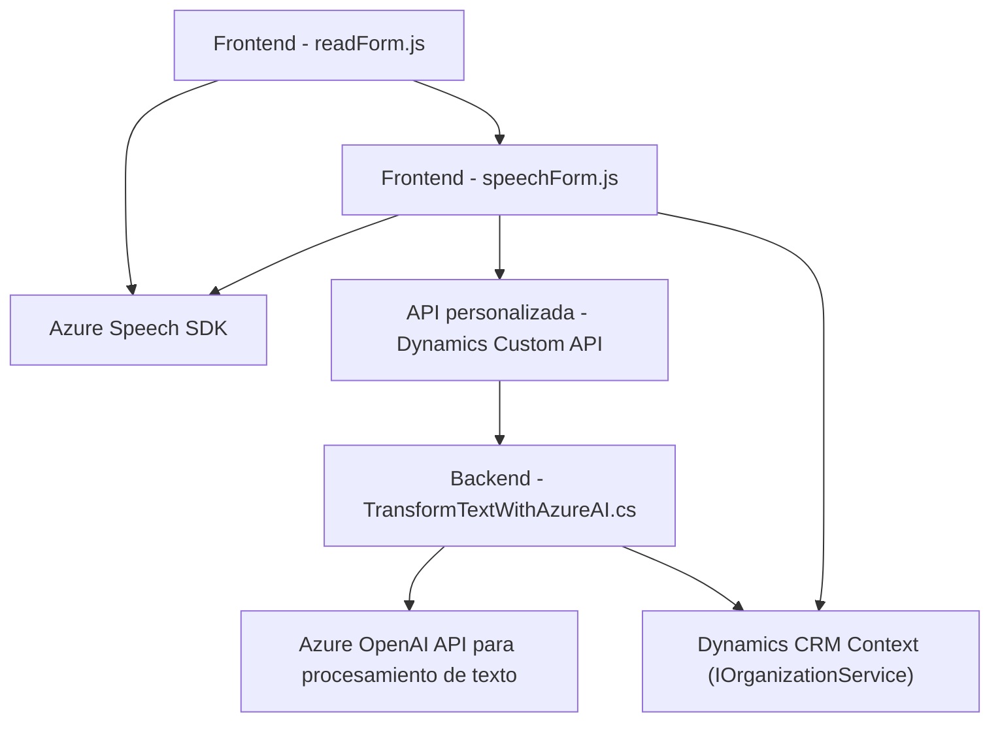

### Breve resumen técnico
En este repositorio se presentan tres componentes diferentes que apuntan a una solución basada en inteligencia artificial y reconocimiento de voz, especialmente orientada hacia la integración con formularios y sistemas Dynamics CRM. Se emplea tecnología de Azure, específicamente `Azure Speech SDK` y `Azure OpenAI API`. Las dependencias externas y nativas fortalecen la arquitectura para un entorno dinámico en capturación, procesamiento y síntesis del contenido.

---

### Descripción de arquitectura
La arquitectura se puede clasificar como **n capas**, dado que separa claramente las preocupaciones en diferentes niveles:
1. **Capa de presentación:** Representada por los archivos `readForm.js` y `speechForm.js`, maneja la interacción del usuario con el formulario y las operaciones del reconocimiento de voz, transcripción y síntesis de texto a voz.
2. **Capa de lógica de negocio:** Representada por las funciones internas que procesan y vinculan los datos de los formularios con Dynamics 365.
3. **Capa de datos/servicios:** Implementada en `TransformTextWithAzureAI.cs`, este archivo actúa como un plugin para interactuar con servicios externos, como la API de Azure OpenAI, y transforma el texto de entrada en JSON.

Además, se observan patrones como **Event-Driven Architecture** y **Service-Oriented Architecture**, reflejando una solución que interactúa con servicios externos y se basa en eventos.

---

### Tecnologías usadas
1. **Frontend:** Implementaciones en JavaScript con manipulación del DOM y uso de `Azure Speech SDK` para interacción de voz.
2. **Backend:** 
   - **Plugin en C#** para integrar y extender funcionalidades en Dynamics CRM.
   - HTTP client (`System.Net.Http`) para conexión con **Azure OpenAI API**.
3. **Frameworks y plataformas:**
   - **Dynamics CRM SDK (IOrganizationService):** Manejo del contexto CRM.
   - **Azure Speech SDK:** Transcripción y síntesis de voz.
   - **Azure OpenAI API:** Procesamiento de texto avanzado.
4. **Patrones de diseño:**
   - Patrones de **callback** y eventos.
   - **Plugin-based architecture** para extensibilidad del CRM.
   - **SOA** para interacción con servicios externos.
5. **Dependencias:**
   - Newtonsoft.Json.
   - System.Text.Json.
   - System.Net.Http.
   - Microsoft.Xrm.Sdk.

---

### Diagrama **Mermaid**

---

### Conclusión final
La solución implementada en el repositorio se centra en mejorar la interacción del usuario con formularios alojados en Dynamics CRM mediante reconocimiento de voz y procesamiento inteligente de texto. La arquitectura es de tipo **n capas**, integrada con APIs de Azure para transcripción de voz y enriquecida con un plugin que aplica reglas predefinidas a los datos utilizando la API de Azure OpenAI. Aunque el diseño es modular y utiliza múltiples tecnologías avanzadas, tiene algunos puntos débiles, como la posible exposición de credenciales en el código, que debería corregirse mediante el uso de variables de entorno o sistemas de gestión de secretos.