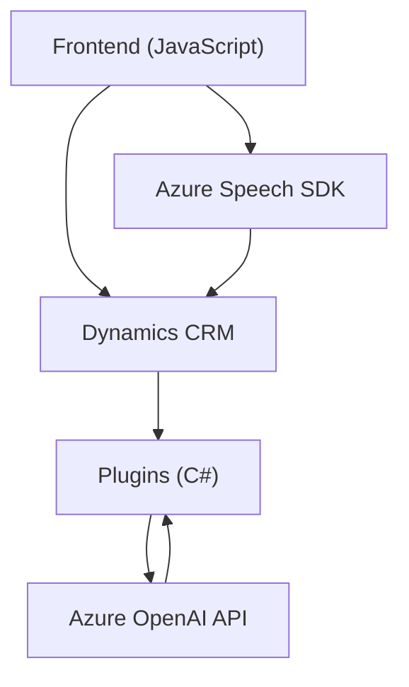

### Breve Resumen Técnico
Este repositorio implementa una solución que integra funcionalidades de reconocimiento de voz, síntesis de voz y procesamiento de texto, utilizando servicios externos como Azure Speech SDK y Azure OpenAI. El objetivo principal es interactuar con formularios en Dynamics 365, permitiendo convertir voz a texto, texto a voz, y estructurar datos mediante servicios de inteligencia artificial. 

---

### Descripción de Arquitectura

La solución tiene tres componentes principales:
1. **Frontend (JavaScript)**: Maneja las interacciones con el usuario (reconocimiento de voz y síntesis de voz). Se incluye lógica modular para procesar datos visibles en formularios de Dynamics.
2. **Backend Plugin (C#)**: Extiende Dynamics CRM utilizando un plugin que interactúa directamente con Azure OpenAI para transformar texto según normas personalizadas.
3. **Dependencias Externas**: Se integran servicios de inteligencia artificial (Azure Speech SDK y Azure OpenAI) para realizar tareas específicas (voz a texto, procesamiento de texto).

La arquitectura global parece ser una mezcla entre **Arquitectura de N-Capas** (frontend, capas de lógica, servicios externos) y un patrón **Client-Service** debido a las interacciones directas entre las capas frontend y los servicios de Dynamics/Azure.

---

### Tecnologías Usadas

1. **Frontend (JavaScript)**:
   - Azure Speech SDK: Para tareas de texto a voz y reconocimiento de voz.
   - Interacción directa con Dynamics CRM.

2. **Backend Plugin (C#)**:
   - Microsoft Dynamics SDK: Para extender capacidades del CRM.
   - Azure OpenAI: Para transformar texto según normas del usuario.
   - Serialización/Deserialización JSON (`System.Text.Json` y `Newtonsoft.Json`).

3. **Patrones**:
   - **Modularidad Funcional**: Funciones con responsabilidades claramente definidas.
   - **Integración con API REST/Servicios Externos**: Azure Speech SDK y Azure OpenAI.
   - **Interfaz basada en eventos**: Uso extensivo de callbacks y funciones asíncronas en el frontend.
   - **Plugin Design Pattern**: Extendiendo Dynamics CRM con funcionalidades específicas.

---

### Dependencias o Componentes Externos
1. Azure Speech SDK:
   - Usado para la síntesis de voz y reconocimiento de voz.
   - Dependencia cargada dinámicamente desde un endpoint público de Azure.

2. Azure OpenAI:
   - API externa consumida por el plugin para transformar texto según normas específicas.
   - Credenciales de API y configuración probablemente declaradas en un archivo de configuración o en variables de entorno.

3. Dynamics CRM:
   - Interacción directa tanto desde el frontend como desde el plugin.

4. `Xrm.WebApi.online` (en frontend):
   - API integrada de Dynamics para realizar llamadas al servicio desde el cliente.

---

### Diagrama Mermaid

---

### Conclusión Final
Esta solución es una arquitectura híbrida orientada a servicios (SOA) con tres componentes principales: frontend basado en JavaScript interactuando con servicios de Azure, un plugin extendiendo la funcionalidad de Dynamics CRM en el backend, y una integración con Azure OpenAI. Los patrones empleados muestran una buena modularidad y enfoque en la reutilización, aunque ciertos aspectos como la centralización de configuración y el manejo extensivo de dependencias externas podrían beneficiarse de mejoras adicionales.