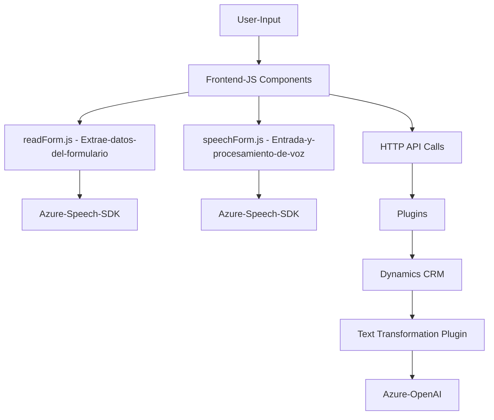

### Breve Resumen Técnico:
El repositorio contiene tres componentes distintos enfocados en la interacción entre **front-end**, procesamiento de voz, y un plugin destinado para el entorno Dynamics CRM, que utiliza servicios externos. Las principales funcionalidades se encuentran en la integración de servicios cloud, concretamente **Azure Speech SDK** y **Azure OpenAI**, para realizar procesamiento y síntesis de voz, así como transformaciones avanzadas de texto con inteligencia artificial.

---

### Descripción de Arquitectura:
La solución utiliza una arquitectura de varias capas que separa claramente tres áreas:  
1. **Frontend:** Maneja interacción con el usuario y convierte información visible o voces en elementos procesables utilizando el SDK correspondiente.  
2. **Backend Dynamics Plugin:** Implementa lógica empresarial y conecta el sistema CRM con la AI de Azure a través de solicitudes HTTP.  
3. **Servicios Externos:** Se apoya en la inteligencia artificial de Azure, tanto para síntesis como para procesamiento del texto (Speech SDK y OpenAI).

La estructura refleja principios **modulares**, donde cada componente tiene su propia responsabilidad y utiliza servicios cloud para extender funcionalidades.

---

### Tecnologías Usadas:
1. **Lenguajes:**  
   - **JavaScript:** En el frontend para interacción, procesamiento de formularios y voz.  
   - **C#:** En el plugin backend destinado para Dynamics CRM.
2. **Frameworks y SDK:**  
   - **Azure Speech SDK:** Para convertir texto a voz y viceversa.  
   - **Azure OpenAI Service:** Para procesamiento avanzado de texto mediante IA.
   - **Dynamics CRM SDK:** Para la integración del plugin con el contexto de CRM y manipulación de entidades y atributos.
3. **Patrones:**  
   - **Arquitectura modular:** Cada archivo aborda una funcionalidad específica.  
   - **Callback-driven Loading:** SDK dinamicamente cargado.  
   - **Service Integration:** Dependencia en APIs externas para extensibilidad.  
   - **MVC-like:** Separación de lógica, datos (modelo) e interfaz.  
   - **Plugin Pattern:** Para la integración entre Dynamics CRM y Azure OpenAI.
4. **Otros:**  
   - **HTTP Requests:** Para realizar llamadas al endpoint de OpenAI.  
   - **Json Handling Libraries (Newtonsoft y System.Text.Json):** Para manejo estricto de formato JSON.  
   - **RegEx Parsing:** Se utiliza en el plugin para identificar y procesar los datos de entrada.

---

### Diagrama Mermaid:

---

### Conclusión Final:
Este repositorio implementa una solución híbrida basada en la interacción entre frontend, servicios externos y plugins para la plataforma Dynamics CRM. Con tecnologías avanzadas como **Azure Speech SDK** y **Azure OpenAI**, el enfoque combina cloud computing y desarrollo modular. La lógica de negocio expuesta trabaja sobre una arquitectura de **n-capas**, donde cada módulo cumple un rol especifico y las dependencias externas amplían las capacidades del sistema.

Aunque el diseño técnico actual está bien estructurado, algunas áreas podrían mejorarse, como centralizar configuraciones para normas o tratar excepciones de forma más robusta. En general, la solución es adecuada para manejar funcionalidades de forma extensible y escalable.