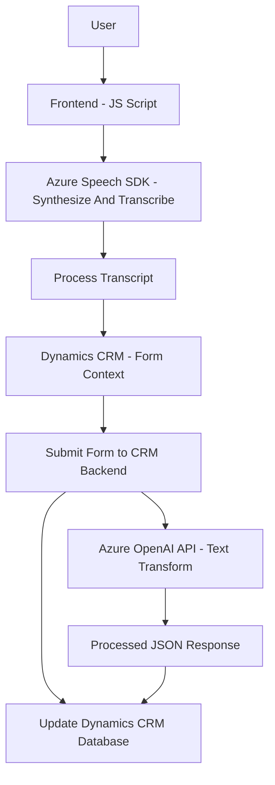

### Breve resumen técnico

El repositorio analizado implementa una solución que combina interacción con formularios (front-end) y procesamiento de datos mediante servicios externos, principalmente de Azure. La solución incluye tres principales módulos:

1. **Frontend/JS**: Scripts para la captura y generación de voz (mediante Azure Speech SDK), procesamiento de texto transcrito y vinculación con formularios basados en Dynamics 365.
2. **Plugins/C#**: Backend que actúa como un plugin en Dynamics CRM, integrándose con Azure OpenAI para text transformation.
3. **Azure Speech SDK** y **OpenAI API** son las tecnologías clave utilizadas en esta arquitectura.

---

### Descripción de arquitectura

La solución sigue una arquitectura basada en tres capas:
1. **Presentación (Frontend/JS)**:
   - Captura de entrada de voz del usuario, transcripción y extracción de datos relevantes.
   - Vinculación con formularios en Dynamics 365 para actualizar campos relacionados.

2. **Middleware (Azure Speech SDK y Azure OpenAI)**:
   - Azure Speech SDK para reconocimiento de voz, síntesis y manejo de texto hablado.
   - Azure OpenAI API usada en el plugin (C#) para transformar o inferir textos estructurados.

3. **Backend (Plugins/C#)**:
   - Arquitectura típica de Plugin Dynamics.
   - Procesamiento adicional en Dynamics CRM, con la lógica de transformación basada en reglas y llamada directa a Azure OpenAI.

---

### Tecnologías usadas

#### **Frontend/JS**:
- **Azure Speech SDK**: Reconocimiento y síntesis de voz.
- **Vanilla JavaScript**: Procesamiento de transcripciones y manipulación de formularios.
- **Dynamics Framework via `formContext`**: Interacción con formularios de Dynamics 365.

#### **Backend/C# Plugin**:
- **Microsoft Dynamics SDK**: Interacción con CRM contexto.
- **Azure OpenAI API**: Transformación mediante Inteligencia Artificial.
- **Newtonsoft.Json / HttpClient**: Integración con APIs externas.

#### **Frameworks y Patrones**:
- **Modular design**:
  - Extensive use of reusable functions in JS.
  - Separation of logic (frontend vs backend).
- **Facade Pattern** (simplifies API interaction via dedicated functions).
- **API-driven architecture**:
  - External API-centric communication with Azure services.
- **Plugin analogy in backend**:
  - Single entry point for execution via `Execute`.

---

### Dependencias o componentes externos presentes

1. **Azure Speech SDK** (for voice input/output processing).
2. **Azure OpenAI API** (for transforming text into JSON structure).
3. **Microsoft Dynamics CRM SDK** (integration with CRM form contexts).
4. **Browser APIs** (e.g., DOM manipulation via `formContext` for visibility filters, etc.).
5. **Third-party libraries in C#**:
   - `Newtonsoft.Json` (JSON processing).
   - `HttpClient` (API requests in .NET).

---

### Diagrama Mermaid

---

### Conclusión final

La solución implementada representa una three-tier architecture with modular MVC influences that combine frontend, middleware services, and a CRM backend. The use of external components (Azure Speech SDK for voice processing and Azure OpenAI API for text management) shows this system's reliance on cloud technologies for seamless interaction with users. The reliance on Microsoft Dynamics CRM emphasizes its alignment for enterprise integration, making it an intelligent tool to automate voice-to-text or inferential processing for CRM workflows.