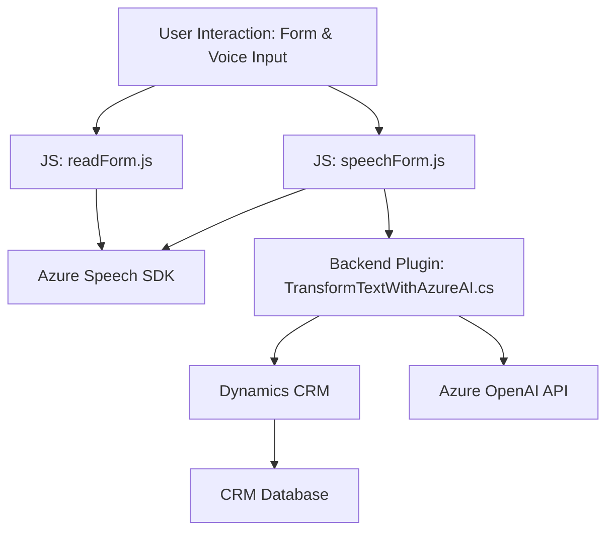

## Informe técnico basado en los archivos proporcionados

---

### Breve resumen técnico
La solución presentada parece ser un sistema para la interacción con formularios de Dynamics CRM mediante reconocimiento y síntesis de voz. Adicionalmente, incluye procesamiento avanzado de texto con Azure OpenAI transformando cadenas en estructura de datos legible. Combina un front-end basado en JavaScript para interacciones visuales y de voz con plugins en tecnología .NET como backend para integración avanzada con Dynamics CRM.

---

### Descripción de arquitectura
La solución está dividida en **frontend** y **backend**, y su arquitectura es de tipo **n capas**. Estas capas incluyen:
1. **Capa de presentación**: Frontend en JavaScript para interactuar directamente con usuarios.
2. **Capa de negocio**: Backend en .NET que se ejecuta como plugin dentro de Dynamics CRM. Este orquesta la lógica avanzada de transformación textual utilizando Azure OpenAI.
3. **Capa de servicios externos**:
   - **Azure Speech SDK**: Para reconocimiento de voz/síntesis.
   - **Azure OpenAI**: Para transformar texto.

---

### Tecnologías usadas
1. **Frontend (FRONTEND folder)**:
   - **JavaScript**: Desarrollo de las funcionalidades para interacción con formularios y Azure Speech SDK.
   - **Azure Speech SDK**: Procesa tanto síntesis como reconocimiento de voz.
   - **Promesas y async/await**: Para la gestión de operaciones asíncronas, como la carga del SDK y la comunicación con servicios externos.

2. **Backend (Plugins folder)**:
   - **C#/.NET**: Implementación del plugin para Dynamics CRM.
   - **Dynamics CRM SDK**: Uso de interfaces como `IPluginExecutionContext` y `IOrganizationService`.
   - **Azure OpenAI**: Consumo de APIs externas para transformar texto.
   - **System.Text.Json y Newtonsoft.Json.Linq**: Para manejo de JSON.
   - **HTTP Client**: Realiza solicitudes HTTP para interactuar con Azure OpenAI.

---

### Diagrama Mermaid válido para GitHub

---

### Conclusión final
La solución es un **integral sistema n-capas** diseñado específicamente para mejorar la interacción de usuarios con formularios de Dynamics CRM mediante voz y procesamiento inteligente de texto. Utiliza tecnologías modernas como **JavaScript**, **Azure Speech SDK** y **Azure OpenAI**, además de un **plugin backend en C#** para extender funcionalidad de Dynamics CRM. La arquitectura es robusta para procesar voz, realizar transformación de texto estructurado y mapear valores directamente en Dynamics con alta modularidad, lo que facilita mantenimiento y ampliaciones futuras.