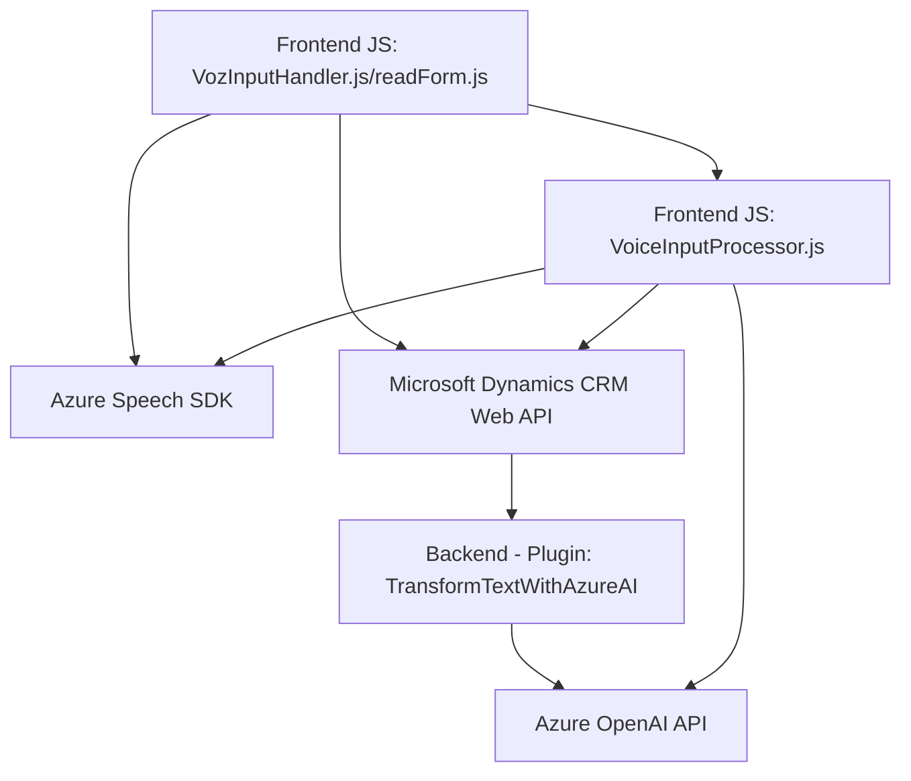

### **Resumen Técnico**
Este repositorio alberga una solución centrada en la interacción con formularios mediante comandos de voz, utilizando servicios en la nube como Azure Speech SDK y Azure OpenAI. Los componentes presentes interactúan principalmente con Dynamics CRM, mejorando la accesibilidad y optimizando la actualización de datos en formularios.

---

### **Descripción de Arquitectura**
La arquitectura sigue un enfoque modular con un diseño **n-capas**, incluyendo:
1. **Frontend JavaScript**: Implementa la captación y lectura de voz en el navegador mediante Azure Speech SDK, además de manipular datos visibles en formularios dinámicamente.
2. **Backend Plugins (Dynamics)**: Extensión de Microsoft Dynamics CRM mediante plugins que transforman texto hablado en datos estructurados (JSON) usando Azure OpenAI.
3. **Servicios Externos**: Integración directa con APIs como Azure OpenAI y Azure Speech SDK.

Los distintos módulos están organizados, pero se mantiene la impresión de una arquitectura monolítica ampliada, donde los servicios externos refuerzan funcionalidades específicas sin dividirse claramente en microservicios.

---

### **Tecnologías Usadas**
1. **Frontend**:
   - **Lenguaje**: JavaScript.
   - **APIs externas**: Azure Speech SDK.
   - **Frameworks y SDK**: Dynamics CRM Web API (`Xrm.WebApi`) para interactuar con el backend.

2. **Backend**:
   - **Lenguaje**: C# en .NET Framework.
   - **Frameworks**:
     - Microsoft Dynamics SDK para creación de plugins.
     - Azure OpenAI para procesamiento de lenguaje natural.
   - **Librerías**:
     - `Newtonsoft.Json` para manipulación JSON.
     - `System.Net.Http` para llamadas REST.

3. **Patrones arquitectónicos**:
   - **Callback/Event-driven pattern**: Procesos activados mediante eventos o callbacks en el frontend.
   - **External Service Integration**: Uso de APIs para operaciones como voz a texto y procesamiento de lenguaje natural.
   - **Plugin Design Pattern**: Implementado a través de la extensión de Dynamics CRM.

---

### **Diagramas Mermaid válidos para GitHub**

---

### **Conclusión Final**
Este proyecto implementa una solución API-centrada con enfoque modular, que puede ser considerado un monolito extendido. La interacción entra las partes frontend y backend facilita la accesibilidad mediante voz y procesamiento IA, pero apunta a ser limitado en escalabilidad horizontal. Para futuras mejoras, se podría reestructurar hacia microservicios o arquitectura hexagonal que permita separaciones más claras entre: frontend, procesamiento de voz y la lógica del plugin para Dynamics CRM.